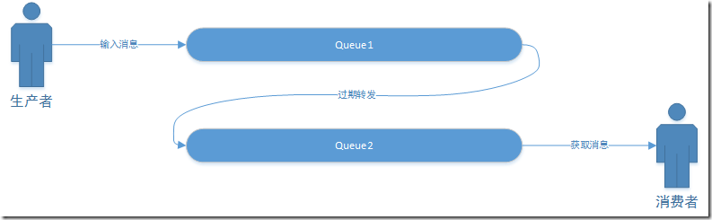
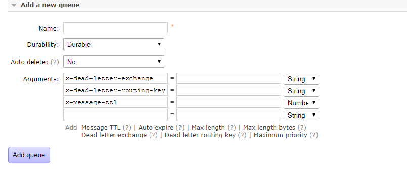

[TOC]
# 单机和分布式下延迟任务的实现总结
延迟任务有别于定式任务，定式任务往往是固定周期的，有明确的触发时间。而延迟任务一般没有固定的开始时间，它常常是由一个事件触发的，而在这个事件触发之后的一段时间内触发另一个事件。延迟任务相关的业务场景如下：
* 场景一：物联网系统经常会遇到向终端下发命令，如果命令一段时间没有应答，就需要设置成超时。
* 场景二：订单下单之后30分钟后，如果用户没有付钱，则系统自动取消订单。
* 场景三：某些支付渠道商会采用退避指数的方式异步回调支付结果（如果同步通知失败），分别是x分钟、x^2分钟、x^3分钟后...回调结果。

下面我们来探讨一些方案，其实这些方案没有好坏之分，和系统架构一样，只有最适合。对于单机和数据量较小的情况下，任意一种方案都可行，考虑的是简单明了和开发速度，尽量避免把系统搞复杂了。而对于分布式或数据量较大的情况下，就需要有一些选择，并不是所有的方案都适合了。

## 延迟任务实现方案的分类
下文把延时任务的实现方案分为两类：
* 基于内存实现延时任务的方案。
* 基于介质实现延时任务的方案。

仅仅是本人自己擅自命名，没什么权威。两者的主要区别是：基于内存实现延时任务的运行时数据都放在内存中，如果程序执行过程中出现问题导致内存中的任务丢失（例如服务器宕机），
需要考虑恢复当时正在运行且未执行完毕的延时任务。基于介质实现的延时任务，这里的介质可以是数据库、K-V结构、消息队列等，待执行的任务存放在一定的介质中被持久化，因此任务丢失的
可能性会比较低，当然也必须苛刻地考虑正在执行的任务（尚未执行完）丢失的情况。

## 基于内存实现延时任务的方案
基于内存实现延时任务的方案总结下来主要有以下几种：
* JDK延迟队列，主要由java.util.concurrent.DelayQueue实现。
* JDK的ScheduledThreadPoolExecutor，也就是由调度线程池实现（当然在旧版本的JDK中可以使用Timer和TimerTask，但是ScheduledThreadPoolExecutor出现后可以取代Timer和TimerTask）。
* 时间轮。

### JDK延迟队列
Java中的DelayQueue位于java.util.concurrent包下，作为单机实现，它很好的实现了延迟一段时间后触发事件的需求。由于是线程安全的它可以有多个消费者和多个生产者，从而在某些情况下可以提升性能。DelayQueue本质是封装了一个PriorityQueue，使之线程安全，加上Delay功能，也就是说，消费者线程只能在队列中的消息“过期”之后才能返回数据获取到消息，不然只能获取到null。
之所以要用到PriorityQueue，主要是需要排序。也许后插入的消息需要比队列中的其他消息提前触发，那么这个后插入的消息就需要最先被消费者获取，这就需要排序功能。PriorityQueue内部使用最小堆来实现排序队列。队首的，最先被消费者拿到的就是排序系数最小的那个。使用最小堆让队列在数据量较大的时候比较有优势。使用最小堆来实现优先级队列主要是因为最小堆在插入和获取时，时间复杂度相对都比较好，都是O(logN)。
使用DelayQueue的时候，要求DelayQueue中的元素是java.util.concurrent.Delayed的子类，因此，我们需要实现java.util.concurrent.Delayed接口，覆写两个方法`getDelay()`和`compareTo()`，前者用于控制元素剩余延迟时间，后者用于元素排序。

#### DelayQueue使用例子

DelayedTask实现了Delayed接口
```java
import java.util.concurrent.Delayed;
import java.util.concurrent.TimeUnit;

/**
 * @author throwable
 * @version v1.0
 * @description
 * @since 2017/10/9 23:45
 */
public class DelayedTask<T extends Runnable> implements Delayed {

	private final T task;
	private final long deadline;

	public DelayedTask(T task, long deadline) {
		this.task = task;
		this.deadline = deadline;
	}

	//返回与此对象相关的剩余延迟时间，以给定的时间单位表示
	@Override
	public long getDelay(TimeUnit unit) {
		return unit.convert(this.deadline - System.currentTimeMillis(), TimeUnit.MILLISECONDS);
	}

	@Override
	public int compareTo(Delayed other) {
		if (other == this) // compare zero ONLY if same object
			return 0;
		if (other instanceof DelayedTask) {
			DelayedTask x = (DelayedTask) other;
			long diff = deadline - x.deadline;
			if (diff < 0)
				return -1;
			else if (diff > 0)
				return 1;
			else
				return 1;
		}
		long d = (getDelay(TimeUnit.MILLISECONDS) - other.getDelay(TimeUnit.MILLISECONDS));
		return (d == 0) ? 0 : ((d < 0) ? -1 : 1);
	}

	public T getTask() {
		return task;
	}

	public long getDeadline() {
		return deadline;
	}

	@Override
	public boolean equals(Object o) {
		if (this == o) return true;
		if (o == null || getClass() != o.getClass()) return false;
		DelayedTask<?> that = (DelayedTask<?>) o;
		if (deadline != that.deadline) return false;
		return task != null ? task.equals(that.task) : that.task == null;
	}

	@Override
	public int hashCode() {
		int result = task != null ? task.hashCode() : 0;
		result = 31 * result + (int) (deadline ^ (deadline >>> 32));
		return result;
	}
}
```
TaskQueueDaemonThread用于管理DelayQueue
```java
import org.slf4j.Logger;
import org.slf4j.LoggerFactory;

import java.util.concurrent.DelayQueue;
import java.util.concurrent.Executor;
import java.util.concurrent.Executors;

/**
 * @author throwable
 * @version v1.0
 * @description
 * @since 2017/10/9 23:58
 */
public class TaskQueueDaemonThread {

	private static final Logger LOGGER = LoggerFactory.getLogger(TaskQueueDaemonThread.class);

	private static final Executor EXECUTOR = Executors.newFixedThreadPool(20);

	private static final DelayQueue<DelayedTask> QUEUE = new DelayQueue<>();

	private TaskQueueDaemonThread() {
	}

	private static class LazyHolder {
		private static final TaskQueueDaemonThread TASK_QUEUE_DAEMON_THREAD = new TaskQueueDaemonThread();
	}

	public static TaskQueueDaemonThread getInstance() {
		return LazyHolder.TASK_QUEUE_DAEMON_THREAD;
	}

	public void init() {
		Thread daemonThread = new Thread(this::execute);
		daemonThread.setDaemon(true);
		daemonThread.setName("Task Queue Daemon Thread");
		daemonThread.start();
	}

	private void execute() {
		if (LOGGER.isDebugEnabled()) {
			LOGGER.debug("Daemon thread starts...");
		}
		while (true) {
			try {
				DelayedTask task = QUEUE.take();  //一直阻塞
				if (null != task) {
					Runnable runnable = task.getTask();
					if (null != runnable) {
						EXECUTOR.execute(runnable);
						if (LOGGER.isInfoEnabled()) {
							LOGGER.debug("Execute task:{},current timestamp:{}", runnable, System.currentTimeMillis());
						}
					}
				}
			} catch (Exception e) {
				LOGGER.error("Execute task failed", e);
				break;
			}
		}
	}

	public void putTask(long deadline, Runnable task) {
		DelayedTask delayedTask = new DelayedTask<>(task, deadline);
		QUEUE.put(delayedTask);
	}

	public void removeTask(DelayedTask<Runnable> task) {
		QUEUE.remove(task);
	}

	public static void main(String[] args) throws Exception{
		TaskQueueDaemonThread instance = TaskQueueDaemonThread.getInstance();
		instance.init();
		instance.putTask(System.currentTimeMillis() + 5000, () -> System.out.println("延迟5000毫秒执行"));
		instance.putTask(System.currentTimeMillis() + 6000, () -> System.out.println("延迟6000毫秒执行"));

		Thread.sleep(Integer.MAX_VALUE);
	}
}
```
运行TaskQueueDaemonThread中的main函数，控制台输出如下：
```java
00:16:13.133 [Task Queue Daemon Thread] DEBUG org.throwable.TaskQueueDaemonThread - Daemon thread starts...
延迟5000毫秒执行
00:16:18.114 [Task Queue Daemon Thread] DEBUG org.throwable.TaskQueueDaemonThread - Execute task:org.throwable.TaskQueueDaemonThread$$Lambda$2/410424423@4334ea6b,current timestamp:1507565778114
00:16:19.116 [Task Queue Daemon Thread] DEBUG org.throwable.TaskQueueDaemonThread - Execute task:org.throwable.TaskQueueDaemonThread$$Lambda$3/1323468230@50bfb93d,current timestamp:1507565779116
延迟6000毫秒执行
```

**注意这个例子仅仅是用于演示，切勿使用在生产环境。**

#### JDK延迟队列DelayQueue总结

* 优点：使用相对简单，编码量少。
* 缺点：需要维护延迟队列；需要做额外的逻辑(例如守护线程轮询)来执行队列中的任务；完全基于内存，需要考虑应用出现异常导致内存数据丢失从而需要恢复任务。

### ScheduledThreadPoolExecutor
ScheduledThreadPoolExecutor是JDK(1.5以上)自带的一种线程池，它是ScheduledExecutorService的实现，能调度一些命令在一段时间之后执行，或者周期性的执行。
ScheduledThreadPoolExecutor提供了一种并行处理的模型，简化了线程的调度。它内部使用的DelayedWorkQueue是类似DelayQueue的实现，也是基于最小堆的、线程安全的数据结构。
ScheduledExecutorService比上面一种DelayQueue更加实用。因为，一般来说，使用DelayQueue获取消息后触发事件都会实用多线程的方式执行(需要做额外的执行逻辑)，以保证其他事件能准时进行。而ScheduledThreadPoolExecutor就是对这个过程进行了封装，让大家更加方便的使用。
同时在加强了部分功能，比如定时触发、周期性触发。

#### 使用ScheduledThreadPoolExecutor的例子
每个打印任务延迟i秒执行：
```java
pimport io.netty.util.HashedWheelTimer;
 import io.netty.util.Timeout;
 import io.netty.util.TimerTask;
 import org.slf4j.Logger;
 import org.slf4j.LoggerFactory;
 
 import java.util.concurrent.TimeUnit;
 
 /**
  * @author throwable
  * @version v1.0
  * @description
  * @since 2017/10/10 23:33
  */
 public class HashedWheelTimerDemo {
 
 	private static final Logger LOGGER = LoggerFactory.getLogger(HashedWheelTimerDemo.class);
 
 	public static void main(String[] args) throws Exception {
 		HashedWheelTimer wheelTimer = new HashedWheelTimer();
 		wheelTimer.newTimeout(new Task(), 5, TimeUnit.SECONDS);
 		wheelTimer.newTimeout(new Task(), 10, TimeUnit.SECONDS);
 		wheelTimer.newTimeout(new Task(), 15, TimeUnit.SECONDS);
 
 		Thread.sleep(Integer.MAX_VALUE);
 	}
 
 	protected static class Task implements TimerTask {
 
 		@Override
 		public void run(Timeout timeout) throws Exception {
 			LOGGER.info("Task executes....");
 		}
 	}
 }
```
运行main函数后控制台输出：
```
23:14:50.227 [pool-1-thread-1] INFO org.throwable.ScheduledThreadPoolExecutorDemo - Execution starts,current threadId:12
23:14:51.226 [pool-1-thread-2] INFO org.throwable.ScheduledThreadPoolExecutorDemo - Execution starts,current threadId:13
23:14:52.226 [pool-1-thread-3] INFO org.throwable.ScheduledThreadPoolExecutorDemo - Execution starts,current threadId:14
23:14:53.225 [pool-1-thread-4] INFO org.throwable.ScheduledThreadPoolExecutorDemo - Execution starts,current threadId:15
23:14:54.226 [pool-1-thread-5] INFO org.throwable.ScheduledThreadPoolExecutorDemo - Execution starts,current threadId:16
23:14:55.226 [pool-1-thread-6] INFO org.throwable.ScheduledThreadPoolExecutorDemo - Execution starts,current threadId:17
23:14:56.226 [pool-1-thread-7] INFO org.throwable.ScheduledThreadPoolExecutorDemo - Execution starts,current threadId:18
23:14:57.228 [pool-1-thread-8] INFO org.throwable.ScheduledThreadPoolExecutorDemo - Execution starts,current threadId:19
23:14:58.226 [pool-1-thread-9] INFO org.throwable.ScheduledThreadPoolExecutorDemo - Execution starts,current threadId:20
23:14:59.226 [pool-1-thread-10] INFO org.throwable.ScheduledThreadPoolExecutorDemo - Execution starts,current threadId:21
```

#### ScheduledThreadPoolExecutor总结
* 优点：简单，并且具备定时调度功能，满足绝大多数场景的需要。
* 缺点：完全基于内存，需要考虑应用出现异常导致内存数据丢失从而需要恢复任务。

**如果要在DelayQueue和ScheduledThreadPoolExecutor选择，那么一定要选择使用ScheduledThreadPoolExecutor。**

### 时间轮
时间轮是一种非常惊艳的数据结构。其在Linux内核中使用广泛，是Linux内核定时器的实现方法和基础之一。
按使用场景，大致可以分为两种时间轮：原始时间轮和分层时间轮。
分层时间轮是原始时间轮的升级版本，来应对时间“槽”数量比较大的情况，对内存和精度都有很高要求的情况。我们延迟任务的场景一般只需要用到原始时间轮就可以了。
原始时间轮：一个轮子，有8个“槽”，可以代表未来的一个时间。如果以秒为单位，中间的指针每隔一秒钟转动到新的“槽”上面，就好像手表一样。
如果当前指针指在1上面，我有一个任务需要4秒以后执行，那么这个执行的线程回调或者消息将会被放在5上。
那如果需要在20秒之后执行怎么办，由于这个环形结构槽数只到8，如果要20秒，指针需要多转2圈。位置是在2圈之后的5上面（20 % 8 + 1）。这个圈数需要记录在槽中的数据结构里面。
这个数据结构最重要的是两个指针，一个是触发任务的函数指针，另外一个是触发的总第几圈数。时间轮可以用简单的数组或者是环形链表来实现。
相比DelayQueue的数据结构，时间轮在算法复杂度上有一定优势。DelayQueue由于涉及到排序，需要调堆，插入和移除的复杂度是O(lgn)，而时间轮在插入和移除的复杂度都是O(1)。
时间轮比较好的开源实现是Netty的`HashedWheelTimer`。 

**对于netty的``，下面简单说明一下它的使用：**

HashedWheelTimer有多个构造函数。其中：
- ThreadFactory ：创建线程的类，默认Executors.defaultThreadFactory()。
- TickDuration：多少时间指针顺时针转一格，单位由下面一个参数提供。
- TimeUnit：上一个参数的时间单位。
- TicksPerWheel：时间轮上的格子数。

如果一个任务要在120s后执行，时间轮是默认参数的话，那么这个任务在时间轮上需要经过120000ms / (512 * 100ms) = 2轮，120000ms % (512 * 100ms) = 176格。
在使用HashedWheelTimer的过程中，延迟任务的实现最好使用异步的，HashedWheelTimer的任务管理和执行都在一个线程里面。如果任务比较耗时，那么指针就会延迟，导致整个任务就会延迟。

#### HashedWheelTimer使用例子(记得添加`netty-all`依赖)
```java
import io.netty.util.HashedWheelTimer;
import io.netty.util.Timeout;
import io.netty.util.TimerTask;
import org.slf4j.Logger;
import org.slf4j.LoggerFactory;

import java.util.concurrent.TimeUnit;

/**
 * @author throwable
 * @version v1.0
 * @description
 * @since 2017/10/10 23:33
 */
public class HashedWheelTimerDemo {

	private static final Logger LOGGER = LoggerFactory.getLogger(HashedWheelTimerDemo.class);

	public static void main(String[] args) throws Exception {
		HashedWheelTimer wheelTimer = new HashedWheelTimer();
		wheelTimer.newTimeout(new Task(), 5, TimeUnit.SECONDS);
		wheelTimer.newTimeout(new Task(), 10, TimeUnit.SECONDS);
		wheelTimer.newTimeout(new Task(), 15, TimeUnit.SECONDS);

		Thread.sleep(Integer.MAX_VALUE);
	}

	protected static class Task implements TimerTask {

		@Override
		public void run(Timeout timeout) throws Exception {
			LOGGER.info("Task executes....");
		}
	}
}
```
等待十五秒后控制台输出：
```
23:36:53.854 [pool-1-thread-1] INFO org.throwable.HashedWheelTimerDemo - Task executes....
23:36:58.855 [pool-1-thread-1] INFO org.throwable.HashedWheelTimerDemo - Task executes....
23:37:03.855 [pool-1-thread-1] INFO org.throwable.HashedWheelTimerDemo - Task executes....
```

#### 时间轮总结
* 优点：高效，低延迟。
* 缺点：完全基于内存，需要考虑应用出现异常导致内存数据丢失从而需要恢复任务；占用内存高。

**如果你的应用需要使用基于内存的延迟任务而且要求高效低延迟，可以选择时间轮实现，可以选择Netty的HashedWheelTimer或者参照其源码进行改造，但是前提是你的服务器要有足够的内存。**

## 基于介质实现延时任务的方案
基于介质实现延时任务的方案总结下来主要有以下几种：
* Quartz，基于定时任务扫库，这个是数据量少时候最有效粗暴的方式，分布式下常用的基于Quartz进行二次开发的分布式调度框架有TBSchedule或Elastic-Job等。
* 基于Redis的有序集合ZSet实现类似分布式延迟队列的功能，已经有现成的实现：Jesque，但是Jesque的文档相对较少，具体生产环境使用的规模也无法估计。
* 基于Rabbitmq的TTL和DXL。

### Quartz
Quartz是一个功能丰富,开源库作业调度,可以集成在任何Java应用程序——从最小的独立应用程序甚至到最大的电子商务系统。Quartz可以用来创建简单或复杂的执行几十,几百,甚至几十万的调度作业数;工作的任务被定义为标准的Java组件,这些组件几乎可以按照你任何的执行计划去执行。Quartz调度器包括许多企业级特性,比如支持JTA事务和集群。对于Quartz建议使用基于Quartz二次开发的Elastic-Job，因为Quartz原生的基于数据库实现的集群方案有不完善的地方，这些问题不在本文讨论，本文的例子也是基于Quartz的内存运行态展示。

先引入依赖：
```xml
        <dependency>
            <groupId>org.quartz-scheduler</groupId>
            <artifactId>quartz</artifactId>
            <version>2.3.0</version>
        </dependency>

        <dependency>
            <groupId>org.quartz-scheduler</groupId>
            <artifactId>quartz-jobs</artifactId>
            <version>2.3.0</version>
        </dependency>
```

#### 使用(基于内存)Quartz的例子
Job实现类(一般扫库操作或者业务操作就是放在这个类里面)：
```java
import org.quartz.DisallowConcurrentExecution;
import org.quartz.Job;
import org.quartz.JobExecutionContext;
import org.quartz.JobExecutionException;
import org.slf4j.Logger;
import org.slf4j.LoggerFactory;

import java.time.LocalDateTime;
import java.time.format.DateTimeFormatter;

/**
 * @author throwable
 * @version v1.0
 * @description
 * @since 2017/10/20 15:45
 */
@DisallowConcurrentExecution
public class HelloWorldJob implements Job {

    private static final DateTimeFormatter FORMATTER = DateTimeFormatter.ofPattern("yyyy-MM-dd HH:mm:ss");

    private static final Logger LOGGER = LoggerFactory.getLogger(HelloWorldJob.class);

    @Override
    public void execute(JobExecutionContext jobExecutionContext) throws JobExecutionException {
        LOGGER.info("HelloWorldJob executes,currentTime {}", LocalDateTime.now().format(FORMATTER));
    }
}
```
Job、触发器以及基于内存的调度器的配置和启动：
```java
import org.quartz.*;
import org.quartz.impl.StdSchedulerFactory;
import org.slf4j.Logger;
import org.slf4j.LoggerFactory;
import org.throwable.support.HelloWorldJob;

/**
 * @author throwable
 * @version v1.0
 * @description
 * @since 2017/10/20 15:48
 */
public class Main {

    private static final Logger LOGGER = LoggerFactory.getLogger(Main.class);

    public static void main(String[] args) throws Exception{
        LOGGER.info("Initializing...");
        SchedulerFactory sf = new StdSchedulerFactory();
        Scheduler scheduler = sf.getScheduler();

        LOGGER.info("Load jobDetail...");
        JobDetail job = JobBuilder.newJob(HelloWorldJob.class).withIdentity("job1","group1").build();

        LOGGER.info("Load trigger...");
        SimpleTrigger trigger = TriggerBuilder.newTrigger().withIdentity("job1","group1")
                .startNow().withSchedule(SimpleScheduleBuilder.repeatSecondlyForever(5).repeatForever()).build();

        LOGGER.info("Start scheduling...");
        scheduler.scheduleJob(job,trigger);

        scheduler.start();
        Thread.sleep(Integer.MAX_VALUE);
    }
}
```
**注意1：上面仅仅是一个例子，切勿使用在生产环境，基于内存的实现只是测试或者试用情况下才使用。**
**注意2：Quartz在2.3.0大部分的Api的构造方法都废弃了，这些Api推荐使用Builder模式代替原来的直接新建实例的方式使用**


#### Quartz总结
如果数据量少，没有分表分库的情况下，Quartz自身的集群方案也是一种比较容易、成熟、高效的方案。在分表分库、数据量不大的情况下，使用基于Quartz进行二次开发的Elastic-Job也是比较成熟的生产环境级别的分布式调度方案(如果不想从零搭建Quartz，推荐直接使用Elastic-Job，因为Elastic-Job在容灾、分片等等方面已经相对成熟)。

- 优点：操作简单，技术成熟。
- 缺点：性能和数据量一般呈负相关，如果涉及到分表分库要考虑分片方案，技术相对复杂，搭建调度集群需要考虑容灾。

其实一切还是基于业务考虑，如果调度或者延时任务相对简单，Quartz绝对是简单暴力有效快捷的方法。


### 基于Redis的有序集合ZSet实现延时任务
如果不了解Redis的有序集合这一数据结构，可以自行查阅相关的资料。使用ZSet实现延时任务的原理是ZSet的每个元素都有一个score(得分)值，这个值用于Redis中的ZSet元素排序，但是对于业务方来说，可以用它直接存储元素时带有业务特性的浮点型数据，例如时间戳，然后额外维护一个守护线程用于扫描满足相应时间段的数据进行操作即可。但是需要注意一点，从Redis的ZSet结构获取到数据后，一般需要进行删除，获取和删除属于两个独立的原子操作，有可能引起并发问题，这两个步骤最好使用事务处理或者使用Lua脚本保证其原子性(Redis也推荐直接使用Lua脚本代替Redis事务)。

先引入依赖：
```xml
<dependency>
    <groupId>redis.clients</groupId>
    <artifactId>jedis</artifactId>
    <version>2.9.0</version>
</dependency>
```

一个例子如下：
后台扫描线程如下(实现比较简陋)：
```java
import org.slf4j.Logger;
import org.slf4j.LoggerFactory;
import redis.clients.jedis.Jedis;

import java.util.Set;
import java.util.concurrent.ExecutorService;
import java.util.concurrent.Executors;
import java.util.concurrent.atomic.AtomicBoolean;

/**
 * @author throwable
 * @version v1.0
 * @description
 * @since 2017/10/20 16:50
 */
public class RedisDaemonThread {

    private static final ExecutorService EXECUTOR = Executors.newFixedThreadPool(10);
    private static final Logger LOGGER = LoggerFactory.getLogger(RedisDaemonThread.class);
    private AtomicBoolean start = new AtomicBoolean(false);
    private String collectionKey;

    public void init(String collectionKey) {
        this.collectionKey = collectionKey;
        start.compareAndSet(false, true);
        Thread thread = new Thread(buildExecutionRunnable(), "redis-daemon-thread");
        thread.setDaemon(true);
        thread.start();
    }

    private Runnable buildExecutionRunnable() {
        final Jedis jedis = new Jedis("127.0.0.1", 6379);
        return () -> {
            while (start.get()) {
                long end = System.currentTimeMillis();  //结束的score为当前系统毫秒数
                long start = end - 30 * 60 * 1000;     //起始的score为结束score减半小时
                Set<String> zrange = jedis.zrangeByScore(collectionKey, start, end);
                if (null != zrange && !zrange.isEmpty()) {
                    for (String value : zrange) {
                        EXECUTOR.execute(() -> LOGGER.info("当前执行的数据为---> {}", value));
                    }
                }
                LOGGER.info("删除记录{}条!!", jedis.zremrangeByScore(collectionKey, start, end));
                sleep();
            }
        };
    }

    public void stop() {
        start.compareAndSet(true, false);
    }

    private void sleep() {
        try {
            Thread.sleep(5000);
        } catch (Exception e) {
            //ignore
        }
    }
}
```
主函数：
```java
import org.throwable.support.RedisDaemonThread;
import redis.clients.jedis.Jedis;

/**
 * @author throwable
 * @version v1.0
 * @description
 * @since 2017/10/20 17:06
 */
public class RedisMain {

    public static void main(String[] args) throws Exception {
        String collectionKey = "doge";
        Jedis jedis = new Jedis("127.0.0.1", 6379);
        long start = System.currentTimeMillis();
        jedis.zadd(collectionKey, start, "doge-init");
        jedis.zadd(collectionKey, start + 100, "doge100");
        jedis.zadd(collectionKey, start + 1000, "doge1000");
        jedis.zadd(collectionKey, start + 5000, "doge5000");
        jedis.zadd(collectionKey, start + 10000, "doge10000");
        RedisDaemonThread daemonThread = new RedisDaemonThread();
        daemonThread.init(collectionKey);
        Thread.sleep(Integer.MAX_VALUE);
    }
}
```

控制台输出：
```
17:44:25.675 [pool-1-thread-2] INFO org.throwable.support.RedisDaemonThread - 当前执行的数据为---> doge100
17:44:25.678 [pool-1-thread-1] INFO org.throwable.support.RedisDaemonThread - 当前执行的数据为---> doge-init
17:44:25.674 [redis-daemon-thread] INFO org.throwable.support.RedisDaemonThread - 删除记录2条!!
17:44:30.679 [pool-1-thread-3] INFO org.throwable.support.RedisDaemonThread - 当前执行的数据为---> doge1000
17:44:30.679 [redis-daemon-thread] INFO org.throwable.support.RedisDaemonThread - 删除记录3条!!
17:44:30.679 [pool-1-thread-4] INFO org.throwable.support.RedisDaemonThread - 当前执行的数据为---> doge5000
17:44:30.679 [pool-1-thread-5] INFO org.throwable.support.RedisDaemonThread - 当前执行的数据为---> doge10000
17:44:35.679 [redis-daemon-thread] INFO org.throwable.support.RedisDaemonThread - 删除记录0条!!
17:44:40.680 [redis-daemon-thread] INFO org.throwable.support.RedisDaemonThread - 删除记录0条!!
17:44:45.680 [redis-daemon-thread] INFO org.throwable.support.RedisDaemonThread - 删除记录0条!!
```

**注意：上述的例子尚不完善(如没有添加事务)，仅仅作为参考，请勿使用在生产环境。**

#### 基于Redis的ZSet实现延时任务总结
基于Redis的ZSet实现延时任务其实有现成的Java类库，叫Jesque，不过可能文档比较少，可以自行查阅。
- 优点：NoSql结构，在数据量大或者高并发的场景有比较大的优势。
- 缺点：需要维护一个定时调度或者守护线程对取出的数据进行处理，另外，数据从ZSet结构取出和删除必须在同一个原子操作，最好使用Lua脚本代替Redis事务。

**PS：个人所在公司的支付网关项目的延时任务就是基于这种方案实现的，目前比较稳定，在高并发的场景下性能也比较优异。**

### 基于Rabbitmq的TTL和DLX实现延时任务
TTL就是Time To Live(消息的存活时间，单位为毫秒)，DLX就是Dead Letter Exchange(死信交换器)。
其实个人认为，这种方案是最优雅的实现，因为它是典型的空间换取功能(时间、效率)的实现。Exchage的概念在这里就不在赘述，可以自行查阅。一个消息在满足如下条件下，会进入死信交换器，记住这里是交换器而不是队列，一个交换器可以对应很多队列。
1. 一个消息被Consumer拒收了，并且reject方法的参数里requeue是false。也就是说不会被再次放在队列里，被其他消费者使用。
2. 上面的消息的TTL到了，消息过期了。
3. 队列的长度限制满了。排在前面的消息会被丢弃或者扔到死信路由上。

Dead Letter Exchange其实就是一种普通的exchange，和创建其他exchange没有两样。只是在某一个设置Dead Letter Exchange的队列中有消息过期了，会自动触发消息的转发，发送到Dead Letter Exchange中去，我们可以配置队列绑定到Dead Letter Exchange，那么Dead Letter Exchange就会把消息投递到我们配置的队列中。简单来看，就是下图这样：



TTL和DLX的配置可以见Rabbitmq的控制台中的添加队列的功能：



不过使用TTL和DLX有一点需要注意：一个消息比在同一队列中的其他消息提前过期，提前过期的也不会优先进入死信队列，它们还是按照入库的顺序让消费者消费。如果第一进去的消息过期时间是1小时，那么死信队列的消费者也许等1小时才能收到第一个消息。参考官方文档发现“Only when expired messages reach the head of a queue will they actually be discarded (or dead-lettered).”只有当过期的消息到了队列的顶端（队首），才会被真正的丢弃或者进入死信队列。

当然，直接控制台新建就有点不合理，下面一个例子说明怎么使用TTL和DLX：
生产者代码：
```java
import com.rabbitmq.client.AMQP;
import com.rabbitmq.client.Channel;
import com.rabbitmq.client.Connection;
import com.rabbitmq.client.ConnectionFactory;

import java.util.HashMap;
import java.util.Map;

/**
 * @author throwable
 * @version v1.0
 * @description
 * @since 2017/10/20 18:33
 */
public class Producer {

    public static void main(String[] args) throws Exception {
        ConnectionFactory factory = new ConnectionFactory();
        factory.setHost("127.0.0.1");
        factory.setPort(5672);
        factory.setUsername("guest");
        factory.setPassword("guest");

        Connection connection = factory.newConnection();
        Channel channel = connection.createChannel();
        //dlx交互器，实质上是一个direct类型的交换器
        channel.exchangeDeclare("dlx-exchange", "direct");

        //dlx转发目标队列
        channel.queueDeclare("dlx-consume-queue", true, false, false, null);
        //dlx交换器绑定到转发队列
        channel.queueBind("dlx-consume-queue", "dlx-exchange", "dlx-exchange-routing-key");

        Map<String, Object> queueArgs = new HashMap<>();
        queueArgs.put("x-dead-letter-exchange", "dlx-exchange");
        queueArgs.put("x-dead-letter-routing-key", "dlx-exchange-routing-key");
        channel.exchangeDeclare("queue-ttl-dlx", "direct");
        channel.queueBind("queue-ttl-dlx", "queue-ttl-dlx", "queue-ttl-dlx");
        channel.queueDeclare("queue-ttl-dlx", true, false, false, queueArgs);
        byte i = 10;
        do {
            channel.basicPublish("queue-ttl-dlx", "queue-ttl-dlx", new AMQP.BasicProperties.Builder().expiration(String.valueOf(i * 1000)).build(),
                    new byte[]{i});
            i--;
        } while (i >= 0);

        channel.close();
        connection.close();
    }
}
```
消费者代码：
```java
import com.rabbitmq.client.*;

import java.io.IOException;
import java.time.LocalDateTime;
import java.time.format.DateTimeFormatter;

/**
 * @author throwable
 * @version v1.0
 * @description
 * @since 2017/10/20 18:33
 */
public class Consumer {

    private static final DateTimeFormatter FORMATTER = DateTimeFormatter.ofPattern("yyyy-MM-dd HH:mm:ss");

    public static void main(String[] args) throws Exception {
        ConnectionFactory factory = new ConnectionFactory();
        factory.setHost("127.0.0.1");
        factory.setPort(5672);
        factory.setUsername("guest");
        factory.setPassword("guest");

        Connection connection = factory.newConnection();
        Channel channel = connection.createChannel();

        channel.basicConsume("dlx-consume-queue", true, "consumer-xxxxx", new DefaultConsumer(channel) {
            @Override
            public void handleDelivery(String consumerTag, Envelope envelope, AMQP.BasicProperties properties, byte[] body) throws IOException {

                long deliveryTag = envelope.getDeliveryTag();

                //do some work async
                System.out.println(String.format("currentTime [%s], deliveryTag --> %s, value --> %s", LocalDateTime.now().format(FORMATTER), deliveryTag, body[0]));
            }
        });
    }
}
```
大概十秒之后，控制台输出：
```java
currentTime [2017-10-20 19:08:30], deliveryTag --> 1, value --> 10
currentTime [2017-10-20 19:08:30], deliveryTag --> 2, value --> 9
currentTime [2017-10-20 19:08:30], deliveryTag --> 3, value --> 8
currentTime [2017-10-20 19:08:30], deliveryTag --> 4, value --> 7
currentTime [2017-10-20 19:08:30], deliveryTag --> 5, value --> 6
currentTime [2017-10-20 19:08:30], deliveryTag --> 6, value --> 5
currentTime [2017-10-20 19:08:30], deliveryTag --> 7, value --> 4
currentTime [2017-10-20 19:08:30], deliveryTag --> 8, value --> 3
currentTime [2017-10-20 19:08:30], deliveryTag --> 9, value --> 2
currentTime [2017-10-20 19:08:30], deliveryTag --> 10, value --> 1
currentTime [2017-10-20 19:08:30], deliveryTag --> 11, value --> 0
```
结果正好印证了“Only when expired messages reach the head of a queue will they actually be discarded (or dead-lettered).”这个说明。

## 总结
“一切结构都是为了实现业务功能，脱离业务的架构只是空中楼阁”。上面说到的任何一种方案其实都可以使用在分布式系统的子节点，只是要考虑同步和恢复的问题。对于数据量小的系统可以采用Quartz+扫库这种暴力直接的方案实现延时任务(涉及到分片可以使用Elastic-Job，或者什么都不用想，直接使用Elastic-Job或者基于它二次开发)，如果对Redis和Lua比较熟练，可以使用Redis基于有序集合+外部维护一个任务线程(组)实现，对于Rabbitmq使用比较熟练并且Rabbitmq集群方案比较完善的情况下，其实Rabbitmq实现也是一种有效的方案。