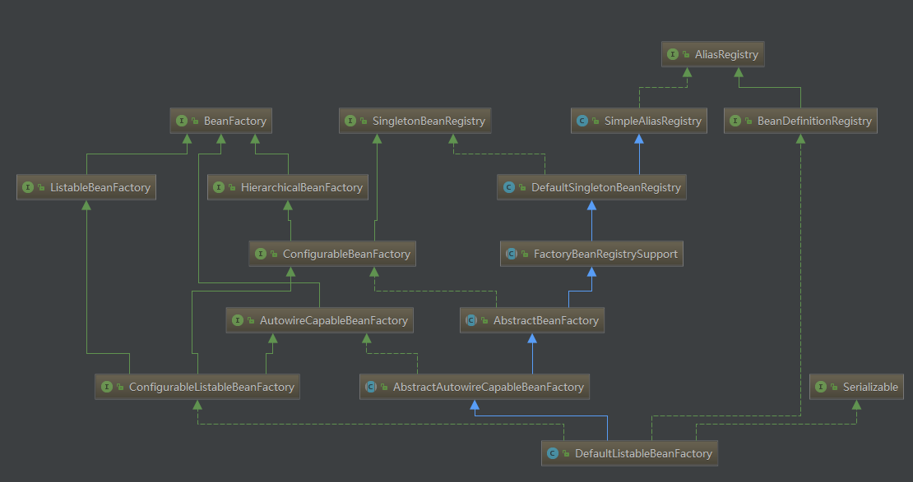
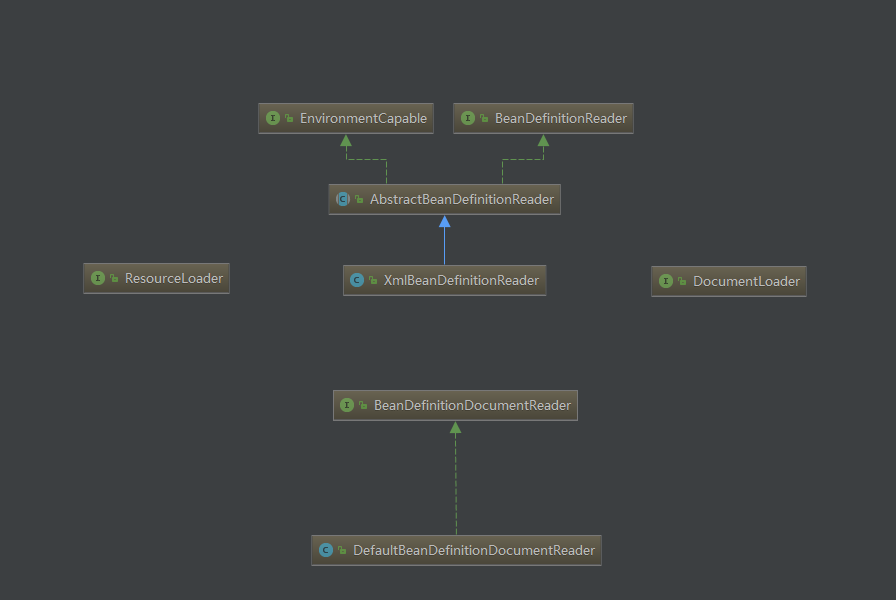
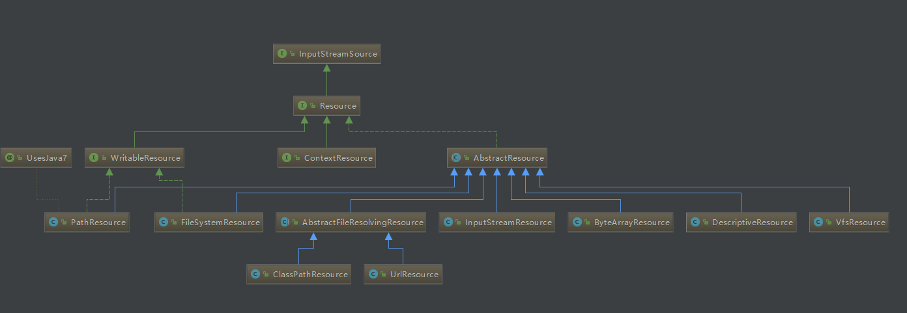
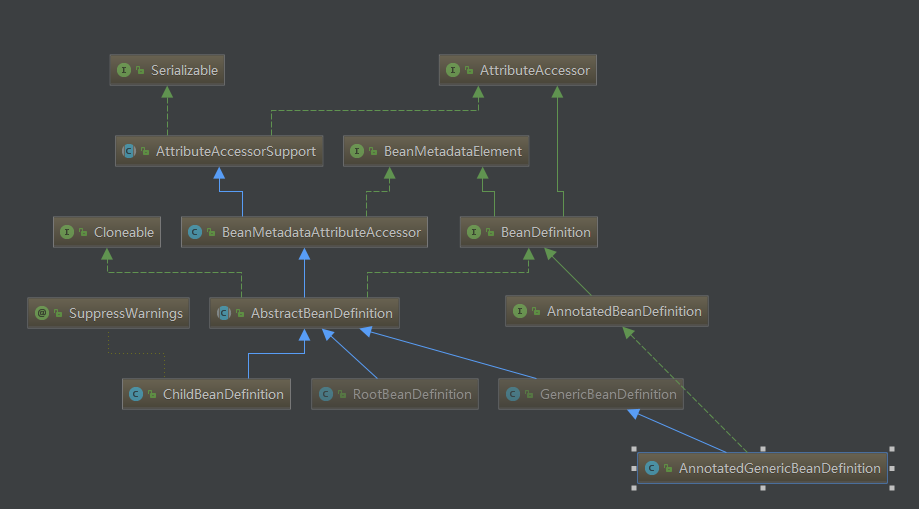

[TOC]

# Bean的创建、注册以及获取

**前言：**

1.Spring基于XML配置bean和基于编程式(@Bean)配置bean的创建前解析工作有点不一样，本文只会讲解基于编程式配置Bean的情况；

2.在展开bean的创建过程之前，先列举一下Spring的bean创建过程(其实不仅仅包括创建过程，还有注册、扩展等操作，下文简单称为bean创建过程)需要到的核心类。

## 准备阶段

先简单介绍一下Spring基于XML文件的bean创建过程中使用到的核心类，主要包括三个部分：

### 1.容器加载的相关类(BeanFactory体系)



下面逐层介绍一下上图BeanFactory体系中涉及到的所有接口和类：

* **AliasRegistry: **定义对alias(**别名**)的简单增删查等操作。

* **SimpleAliasRegistry: ** 主要使用map(**ConcurrentHashMap**)作为alias的缓存，并且实现AliasRegistry接口。

* **SingletonBeanRegistry: **定义对单例的注册和获取。

* **BeanFactory: ** 接口定义了基本的IoC容器的规范，如获取bean和获取判断bean全局范围类型等。

* **DefaultSingletonBeanRegistry: ** 对SingletonBeanRegistry接口的实现，里面有多个集合类型的容器用于判断或者存储单例bean或者用于bean创建过程时的各种判断(常听说的Spring单例缓存池就在这里)。

* **HierarchicalBeanFactory: ** 它主要是提供父 BeanFactory 的功能，通过它能够获取当前 BeanFactory 的父工厂（ PS: 若在 A 工厂启动并加载 Bean 之前， B 工厂先启动并加载了，那 B 就是 A 的父工厂），这样就能让当前的 BeanFactory 加载父工厂加载的 Bean 了(和命名一致，使得BeanFactory得到层次化的功能)。

* **ListableBeanFactory: **提供了列举 Bean 的功能，他能够列举当前 BeanFactory 加载的所有 Bean ：列举所有 Bean 的名字或者满足某种类型的 Bean 的名字，根据类型返回所有 Bean 对象等。

* **BeanDefinitionRegistry: ** 定义对BeanDefinition的注册、移除、查询等功能。

* **FactoryBeanRegistrySupport: ** 在DefaultSingletonBeanRegistry基础上增加了对FactoryBean的特殊处理功能。

* **ConfigurableBeanFactory: ** 提供了配置BeanFactory的多种方法，例如添加BeanClassLoader、设置ParentBeanFactory、添加BeanPostProcessor等等。

* **AbstractBeanFactory: ** 综合FactoryBeanRegistrySupport和ConfigurableBeanFactory的功能，有一点比较重要的是bean的大多数属性在这个BeanFactory里面缓存，例如PropertyEditor、BeanPostProcessor等。

* **AutowireCapableBeanFactory: ** 定义创建bean、bean自动注入、初始化bean(资源和属性)、应用bean的后处理器等方法。

* **AbstractAutowireCapableBeanFactory: ** 综合AbstractBeanFactory的功能并对AutowireCapableBeanFactory接口进行实现。

* **ConfigurableListableBeanFactory: **  提供了列举 Bean 的功能，添加指定忽略依赖、接口等。(继承自

  ListableBeanFactory, AutowireCapableBeanFactory, ConfigurableBeanFactory三个接口，得到它们的所有功能)。

* **DefaultListableBeanFactory : ** 整个体系最底层实现，综合了上面所有功能，主要是对Bean注册后的处理。一般来说，在一些钩子接口拿到的BeanFactory的实例通常都是DefaultListableBeanFactory 的实例。

其实DefaultListableBeanFactory还有一个子类XmlBeanFactory，这个类是XML加载Bean的基础，但是不知道什么原因这个类在Spring 3.1版本已经废弃，而且注释里面写了废物的原因是"in favor of DefaultListableBeanFactory"(为了支持DefaultListableBeanFactory)，具体原因不得而知，但是它仍然是Spring

XML配置Bean的加载入口(DEBUG的时候断点可以放在**this.reader.loadBeanDefinitions(resource)**)。

### 2.XML配置文件读取操作相关类



简述一下XML配置文件读取的大概步骤：

(1) 入口类是XmlBeanDefinitionReader，通过继承于AbstractBeanDefinitionReader中的方法通过ResourceLoader中的location把配置文件转化为Resource(Spring-core包的Resource)

(2) 通过DocumentLoader接口的实现类对Resource文件进行转换，将Resource转化为Document

(3)通过接口BeanDefinitionDocumentReader的实现类DefaultBeanDefinitionDocumentReader对

Document进行解析，Element的解析实际上是由BeanDefinitionParserDelegate完成的。

### 3.资源文件的类族



最主要是ClassPathResource，它的实现最底层依赖于class或者classLoader提供底层方法实现，用于加载类路径下的资源文件，作用是实现资源文件转换为InputStream。

### 4.BeanDefinition的类族



(1)BeanDefinition是bean定义的接口，定义了一些接口规范。

(2)AbstractBeanDefinition是bean定义的抽象类，主要是存放BeanDefinition的默认属性和公有属性，并且重写了重写了equals，hashCode，toString方法。

(3)RootBeanDefinition和ChildBeanDefinition，一个RootBeanDefinition定义表明它是一个可合并的bean definition，表示一个从配置源（XML，Java Config）中生成的BeanDefinition，ChildBeanDefinition是一种bean definition，它可以继承它父类的设置，即ChildBeanDefinition对RootBeanDefinition有一定的依赖关系，ChildBeanDefinition从父类RootBeanDefinition继承构造参数值，属性值并可以重写父类的方法，同时也可以增加新的属性或者方法。(类同于java类的继承关系)。若指定初始化方法，销毁方法或者静态工厂方法，　　ChildBeanDefinition将重写相应父类的设置，depends on，autowire mode，dependency check，sigleton，lazy init 一般由子类自行设定。

(4)GenericBeanDefinition是一站式的标准bean definition，除了具有指定类、可选的构造参数值和属性参数这些其它bean definition一样的特性外，它还具有通过parenetName属性来灵活设置parent bean definition，这个类在Spring2.5后可以直接取代RootBeanDefinition和ChildBeanDefinition的组合。

(5)AnnotatedGenericBeanDefinition，对应于**注解@Bean上的目标方法返回的目标对象或者内建注解@Component对应的目标类生成的目标对象**，继承于GenericBeanDefinition，实现了AnnotatedBeanDefinition接口，具备获取目标对象注解元信息的功能。

下面简单叙述一下BeanDefinition体系里面的一些接口和抽象类提供的重要方法：

AnnotatedBeanDefinition：提供获取注解元信息和方法元信息。

```java
public interface AnnotatedBeanDefinition extends BeanDefinition {

	/**
	 * Obtain the annotation metadata (as well as basic class metadata)
	 * for this bean definition's bean class.
	 * @return the annotation metadata object (never {@code null})
	 */
	AnnotationMetadata getMetadata();

	/**
	 * Obtain metadata for this bean definition's factory method, if any.
	 * @return the factory method metadata, or {@code null} if none
	 * @since 4.1.1
	 */
	MethodMetadata getFactoryMethodMetadata();

}
```

AttributeAccessor：定义了最基本的对成员属性的增删查改。

```java
public interface AttributeAccessor {

	void setAttribute(String name, Object value);

	Object getAttribute(String name);

	Object removeAttribute(String name);
	
	boolean hasAttribute(String name);

	String[] attributeNames();
}
```

BeanMetadataElement：定义了一个可以返回配置源的元信息的方法。

```java
public interface BeanMetadataElement {

	/**
	 * Return the configuration source {@code Object} for this metadata element
	 * (may be {@code null}).
	 */
	Object getSource();

}
```

抽象类AttributeAccessorSupport：实现了AttributeAccessor，把成员属性存放在一个叫attributes的LinkedHashMap中。

抽象类BeanMetadataAttributeAccessor：继承于AttributeAccessorSupport，作用有点像一个适配器，原来的添加成员属性是设置key-value，在这里适配为#addMetadataAttribute(BeanMetadataAttribute attribute)，同时提供了公有方法#setSource(Object source)。

BeanDefinitionHolder实现了BeanMetadataElement，同时，它的属性如下：

```java
    private final BeanDefinition beanDefinition;

	private final String beanName;

	private final String[] aliases;
```

这个类持有BeanDefinition对象，beanName以及bean的别名，在Spring内部，它用来临时保存BeanDefinition来传递BeanDefinition，作用就如命名那样，BeanDefinition的持有者。


## 刷新容器上下文(refreshContext)

Spring启动的一个最核心的操作就是刷新容器上下文，这个操作包括很多步骤，下面一一详细分析。

入口是SpringApplication里面的一个#refreshContext方法：

```java
private void refreshContext(ConfigurableApplicationContext context) {
		refresh(context);
		if (this.registerShutdownHook) {
			try {
				context.registerShutdownHook();
			}
			catch (AccessControlException ex) {
				// Not allowed in some environments.
			}
		}
	}
```

调用链的末端委托为AbstractApplicationContext的#refresh方法：

```java
public void refresh() throws BeansException, IllegalStateException {
		synchronized (this.startupShutdownMonitor) {
			// Prepare this context for refreshing.
			prepareRefresh();

			// Tell the subclass to refresh the internal bean factory.
			ConfigurableListableBeanFactory beanFactory = obtainFreshBeanFactory();

			// Prepare the bean factory for use in this context.
			prepareBeanFactory(beanFactory);

			try {
				// Allows post-processing of the bean factory in context subclasses.
				postProcessBeanFactory(beanFactory);

				// Invoke factory processors registered as beans in the context.
				invokeBeanFactoryPostProcessors(beanFactory);

				// Register bean processors that intercept bean creation.
				registerBeanPostProcessors(beanFactory);

				// Initialize message source for this context.
				initMessageSource();

				// Initialize event multicaster for this context.
				initApplicationEventMulticaster();

				// Initialize other special beans in specific context subclasses.
				onRefresh();

				// Check for listener beans and register them.
				registerListeners();

				// Instantiate all remaining (non-lazy-init) singletons.
				finishBeanFactoryInitialization(beanFactory);

				// Last step: publish corresponding event.
				finishRefresh();
			}

			catch (BeansException ex) {
				if (logger.isWarnEnabled()) {
					logger.warn("Exception encountered during context initialization - " +
							"cancelling refresh attempt: " + ex);
				}

				// Destroy already created singletons to avoid dangling resources.
				destroyBeans();

				// Reset 'active' flag.
				cancelRefresh(ex);

				// Propagate exception to caller.
				throw ex;
			}

			finally {
				// Reset common introspection caches in Spring's core, since we
				// might not ever need metadata for singleton beans anymore...
				resetCommonCaches();
			}
		}
	}
```

这个方法里面有十多个小的方法，看似简单，但是每个小方法里面都有一套极长的调用链，下面分小节详细讲解每个小方法的内容。

### prepareRefresh

AbstractApplicationContext#prepareRefresh：刷新上下文前的准备方法，主要是初始化资源文件的源和校验是否缺少必须的资源属性。

```java
    protected void prepareRefresh() {
		this.startupDate = System.currentTimeMillis();
		this.closed.set(false);
		this.active.set(true);

		if (logger.isInfoEnabled()) {
			logger.info("Refreshing " + this);
		}

		// Initialize any placeholder property sources in the context environment
		initPropertySources();

		// Validate that all properties marked as required are resolvable
		// see ConfigurablePropertyResolver#setRequiredProperties
		getEnvironment().validateRequiredProperties();

		// Allow for the collection of early ApplicationEvents,
		// to be published once the multicaster is available...
		this.earlyApplicationEvents = new LinkedHashSet<ApplicationEvent>();
	}
```

* 方法前面三行分别是记录启动时间戳，把closed设置为false，把active设置为true。

* initPropertySources：初始化资源属性源，主要是如果上下文中的Environment实例为Null的时候(**实际上肯定不会为Null，因为Environment实例已经在方法SpringApplication#prepareEnvironment中被创建，创建完成同时会把命令行参数和Profile参数添加进去MutablePropertySources**)构造ConfigurableEnvironment的实例StandardEnvironment，同时如果构造的ConfigurableEnvironment是ConfigurableWebEnvironment的实例，将会使用servletContext初始化资源属性源，详见StandardServletEnvironment#initPropertySources。

* validateRequiredProperties：校验必须的资源属性值，此方法最后委托给AbstractPropertyResolver#

  validateRequiredProperties，主要做requiredProperties的非空校验。

* 构建一个名为earlyApplicationEvents，元素类型为ApplicationEvent的LinkedHashSet，作用见它的注释描述：构造一个早期的ApplicationEvent集合用于**multicaster**(广播器)被激活时ApplicationEvent发布。

PS:实际上在Debug过程发现#initPropertySources和#validateRequiredProperties其实没有做任何事情。

### obtainFreshBeanFactory

AbstractApplicationContext#obtainFreshBeanFactory（**这个方法十分重要**），作用是获取新的BeanFactory。

```java
    protected ConfigurableListableBeanFactory obtainFreshBeanFactory() {
		refreshBeanFactory();
		ConfigurableListableBeanFactory beanFactory = getBeanFactory();
		if (logger.isDebugEnabled()) {
			logger.debug("Bean factory for " + getDisplayName() + ": " + beanFactory);
		}
		return beanFactory;
	}
```

首先我们一定要关注一个十分重要的类**GenericApplicationContext**，这个类的空入参构造就是生成一个新的**DefaultListableBeanFactory**，熟悉Spring体系的人必然知道DefaultListableBeanFactory这个类的重要性，obtainFreshBeanFactory方法如下，里面的#refreshBeanFactory和#getBeanFactory都是由GenericApplicationContext实现，refreshBeanFactory主要是把GenericApplicationContext中的#refreshBeanFactory使用cas把refreshed属性设置为true，并且为DefaultListableBeanFactory设置serializationId，#getBeanFactory就是返回新建的DefaultListableBeanFactory实例。

那么这里有一个比较大的疑惑，GenericApplicationContext的实例是什么时候创建的？答案见SpringBootServletInitializer的#createRootApplicationContext：

```java
   protected WebApplicationContext createRootApplicationContext(
			ServletContext servletContext) {
		SpringApplicationBuilder builder = createSpringApplicationBuilder();
		builder.main(getClass());
		ApplicationContext parent = getExistingRootWebApplicationContext(servletContext);
		if (parent != null) {
			this.logger.info("Root context already created (using as parent).");
			servletContext.setAttribute(
					WebApplicationContext.ROOT_WEB_APPLICATION_CONTEXT_ATTRIBUTE, null);
			builder.initializers(new ParentContextApplicationContextInitializer(parent));
		}
		builder.initializers(
				new ServletContextApplicationContextInitializer(servletContext));
		builder.listeners(new ServletContextApplicationListener(servletContext));
		builder.contextClass(AnnotationConfigEmbeddedWebApplicationContext.class);
		builder = configure(builder);
		SpringApplication application = builder.build();
		if (application.getSources().isEmpty() && AnnotationUtils
				.findAnnotation(getClass(), Configuration.class) != null) {
			application.getSources().add(getClass());
		}
		Assert.state(!application.getSources().isEmpty(),
				"No SpringApplication sources have been defined. Either override the "
						+ "configure method or add an @Configuration annotation");
		// Ensure error pages are registered
		if (this.registerErrorPageFilter) {
			application.getSources().add(ErrorPageFilterConfiguration.class);
		}
		return run(application);
	}
```

builder.contextClass(AnnotationConfigEmbeddedWebApplicationContext.class);这一行代码就是设置了当前应用的上下文的class，**AnnotationConfigEmbeddedWebApplicationContext**继承于EmbeddedWebApplicationContext，而EmbeddedWebApplicationContext继承于GenericApplicationContext，同时它具备了AnnotationConfigWebApplicationContext的功能，这个被强化的上下文类具备注解配置、嵌入式初始化启动、Web应用上下文等功能。这里仅仅是设置了context的class，真正被实例化在SpringApplication的#run( String... args)方法里面的**context = createApplicationContext( )**，九曲十八弯后终于弄清楚获取新的BeanFactory的详细过程。

### prepareBeanFactory

对上一步obtainFreshBeanFactory创建的BeanFactory进行一些准备操作。

```java
protected void prepareBeanFactory(ConfigurableListableBeanFactory beanFactory) {
		// Tell the internal bean factory to use the context's class loader etc.
		beanFactory.setBeanClassLoader(getClassLoader());
		beanFactory.setBeanExpressionResolver(new StandardBeanExpressionResolver(beanFactory.getBeanClassLoader()));
		beanFactory.addPropertyEditorRegistrar(new ResourceEditorRegistrar(this, getEnvironment()));

		// Configure the bean factory with context callbacks.
		beanFactory.addBeanPostProcessor(new ApplicationContextAwareProcessor(this));
		beanFactory.ignoreDependencyInterface(EnvironmentAware.class);
		beanFactory.ignoreDependencyInterface(EmbeddedValueResolverAware.class);
		beanFactory.ignoreDependencyInterface(ResourceLoaderAware.class);
		beanFactory.ignoreDependencyInterface(ApplicationEventPublisherAware.class);
		beanFactory.ignoreDependencyInterface(MessageSourceAware.class);
		beanFactory.ignoreDependencyInterface(ApplicationContextAware.class);

		// BeanFactory interface not registered as resolvable type in a plain factory.
		// MessageSource registered (and found for autowiring) as a bean.
		beanFactory.registerResolvableDependency(BeanFactory.class, beanFactory);
		beanFactory.registerResolvableDependency(ResourceLoader.class, this);
		beanFactory.registerResolvableDependency(ApplicationEventPublisher.class, this);
		beanFactory.registerResolvableDependency(ApplicationContext.class, this);

		// Register early post-processor for detecting inner beans as ApplicationListeners.
		beanFactory.addBeanPostProcessor(new ApplicationListenerDetector(this));

		// Detect a LoadTimeWeaver and prepare for weaving, if found.
		if (beanFactory.containsBean(LOAD_TIME_WEAVER_BEAN_NAME)) {
			beanFactory.addBeanPostProcessor(new LoadTimeWeaverAwareProcessor(beanFactory));
			// Set a temporary ClassLoader for type matching.
			beanFactory.setTempClassLoader(new ContextTypeMatchClassLoader(beanFactory.getBeanClassLoader()));
		}

		// Register default environment beans.
		if (!beanFactory.containsLocalBean(ENVIRONMENT_BEAN_NAME)) {
			beanFactory.registerSingleton(ENVIRONMENT_BEAN_NAME, getEnvironment());
		}
		if (!beanFactory.containsLocalBean(SYSTEM_PROPERTIES_BEAN_NAME)) {
			beanFactory.registerSingleton(SYSTEM_PROPERTIES_BEAN_NAME, getEnvironment().getSystemProperties());
		}
		if (!beanFactory.containsLocalBean(SYSTEM_ENVIRONMENT_BEAN_NAME)) {
			beanFactory.registerSingleton(SYSTEM_ENVIRONMENT_BEAN_NAME, getEnvironment().getSystemEnvironment());
		}
	}
```

主要做了下面几件事：

* 设置BeanClassLoader、BeanExpressionResolver(SPEL解析相关)，PropertyEditorRegistrar(PropertyEditor注册器)。
* 添加ApplicationContextAwareProcessor同时忽略所有Aware族接口。
* 注册几个可解析的依赖，包括BeanFactory、ResourceLoader、ApplicationEventPublisher、ApplicationContext，其实后面三者都是AnnotationConfigEmbeddedWebApplicationContext的实例。
* 添加一个BeanPostProcessor为ApplicationListenerDetector(ApplicationListener检测器)。
* 添加一个BeanPostProcessor为LoadTimeWeaverAwareProcessor(用于织入第三方模块，如AspectJ，目标类需要实现LoadTimeWeaverAware接口)，为BeanFactory添加一个ContextTypeMatchClassLoader，同时为ContextTypeMatchClassLoader添加ClassLoader。
* 剩下就是注册几个必须的单例，分别是ConfigurableEnvironment实例，SystemProperties实例(本质上是Map)和SystemEnvironment(本质上是Map)。

### postProcessBeanFactory

AbstractApplicationContext#postProcessBeanFactory、AbstractApplicationContext#invokeBeanFactoryPostProcessors、AbstractApplicationContextregisterBeanPostProcessors这三个方法是刷新Spring应用上下文的重要方法。AbstractApplicationContext#postProcessBeanFactory方法的详细内容见GenericWebApplicationContext#postProcessBeanFactory，依赖于前边创建的ConfigurableListableBeanFactory实例。

```java
protected void postProcessBeanFactory(ConfigurableListableBeanFactory beanFactory) {
		beanFactory.addBeanPostProcessor(new ServletContextAwareProcessor(this.servletContext));
		beanFactory.ignoreDependencyInterface(ServletContextAware.class);

		WebApplicationContextUtils.registerWebApplicationScopes(beanFactory, this.servletContext);
		WebApplicationContextUtils.registerEnvironmentBeans(beanFactory, this.servletContext);
	}
```

分析下大致过程：

* 添加一个BeanPostProcessor为ServletContextAwareProcessor，同时BeanFactory添加一个忽略的接口ServletContextAware。
* 方法registerWebApplicationScopes：注册和Web应用Scope相关的对象。

```java
public static void registerWebApplicationScopes(ConfigurableListableBeanFactory beanFactory, ServletContext sc) {
		beanFactory.registerScope(WebApplicationContext.SCOPE_REQUEST, new RequestScope());
		beanFactory.registerScope(WebApplicationContext.SCOPE_SESSION, new SessionScope(false));
		beanFactory.registerScope(WebApplicationContext.SCOPE_GLOBAL_SESSION, new SessionScope(true));
		if (sc != null) {
			ServletContextScope appScope = new ServletContextScope(sc);
			beanFactory.registerScope(WebApplicationContext.SCOPE_APPLICATION, appScope);
			// Register as ServletContext attribute, for ContextCleanupListener to detect it.
			sc.setAttribute(ServletContextScope.class.getName(), appScope);
		}

		beanFactory.registerResolvableDependency(ServletRequest.class, new RequestObjectFactory());
		beanFactory.registerResolvableDependency(ServletResponse.class, new ResponseObjectFactory());
		beanFactory.registerResolvableDependency(HttpSession.class, new SessionObjectFactory());
		beanFactory.registerResolvableDependency(WebRequest.class, new WebRequestObjectFactory());
		if (jsfPresent) {
			FacesDependencyRegistrar.registerFacesDependencies(beanFactory);
		}
	}
```

beanFactory#registerScope把Scope的实例注册并且存放在AbstractBeanFactory的一个属性名为scopes的LinkedHashMap里面，同时通过beanFactory#registerResolvableDependency注册几个基于ObjectFactory实例获取的接口的实例。#registerResolvableDependency的作用是注册那些依赖ObjectFactory 注入接口实例的对象，如果有疑问可以看下上面的几个类RequestObjectFactory、ResponseObjectFactory等等的用法。

* registerEnvironmentBeans方法主要是注册和Web应用上下文环境相关的单例Bean:

```java
public static void registerEnvironmentBeans(
			ConfigurableListableBeanFactory bf, ServletContext servletContext, ServletConfig servletConfig) {

		if (servletContext != null && !bf.containsBean(WebApplicationContext.SERVLET_CONTEXT_BEAN_NAME)) {
			bf.registerSingleton(WebApplicationContext.SERVLET_CONTEXT_BEAN_NAME, servletContext);
		}

		if (servletConfig != null && !bf.containsBean(ConfigurableWebApplicationContext.SERVLET_CONFIG_BEAN_NAME)) {
			bf.registerSingleton(ConfigurableWebApplicationContext.SERVLET_CONFIG_BEAN_NAME, servletConfig);
		}

		if (!bf.containsBean(WebApplicationContext.CONTEXT_PARAMETERS_BEAN_NAME)) {
			Map<String, String> parameterMap = new HashMap<String, String>();
			if (servletContext != null) {
				Enumeration<?> paramNameEnum = servletContext.getInitParameterNames();
				while (paramNameEnum.hasMoreElements()) {
					String paramName = (String) paramNameEnum.nextElement();
					parameterMap.put(paramName, servletContext.getInitParameter(paramName));
				}
			}
			if (servletConfig != null) {
				Enumeration<?> paramNameEnum = servletConfig.getInitParameterNames();
				while (paramNameEnum.hasMoreElements()) {
					String paramName = (String) paramNameEnum.nextElement();
					parameterMap.put(paramName, servletConfig.getInitParameter(paramName));
				}
			}
			bf.registerSingleton(WebApplicationContext.CONTEXT_PARAMETERS_BEAN_NAME,
					Collections.unmodifiableMap(parameterMap));
		}

		if (!bf.containsBean(WebApplicationContext.CONTEXT_ATTRIBUTES_BEAN_NAME)) {
			Map<String, Object> attributeMap = new HashMap<String, Object>();
			if (servletContext != null) {
				Enumeration<?> attrNameEnum = servletContext.getAttributeNames();
				while (attrNameEnum.hasMoreElements()) {
					String attrName = (String) attrNameEnum.nextElement();
					attributeMap.put(attrName, servletContext.getAttribute(attrName));
				}
			}
			bf.registerSingleton(WebApplicationContext.CONTEXT_ATTRIBUTES_BEAN_NAME,
					Collections.unmodifiableMap(attributeMap));
		}
	}
```

这几个Bean的命名存放在WebApplicationContext接口的常量，实际上这些对象大多是集合类对象，注册操作有点类似Environment的实例注册。

### invokeBeanFactoryPostProcessors

AbstractApplicationContext#invokeBeanFactoryPostProcessors，实现和处理内建的BeanFactoryPostProcessor接口的实例。一般，我们要获取指定的ClassPath下的所有类，必须要扫描指定包下面的所有类，而扫描指定包下的所有类这个动作是由AbstractApplicationContext#invokeBeanFactoryPostProcessors的深层调用链触发的，因此这个步骤在整个上下文刷新的操作中是十分重要的。

```java
protected void invokeBeanFactoryPostProcessors(ConfigurableListableBeanFactory beanFactory) {
		PostProcessorRegistrationDelegate.invokeBeanFactoryPostProcessors(beanFactory, getBeanFactoryPostProcessors());

		// Detect a LoadTimeWeaver and prepare for weaving, if found in the meantime
		// (e.g. through an @Bean method registered by ConfigurationClassPostProcessor)
		if (beanFactory.getTempClassLoader() == null && beanFactory.containsBean(LOAD_TIME_WEAVER_BEAN_NAME)) {
			beanFactory.addBeanPostProcessor(new LoadTimeWeaverAwareProcessor(beanFactory));
			beanFactory.setTempClassLoader(new ContextTypeMatchClassLoader(beanFactory.getBeanClassLoader()));
		}
}
```

核心处理逻辑委托给PostProcessorRegistrationDelegate，这个类作用就是PostProcessor的注册，是一个委托(实际上Java里面不存在委托，委托也并不是设计模式，Spring里面使用的是"委托"的语义，而且多处用到)工具类。这个类主要处理两类PostProcessor接口的实例：BeanFactoryPostProcessor和BeanDefinitionRegistryPostProcessor。首先要了解BeanDefinitionRegistryPostProcessor这个接口的实例可以实现传递形式的注册，举个例子，A、B同时实现了BeanDefinitionRegistryPostProcessor，A被激活，执行BeanDefinitionRegistryPostProcessor的目标方法的时候可以把B进行注册，然后一直传递下去。

讲解这个方法之前还要补充一个前面提到但是没有深入探讨的重点：

SpringApplication#createApplicationContext创建ApplicationContext时(实际上是创建**AnnotationConfigWebApplicationContext**或者**AnnotationConfigEmbeddedWebApplicationContext**)的时候，都会以构造方式或者getter方式创建一个**AnnotatedBeanDefinitionReader**实例和一个**ClassPathBeanDefinitionScanner**，其中ClassPathBeanDefinitionScanner就是Bean定义的扫描器，用于扫描ClassPath中的主要是符合内部注册的注解的BeanDefinition生成一个Set&lt;BeanDefinitionHolder&gt;；而AnnotatedBeanDefinitionReader的实例化做了一件极度重要的事：

调用了AnnotationConfigUtils#registerAnnotationConfigProcessors(BeanDefinitionRegistry registry,Object source)，下面看下这个方法做了什么:

```java
public static Set<BeanDefinitionHolder> registerAnnotationConfigProcessors(
			BeanDefinitionRegistry registry, Object source) {

		DefaultListableBeanFactory beanFactory = unwrapDefaultListableBeanFactory(registry);
		if (beanFactory != null) {
			if (!(beanFactory.getDependencyComparator() instanceof AnnotationAwareOrderComparator)) {
				beanFactory.setDependencyComparator(AnnotationAwareOrderComparator.INSTANCE);
			}
			if (!(beanFactory.getAutowireCandidateResolver() instanceof ContextAnnotationAutowireCandidateResolver)) {
				beanFactory.setAutowireCandidateResolver(new ContextAnnotationAutowireCandidateResolver());
			}
		}

		Set<BeanDefinitionHolder> beanDefs = new LinkedHashSet<BeanDefinitionHolder>(4);

		if (!registry.containsBeanDefinition(CONFIGURATION_ANNOTATION_PROCESSOR_BEAN_NAME)) {
			RootBeanDefinition def = new RootBeanDefinition(ConfigurationClassPostProcessor.class);
			def.setSource(source);
			beanDefs.add(registerPostProcessor(registry, def, CONFIGURATION_ANNOTATION_PROCESSOR_BEAN_NAME));
		}

		if (!registry.containsBeanDefinition(AUTOWIRED_ANNOTATION_PROCESSOR_BEAN_NAME)) {
			RootBeanDefinition def = new RootBeanDefinition(AutowiredAnnotationBeanPostProcessor.class);
			def.setSource(source);
			beanDefs.add(registerPostProcessor(registry, def, AUTOWIRED_ANNOTATION_PROCESSOR_BEAN_NAME));
		}

		if (!registry.containsBeanDefinition(REQUIRED_ANNOTATION_PROCESSOR_BEAN_NAME)) {
			RootBeanDefinition def = new RootBeanDefinition(RequiredAnnotationBeanPostProcessor.class);
			def.setSource(source);
			beanDefs.add(registerPostProcessor(registry, def, REQUIRED_ANNOTATION_PROCESSOR_BEAN_NAME));
		}

		// Check for JSR-250 support, and if present add the CommonAnnotationBeanPostProcessor.
		if (jsr250Present && !registry.containsBeanDefinition(COMMON_ANNOTATION_PROCESSOR_BEAN_NAME)) {
			RootBeanDefinition def = new RootBeanDefinition(CommonAnnotationBeanPostProcessor.class);
			def.setSource(source);
			beanDefs.add(registerPostProcessor(registry, def, COMMON_ANNOTATION_PROCESSOR_BEAN_NAME));
		}

		// Check for JPA support, and if present add the PersistenceAnnotationBeanPostProcessor.
		if (jpaPresent && !registry.containsBeanDefinition(PERSISTENCE_ANNOTATION_PROCESSOR_BEAN_NAME)) {
			RootBeanDefinition def = new RootBeanDefinition();
			try {
				def.setBeanClass(ClassUtils.forName(PERSISTENCE_ANNOTATION_PROCESSOR_CLASS_NAME,
						AnnotationConfigUtils.class.getClassLoader()));
			}
			catch (ClassNotFoundException ex) {
				throw new IllegalStateException(
						"Cannot load optional framework class: " + PERSISTENCE_ANNOTATION_PROCESSOR_CLASS_NAME, ex);
			}
			def.setSource(source);
			beanDefs.add(registerPostProcessor(registry, def, PERSISTENCE_ANNOTATION_PROCESSOR_BEAN_NAME));
		}

		if (!registry.containsBeanDefinition(EVENT_LISTENER_PROCESSOR_BEAN_NAME)) {
			RootBeanDefinition def = new RootBeanDefinition(EventListenerMethodProcessor.class);
			def.setSource(source);
			beanDefs.add(registerPostProcessor(registry, def, EVENT_LISTENER_PROCESSOR_BEAN_NAME));
		}
		if (!registry.containsBeanDefinition(EVENT_LISTENER_FACTORY_BEAN_NAME)) {
			RootBeanDefinition def = new RootBeanDefinition(DefaultEventListenerFactory.class);
			def.setSource(source);
			beanDefs.add(registerPostProcessor(registry, def, EVENT_LISTENER_FACTORY_BEAN_NAME));
		}

		return beanDefs;
	}
```

* 设置BeanFactory的依赖比较器，如果持有的依赖比较器不是AnnotationAwareOrderComparator的实例，则设置为AnnotationAwareOrderComparator的实例。

* 设置BeanFactory自动注入候选者处理器，这个处理器是ContextAnnotationAutowireCandidateResolver的实例，而ContextAnnotationAutowireCandidateResolver继承于QualifierAnnotationAutowireCandidateResolver，由名字可以看出功能，没有深入研究。

* 注册ConfigurationClassPostProcessor，这个BeanDefinitionRegistryPostProcessor的实例就是用于@Configuration的Java配置类的解析，可以说，这个类就是BeanDefinition加载、解析的核心，后面将会用专门的章节解释这个PostProcessor的功能，注意它的BeanName为**org.springframework.context.annotation.internalConfigurationAnnotationProcessor**。

* 注册AutowiredAnnotationBeanPostProcessor，这个BeanPostProcessor和@Autowired、@Value、@Lookup注解的自动注入(构造注入、setter注入、属性注入)功能相关，由此看来这个也是一个十分重要的类，注意它的BeanName为

  **org.springframework.context.annotation.internalAutowiredAnnotationProcessor**。

* 注册RequiredAnnotationBeanPostProcessor，这个BeanPostProcessor和@Required的处理逻辑相关，

  注意它的BeanName为**org.springframework.context.annotation.internalRequiredAnnotationProcessor**。

* 如果支持JSR-250同时BeanFactory中不存在已注册的实例，注册CommonAnnotationBeanPostProcessor，这个BeanPostProcessor主要为@PostConstruct、@PreDestroy、@Resource等注解的处理逻辑提供支持。

* 如果支持JPA，注册org.springframework.orm.jpa.support.PersistenceAnnotationBeanPostProcessor。

* 如果BeanFactory中不存在EventListenerMethodProcessor的Bean定义，则注册。

* 如果BeanFactory中不存在DefaultEventListenerFactory的Bean定义，则注册。

**PS:明确上边注册这一堆的PostProcessor中，只有ConfigurationClassPostProcessor是BeanDefinitionRegistryPostProcessor的实现，其他的都是BeanPostProcessor。**

分析完上面的过程，现在回到PostProcessorRegistrationDelegate这个工具类的逻辑：

```java
PostProcessorRegistrationDelegate.invokeBeanFactoryPostProcessors(beanFactory, getBeanFactoryPostProcessors());
```

下面重点看这个比较长的方法#invokeBeanFactoryPostProcessors:

```java
public static void invokeBeanFactoryPostProcessors(
			ConfigurableListableBeanFactory beanFactory, List<BeanFactoryPostProcessor> beanFactoryPostProcessors) {

		// Invoke BeanDefinitionRegistryPostProcessors first, if any.
		Set<String> processedBeans = new HashSet<String>();

		if (beanFactory instanceof BeanDefinitionRegistry) {
			BeanDefinitionRegistry registry = (BeanDefinitionRegistry) beanFactory;
			List<BeanFactoryPostProcessor> regularPostProcessors = new LinkedList<BeanFactoryPostProcessor>();
			List<BeanDefinitionRegistryPostProcessor> registryPostProcessors =
					new LinkedList<BeanDefinitionRegistryPostProcessor>();

			for (BeanFactoryPostProcessor postProcessor : beanFactoryPostProcessors) {
				if (postProcessor instanceof BeanDefinitionRegistryPostProcessor) {
					BeanDefinitionRegistryPostProcessor registryPostProcessor =
							(BeanDefinitionRegistryPostProcessor) postProcessor;
					registryPostProcessor.postProcessBeanDefinitionRegistry(registry);
					registryPostProcessors.add(registryPostProcessor);
				}
				else {
					regularPostProcessors.add(postProcessor);
				}
			}

			// Do not initialize FactoryBeans here: We need to leave all regular beans
			// uninitialized to let the bean factory post-processors apply to them!
			// Separate between BeanDefinitionRegistryPostProcessors that implement
			// PriorityOrdered, Ordered, and the rest.
			String[] postProcessorNames =
					beanFactory.getBeanNamesForType(BeanDefinitionRegistryPostProcessor.class, true, false);

			// First, invoke the BeanDefinitionRegistryPostProcessors that implement PriorityOrdered.
			List<BeanDefinitionRegistryPostProcessor> priorityOrderedPostProcessors = new ArrayList<BeanDefinitionRegistryPostProcessor>();
			for (String ppName : postProcessorNames) {
				if (beanFactory.isTypeMatch(ppName, PriorityOrdered.class)) {
					priorityOrderedPostProcessors.add(beanFactory.getBean(ppName, BeanDefinitionRegistryPostProcessor.class));
					processedBeans.add(ppName);
				}
			}
			sortPostProcessors(beanFactory, priorityOrderedPostProcessors);
			registryPostProcessors.addAll(priorityOrderedPostProcessors);
			invokeBeanDefinitionRegistryPostProcessors(priorityOrderedPostProcessors, registry);

			// Next, invoke the BeanDefinitionRegistryPostProcessors that implement Ordered.
			postProcessorNames = beanFactory.getBeanNamesForType(BeanDefinitionRegistryPostProcessor.class, true, false);
			List<BeanDefinitionRegistryPostProcessor> orderedPostProcessors = new ArrayList<BeanDefinitionRegistryPostProcessor>();
			for (String ppName : postProcessorNames) {
				if (!processedBeans.contains(ppName) && beanFactory.isTypeMatch(ppName, Ordered.class)) {
					orderedPostProcessors.add(beanFactory.getBean(ppName, BeanDefinitionRegistryPostProcessor.class));
					processedBeans.add(ppName);
				}
			}
			sortPostProcessors(beanFactory, orderedPostProcessors);
			registryPostProcessors.addAll(orderedPostProcessors);
			invokeBeanDefinitionRegistryPostProcessors(orderedPostProcessors, registry);

			// Finally, invoke all other BeanDefinitionRegistryPostProcessors until no further ones appear.
			boolean reiterate = true;
			while (reiterate) {
				reiterate = false;
				postProcessorNames = beanFactory.getBeanNamesForType(BeanDefinitionRegistryPostProcessor.class, true, false);
				for (String ppName : postProcessorNames) {
					if (!processedBeans.contains(ppName)) {
						BeanDefinitionRegistryPostProcessor pp = beanFactory.getBean(ppName, BeanDefinitionRegistryPostProcessor.class);
						registryPostProcessors.add(pp);
						processedBeans.add(ppName);
						pp.postProcessBeanDefinitionRegistry(registry);
						reiterate = true;
					}
				}
			}

			// Now, invoke the postProcessBeanFactory callback of all processors handled so far.
			invokeBeanFactoryPostProcessors(registryPostProcessors, beanFactory);
			invokeBeanFactoryPostProcessors(regularPostProcessors, beanFactory);
		}

		else {
			// Invoke factory processors registered with the context instance.
			invokeBeanFactoryPostProcessors(beanFactoryPostProcessors, beanFactory);
		}

		// Do not initialize FactoryBeans here: We need to leave all regular beans
		// uninitialized to let the bean factory post-processors apply to them!
		String[] postProcessorNames =
				beanFactory.getBeanNamesForType(BeanFactoryPostProcessor.class, true, false);

		// Separate between BeanFactoryPostProcessors that implement PriorityOrdered,
		// Ordered, and the rest.
		List<BeanFactoryPostProcessor> priorityOrderedPostProcessors = new ArrayList<BeanFactoryPostProcessor>();
		List<String> orderedPostProcessorNames = new ArrayList<String>();
		List<String> nonOrderedPostProcessorNames = new ArrayList<String>();
		for (String ppName : postProcessorNames) {
			if (processedBeans.contains(ppName)) {
				// skip - already processed in first phase above
			}
			else if (beanFactory.isTypeMatch(ppName, PriorityOrdered.class)) {
				priorityOrderedPostProcessors.add(beanFactory.getBean(ppName, BeanFactoryPostProcessor.class));
			}
			else if (beanFactory.isTypeMatch(ppName, Ordered.class)) {
				orderedPostProcessorNames.add(ppName);
			}
			else {
				nonOrderedPostProcessorNames.add(ppName);
			}
		}

		// First, invoke the BeanFactoryPostProcessors that implement PriorityOrdered.
		sortPostProcessors(beanFactory, priorityOrderedPostProcessors);
		invokeBeanFactoryPostProcessors(priorityOrderedPostProcessors, beanFactory);

		// Next, invoke the BeanFactoryPostProcessors that implement Ordered.
		List<BeanFactoryPostProcessor> orderedPostProcessors = new ArrayList<BeanFactoryPostProcessor>();
		for (String postProcessorName : orderedPostProcessorNames) {
			orderedPostProcessors.add(beanFactory.getBean(postProcessorName, BeanFactoryPostProcessor.class));
		}
		sortPostProcessors(beanFactory, orderedPostProcessors);
		invokeBeanFactoryPostProcessors(orderedPostProcessors, beanFactory);

		// Finally, invoke all other BeanFactoryPostProcessors.
		List<BeanFactoryPostProcessor> nonOrderedPostProcessors = new ArrayList<BeanFactoryPostProcessor>();
		for (String postProcessorName : nonOrderedPostProcessorNames) {
			nonOrderedPostProcessors.add(beanFactory.getBean(postProcessorName, BeanFactoryPostProcessor.class));
		}
		invokeBeanFactoryPostProcessors(nonOrderedPostProcessors, beanFactory);

		// Clear cached merged bean definitions since the post-processors might have
		// modified the original metadata, e.g. replacing placeholders in values...
		beanFactory.clearMetadataCache();
	}
```

PostProcessorRegistrationDelegate的invokeBeanFactoryPostProcessors中的List&lt;BeanFactoryPostProcessor&gt; beanFactoryPostProcessors默认有三个内建的BeanFactoryPostProcessor，通过DEBUG可以追踪到通过AbstractApplicationContext#addBeanFactoryPostProcessor添加，添加的来源分别是：

ConfigFileApplicationListener#addPostProcessors，添加PropertySourceOrderingPostProcessor。
ConfigurationWarningsApplicationContextInitializer#initialize，添加ConfigurationWarningsPostProcessor。
SharedMetadataReaderFactoryContextInitializer#initialize，添加CachingMetadataReaderFactoryPostProcessor。

* 创建一个命名为processedBeans的HashSet用于过滤下面步骤获取到beanFactory中对应接口的Bean。


* 当入参beanFactory是BeanDefinitionRegistry的实现，一般是DefaultListableBeanFactory，将会走if分支，而非BeanDefinitionRegistry实现，则直接调用#invokeBeanFactoryPostProcessors。
* 进入if分支，先遍历传进来的三个PostProcessor，其中BeanFactoryPostProcessor和BeanDefinitionRegistryPostProcessor分开存放，BeanFactoryPostProcessor放在**regularPostProcessors**这个LinkedList中，BeanDefinitionRegistryPostProcessor放在**registryPostProcessors**这个LinkedList中，在添加BeanDefinitionRegistryPostProcessor提前调用了其**#postProcessBeanDefinitionRegistry**。
* 获取beanFactory中已注册的BeanDefinitionRegistryPostProcessor接口的所有实例，过滤出所有实现了**PriorityOrdered**接口的目标实例集合，过滤过程中命中的实例BeanName放进去**processedBeans**，把这些实例添加到**registryPostProcessors**，排序后遍历目标实例集合中所有实例调用其**#postProcessBeanDefinitionRegistry**。     **[(1) ---- 这里标记一下:第一次调用所有BeanDefinitionRegistryPostProcessor接口的所有Bean实例的#postProcessBeanDefinitionRegistry]**
* 获取beanFactory中已注册的BeanDefinitionRegistryPostProcessor接口的所有实例，过滤出所有实现了**Ordered**接口的目标实例集合，过滤过程中命中的实例BeanName放进去**processedBeans**，把这些实例添加到**registryPostProcessors**，排序后遍历目标实例集合中所有实例调用其**#postProcessBeanDefinitionRegistry**。  **[(2) ---- 这里标记一下:第二次调用所有BeanDefinitionRegistryPostProcessor接口的所有Bean实例的#postProcessBeanDefinitionRegistry]**
* beanFactory中已注册的BeanDefinitionRegistryPostProcessor接口的所有实例，通过processedBeans校对是否有漏网之鱼，如果遗漏了(**主要是没有实现排序接口的实现**)，命中的实例BeanName放进去**processedBeans**，把实例添加到**registryPostProcessors**，调用其**#postProcessBeanDefinitionRegistry**。  **[(3) ---- 这里标记一下:第三次调用所有BeanDefinitionRegistryPostProcessor接口的所有Bean实例的#postProcessBeanDefinitionRegistry]**
* 通过#invokeBeanFactoryPostProcessors遍历调用**registryPostProcessors**中所有实例的**#postProcessBeanFactory**。
* 通过#invokeBeanFactoryPostProcessors遍历调用**regularPostProcessors**中所有实例的**#postProcessBeanFactory**。
* 获取beanFactory中已注册的BeanFactoryPostProcessor接口的所有实例，通过**processedBeans**过滤掉已经处理过的Bean，把遗漏的重新又再划分成三种实现了PriorityOrdered、实现了Ordered、没有排序的，前两种获取到的实例集合需要进行排序，如果需要排序，排序完后遍历所有实例分别通过#invokeBeanFactoryPostProcessors调用#postProcessBeanFactory。
* 调用beanFactory#clearMetadataCache，清理缓存。

**PS:这里得出如下的规律:**

* (1)内建的postProcessBeanDefinitionRegistry先于外部实现的postProcessBeanDefinitionRegistry执行。
* (2)postProcessBeanDefinitionRegistry先于postProcessBeanFactory执行。
* (3)上面分析有三处标记，第一处标记命中的BeanDefinitionRegistryPostProcessor的实例有且仅有**ConfigurationClassPostProcessor**这个Bean(**这些实例必须同时实现PriorityOrdered和BeanDefinitionRegistryPostProcessor两个接口**)，ConfigurationClassPostProcessor执行完#postProcessBeanDefinitionRegistry，使得所有编程式配置的Bean都注册完毕，这个时候执行第二处标记处的获取所有BeanDefinitionRegistryPostProcessor的实例就能获取到外部自定义的所有的BeanDefinitionRegistryPostProcessor实例(**这些实例必须同时实现Ordered和BeanDefinitionRegistryPostProcessor两个接口**)并且调用其#postProcessBeanDefinitionRegistry，然后的第三处标记主要是遗漏的检查，获取所有没有实现排序接口的BeanDefinitionRegistryPostProcessor实例调用其postProcessBeanDefinitionRegistry(**一般来说外部自定义的BeanDefinitionRegistryPostProcessor[没有实现排序接口]就是在第三处标记的时候执行#postProcessBeanDefinitionRegistry**，最常见的如Mybatis中的MapperScannerConfigurer)。
* (4)所有的BeanDefinitionRegistryPostProcessor实例都处理完毕后，接着处理BeanFactoryPostProcessor的实例，处理过程和(3)一致。

到此，PostProcessorRegistrationDelegate#invokeBeanFactoryPostProcessors方法已经分析完毕，接下来就必须分析命中第一处标记的**ConfigurationClassPostProcessor**执行#postProcessBeanDefinitionRegistry到底做了什么事情。

### [重点]Spring编程式配置解析的核心--ConfigurationClassPostProcessor

ConfigurationClassPostProcessor在Spring中主要负责所有@Configuration配置类的解析工作，这里首先要明确一点，Spring扫描Bean组件的识别注解是@Component，常见的注解如@Configuration、@Service、@Repository、@Controller、@ControllerAdive等注解里面都带有@Component注解，其实@Component也是可以单独使用的。ConfigurationClassPostProcessor是一个BeanDefinitionRegistryPostProcessor的实例，那么它的核心逻辑就在#postProcessBeanDefinitionRegistry和#postProcessBeanFactory。先看**ConfigurationClassPostProcessor#postProcessBeanDefinitionRegistry:**

```java
public void postProcessBeanDefinitionRegistry(BeanDefinitionRegistry registry) {
		int registryId = System.identityHashCode(registry);
		if (this.registriesPostProcessed.contains(registryId)) {
			throw new IllegalStateException(
					"postProcessBeanDefinitionRegistry already called on this post-processor against " + registry);
		}
		if (this.factoriesPostProcessed.contains(registryId)) {
			throw new IllegalStateException(
					"postProcessBeanFactory already called on this post-processor against " + registry);
		}
		this.registriesPostProcessed.add(registryId);

		processConfigBeanDefinitions(registry);
	}
```

* 先通过BeanDefinitionRegistry实例生成identityHashCode，用来判断是否重复执行#postProcessBeanDefinitionRegistry或者#postProcessBeanFactory，如果重复执行了直接抛出异常，如果没有则把identityHashCode添加进去registriesPostProcessed这个HashSet中。

进入ConfigurationClassPostProcessor#processConfigBeanDefinitions，这个方法比较长，下面一步一步分析:

```java
public void processConfigBeanDefinitions(BeanDefinitionRegistry registry) {
		List<BeanDefinitionHolder> configCandidates = new ArrayList<BeanDefinitionHolder>();
		String[] candidateNames = registry.getBeanDefinitionNames();

		for (String beanName : candidateNames) {
			BeanDefinition beanDef = registry.getBeanDefinition(beanName);
			if (ConfigurationClassUtils.isFullConfigurationClass(beanDef) ||
					ConfigurationClassUtils.isLiteConfigurationClass(beanDef)) {
				if (logger.isDebugEnabled()) {
					logger.debug("Bean definition has already been processed as a configuration class: " + beanDef);
				}
			}
			else if (ConfigurationClassUtils.checkConfigurationClassCandidate(beanDef, this.metadataReaderFactory)) {
				configCandidates.add(new BeanDefinitionHolder(beanDef, beanName));
			}
		}

		// Return immediately if no @Configuration classes were found
		if (configCandidates.isEmpty()) {
			return;
		}

		// Sort by previously determined @Order value, if applicable
		Collections.sort(configCandidates, new Comparator<BeanDefinitionHolder>() {
			@Override
			public int compare(BeanDefinitionHolder bd1, BeanDefinitionHolder bd2) {
				int i1 = ConfigurationClassUtils.getOrder(bd1.getBeanDefinition());
				int i2 = ConfigurationClassUtils.getOrder(bd2.getBeanDefinition());
				return (i1 < i2) ? -1 : (i1 > i2) ? 1 : 0;
			}
		});

		// Detect any custom bean name generation strategy supplied through the enclosing application context
		SingletonBeanRegistry sbr = null;
		if (registry instanceof SingletonBeanRegistry) {
			sbr = (SingletonBeanRegistry) registry;
			if (!this.localBeanNameGeneratorSet && sbr.containsSingleton(CONFIGURATION_BEAN_NAME_GENERATOR)) {
				BeanNameGenerator generator = (BeanNameGenerator) sbr.getSingleton(CONFIGURATION_BEAN_NAME_GENERATOR);
				this.componentScanBeanNameGenerator = generator;
				this.importBeanNameGenerator = generator;
			}
		}
  .....
	}
```

* 建立一个命名为configCandidates目标类型为BeanDefinitionHolder的ArrayList，用于存放将会被解析的目标类(带有@Configuration)，先从BeanDefinitionRegistry实例(DefaultConfigurableBeanFactory)中获取所有已经注册的Bean，通过ConfigurationClassUtils#isFullConfigurationClass和ConfigurationClassUtils#isLiteConfigurationClass判断是否已经处理过该Configuration类，如果处理过，则打印debug日志，否则通过ConfigurationClassUtils#checkConfigurationClassCandidate判断目标Bean定义是否Configuration类的候选者，如果是则加入到configCandidates中，如果configCandidates方法终止。

这里有必要详细讲解一下ConfigurationClassUtils里面几个工具类的判断规则：

* ConfigurationClassUtils#checkConfigurationClassCandidate，判断目标Bean定义的接口类型，获取其元注解信息，通过#isFullConfigurationCandidate(是否使用了@Configuration注解)判断是否**"full"**类型，如果是则Bean定义中setAttribute，key是ConfigurationClassPostProcessor全类名+ ".configurationClass"，value是"full"，否则通过#isLiteConfigurationCandidate(目标Bean如果是接口返回false，如果带有注解@Component、@ComponentScan、@Import、@ImportResource或者其方法中出现@Bean，则返回true)判断是否**lite**类型，如果是则Bean定义中setAttribute，key是ConfigurationClassPostProcessor全类名+ ".configurationClass"，value是"lite"，否则返回false，最后再判断是否有@Ordedr注解，有则Bean定义中setAttribute，key是ConfigurationClassPostProcessor全类名+ ".order"，value是@Ordedr的value()。
* ConfigurationClassUtils#isFullConfigurationClas就是判断Bean定义中的key为ConfigurationClassPostProcessor全类名+ ".configurationClass"的属性是否为"full"，若是则返回true，否则返回false。
* ConfigurationClassUtils#isLiteConfigurationClass就是判断Bean定义中的key为ConfigurationClassPostProcessor全类名+ ".configurationClass"的属性是否为"lite"，若是则返回true，否则返回false。

看起来有点简陋的做法，但是起到了很好的过滤作用。

* 经过上面的一些判断规则，一般来说(就笔者debug多次来看)，configCandidates里面只会有一个元素，这个元素就是启动类的BeanDefinitionHolder实例(主函数是什么时候注册进去BeanFactory？这个操作可以看下SpringApplication#prepareContext，这里不详细展开)，一般来说，我们使用@SpringBootApplication注解标注启动类，很明显@SpringBootApplication里面就带有了@Configuration，没错它就是一个配置类。
* 接下去是configCandidates元素排序(实际上只有一个元素，其实排序并没有什么作用)，注册BeanNameGenerator。
* 接下来就是关键步骤，Spring源码的注释是Parse each @Configuration class(解析每个标注了@Configuration的类)：

```java
	......... //processConfigBeanDefinitions的剩余源码
	// Parse each @Configuration class
		ConfigurationClassParser parser = new ConfigurationClassParser(
				this.metadataReaderFactory, this.problemReporter, this.environment,
				this.resourceLoader, this.componentScanBeanNameGenerator, registry);

		Set<BeanDefinitionHolder> candidates = new LinkedHashSet<BeanDefinitionHolder>(configCandidates);
		Set<ConfigurationClass> alreadyParsed = new HashSet<ConfigurationClass>(configCandidates.size());
		do {
			parser.parse(candidates);
			parser.validate();

			Set<ConfigurationClass> configClasses = new LinkedHashSet<ConfigurationClass>(parser.getConfigurationClasses());
			configClasses.removeAll(alreadyParsed);

			// Read the model and create bean definitions based on its content
			if (this.reader == null) {
				this.reader = new ConfigurationClassBeanDefinitionReader(
						registry, this.sourceExtractor, this.resourceLoader, this.environment,
						this.importBeanNameGenerator, parser.getImportRegistry());
			}
			this.reader.loadBeanDefinitions(configClasses);
			alreadyParsed.addAll(configClasses);

			candidates.clear();
			if (registry.getBeanDefinitionCount() > candidateNames.length) {
				String[] newCandidateNames = registry.getBeanDefinitionNames();
				Set<String> oldCandidateNames = new HashSet<String>(Arrays.asList(candidateNames));
				Set<String> alreadyParsedClasses = new HashSet<String>();
				for (ConfigurationClass configurationClass : alreadyParsed) {
					alreadyParsedClasses.add(configurationClass.getMetadata().getClassName());
				}
				for (String candidateName : newCandidateNames) {
					if (!oldCandidateNames.contains(candidateName)) {
						BeanDefinition bd = registry.getBeanDefinition(candidateName);
						if (ConfigurationClassUtils.checkConfigurationClassCandidate(bd, this.metadataReaderFactory) &&
								!alreadyParsedClasses.contains(bd.getBeanClassName())) {
							candidates.add(new BeanDefinitionHolder(bd, candidateName));
						}
					}
				}
				candidateNames = newCandidateNames;
			}
		}
		while (!candidates.isEmpty());

		// Register the ImportRegistry as a bean in order to support ImportAware @Configuration classes
		if (sbr != null) {
			if (!sbr.containsSingleton(IMPORT_REGISTRY_BEAN_NAME)) {
				sbr.registerSingleton(IMPORT_REGISTRY_BEAN_NAME, parser.getImportRegistry());
			}
		}

		if (this.metadataReaderFactory instanceof CachingMetadataReaderFactory) {
			((CachingMetadataReaderFactory) this.metadataReaderFactory).clearCache();
		}
```

* 初始化**ConfigurationClassParser(配置类解析器)**，它的构造参数实例类型依次如下：CachingMetadataReaderFactory(缓存读取的元注解信息)，FailFastProblemReporter(快速失败时控制台打印报告)，Environment，DefaultResourceLoader，AnnotationBeanNameGenerator(用于构造BeanName)，DefaultConfigurableBeanFactory，同时，构造函数中会新建一个**ComponentScanAnnotationParser(用于解析@ComponentScan注解)**和一个**ConditionEvaluator(用于@Conditional注解的解析)**。把configCandidates拷贝到命名为candidates的LinkedHashSet，建立一个命名为alreadyParsed的HashSet用来过滤已解析过的类。调用ConfigurationClassParser#parse(**这里有个东西要说清楚:下面的过程仅仅是解析并把解析结果添加到ConfigurationClass实例里面再缓存到Map中，实际上没进行加载或注册操作**)，入参为candidates。

```java
public void parse(Set<BeanDefinitionHolder> configCandidates) {
		this.deferredImportSelectors = new LinkedList<DeferredImportSelectorHolder>();

		for (BeanDefinitionHolder holder : configCandidates) {
			BeanDefinition bd = holder.getBeanDefinition();
			try {
				if (bd instanceof AnnotatedBeanDefinition) {
					parse(((AnnotatedBeanDefinition) bd).getMetadata(), holder.getBeanName());
				}
				else if (bd instanceof AbstractBeanDefinition && ((AbstractBeanDefinition) bd).hasBeanClass()) {
					parse(((AbstractBeanDefinition) bd).getBeanClass(), holder.getBeanName());
				}
				else {
					parse(bd.getBeanClassName(), holder.getBeanName());
				}
			}
			catch (BeanDefinitionStoreException ex) {
				throw ex;
			}
			catch (Throwable ex) {
				throw new BeanDefinitionStoreException(
						"Failed to parse configuration class [" + bd.getBeanClassName() + "]", ex);
			}
		}
        //处理延时加载的ImportSelectors
		processDeferredImportSelectors();
	}
```

* 遍历Set&lt;BeanDefinitionHolder&gt;，按Bean定义的上游类型决定调用不同的多态parse方法，最终全部都是委托给ConfigurationClassParser#processConfigurationClass。
* 通过#processDeferredImportSelectors处理延时加载的ImportSelector，主要是实现了DeferredImportSelector的实例，这些实例存放在命名为deferredImportSelectors的List&lt;DeferredImportSelectorHolder&gt;，在#processImports里面添加，在所有BeanDefinitionHolder中的配置类解析完毕之后统一调用。

```java
protected void processConfigurationClass(ConfigurationClass configClass) throws IOException {
		if (this.conditionEvaluator.shouldSkip(configClass.getMetadata(), ConfigurationPhase.PARSE_CONFIGURATION)) {
			return;
		}

		ConfigurationClass existingClass = this.configurationClasses.get(configClass);
		if (existingClass != null) {
			if (configClass.isImported()) {
				if (existingClass.isImported()) {
					existingClass.mergeImportedBy(configClass);
				}
				// Otherwise ignore new imported config class; existing non-imported class overrides it.
				return;
			}
			else {
				// Explicit bean definition found, probably replacing an import.
				// Let's remove the old one and go with the new one.
				this.configurationClasses.remove(configClass);
				for (Iterator<ConfigurationClass> it = this.knownSuperclasses.values().iterator(); it.hasNext();) {
					if (configClass.equals(it.next())) {
						it.remove();
					}
				}
			}
		}

		// Recursively process the configuration class and its superclass hierarchy.
		SourceClass sourceClass = asSourceClass(configClass);
		do {
			sourceClass = doProcessConfigurationClass(configClass, sourceClass);
		}
		while (sourceClass != null);

		this.configurationClasses.put(configClass, configClass);
	}
```

* 通过ConditionEvaluator#shouldSkip判断是否应该跳过，过程时先获取所有@Conditional的value对应的class的实例，这些实例的类都是实现了Condition接口的类，这些实例添加到一个叫conditions的ArrayList，排序并且遍历，如果ConfigurationPhase为NULL或者是ConfigurationPhase.PARSE_CONFIGURATION，那么会通过Condition#matches，如果Condition#matches返回为true说明"the condition matches and the component can be registered"，此时不应该跳过，否则应该跳过。
* 先做@Import注解的过滤判断，第一种情况是已经存在一个ConfigurationClass被解析注册完毕，另一个新的同类名的ConfigurationClass将要解析，同时它是被其他Bean的@Import导入的，这种情况把@Import合并到已解析的旧的ConfigurationClass里面并且返回，不需再进行解析，否则要把这个ConfigurationClass当做新的Bean进行解析，简单说就是一个标注了@Configuration的类同时被其他Bean通过@Import指定了，那么@Configuration的解析会覆盖@Import的解析，反之不然。
* 把configClass转换为SourceClass，通过#doProcessConfigurationClass递归处理目标ConfigurationClass和它的子类，直到#doProcessConfigurationClass返回值不为NULL，SourceClass是一个很强大的类，当传入了目标类型，能够解析和获取注解元信息、MemberClass((成员)嵌入式的类)、接口信息、父类信息、注解成员信息等等，获取这些信息的方法为后面的解析提供了支持。
* 最后把configClass作为key和value添加进去configurationClasses这个map中。


现在重点看ConfigurationClassParser#doProcessConfigurationClass:

```java
protected final SourceClass doProcessConfigurationClass(ConfigurationClass configClass, SourceClass sourceClass)
			throws IOException {

		// Recursively process any member (nested) classes first
		processMemberClasses(configClass, sourceClass);
       .....
	}
```

* 第一步优先解析成员类(嵌入式的类)，成员类一般就是内部类和静态内部类：

```java
private void processMemberClasses(ConfigurationClass configClass, SourceClass sourceClass) throws IOException {
		for (SourceClass memberClass : sourceClass.getMemberClasses()) {
			if (ConfigurationClassUtils.isConfigurationCandidate(memberClass.getMetadata()) &&
					!memberClass.getMetadata().getClassName().equals(configClass.getMetadata().getClassName())) {
				if (this.importStack.contains(configClass)) {
					this.problemReporter.error(new CircularImportProblem(configClass, this.importStack));
				}
				else {
					this.importStack.push(configClass);
					try {
						processConfigurationClass(memberClass.asConfigClass(configClass));
					}
					finally {
						this.importStack.pop();
					}
				}
			}
		}
	}
```

通过SourceClass#getMemberClasses获取所有成员类，遍历之，通过ConfigurationClassUtils#isConfigurationCandidate和AnnotationMetadata的ClassName还有importStack中是否已经包含该memberClass判断是否需要处理之，如果importStack已经包含之，直接通过problemReporter报告CircularImportProblem，否则再次调用ConfigurationClassParser#doProcessConfigurationClass。

* 第二步，处理@PropertySources注解:

```java
		// Process any @PropertySource annotations
		for (AnnotationAttributes propertySource : AnnotationConfigUtils.attributesForRepeatable(
				sourceClass.getMetadata(), PropertySources.class,
				org.springframework.context.annotation.PropertySource.class)) {
			if (this.environment instanceof ConfigurableEnvironment) {
				processPropertySource(propertySource);
			}
			else {
				logger.warn("Ignoring @PropertySource annotation on [" + sourceClass.getMetadata().getClassName() +
						"]. Reason: Environment must implement ConfigurableEnvironment");
			}
		}
.....
```

步骤就是获取目标对象上的所有@PropertySource解析成AnnotationAttributes(注解成员属性)，遍历之，然后调用ConfigurationClassParser#processPropertySource最后委托到ConfigurationClassParser#addPropertySource把对应的PropertySource添加到ConfigurableEnvironment中。

* 第三步，解析@ComponentScan注解，这一步和触发扫描ClassPath的类相关：

```java
// Process any @ComponentScan annotations
		Set<AnnotationAttributes> componentScans = AnnotationConfigUtils.attributesForRepeatable(
				sourceClass.getMetadata(), ComponentScans.class, ComponentScan.class);
		if (!componentScans.isEmpty() &&
				!this.conditionEvaluator.shouldSkip(sourceClass.getMetadata(), ConfigurationPhase.REGISTER_BEAN)) {
			for (AnnotationAttributes componentScan : componentScans) {
				// The config class is annotated with @ComponentScan -> perform the scan immediately
				Set<BeanDefinitionHolder> scannedBeanDefinitions =
						this.componentScanParser.parse(componentScan, sourceClass.getMetadata().getClassName());
				// Check the set of scanned definitions for any further config classes and parse recursively if needed
				for (BeanDefinitionHolder holder : scannedBeanDefinitions) {
					if (ConfigurationClassUtils.checkConfigurationClassCandidate(
							holder.getBeanDefinition(), this.metadataReaderFactory)) {
						parse(holder.getBeanDefinition().getBeanClassName(), holder.getBeanName());
					}
				}
			}
		}
```

获取目标对象上所有的@ComponentScan的AnnotationAttributes进行遍历，调用ComponentScanAnnotationParser#parse对AnnotationAttributes进行处理，里面触发了ClassPath扫描，返回扫描并且已经解析完毕的一个命名为scannedBeanDefinitions的Set&lt;BeanDefinitionHolder&gt;，同时要注意一点，被扫描和解析过的Bean都会被注册到BeanDefinitionRegistry(DefaultConfigurableBeanFactory)，然后再遍历这个scannedBeanDefinitions调用前边说到的ConfigurationClassParser#parse。那么接下来看下ComponentScanAnnotationParser#parse究竟做了什么事。

```java
public Set<BeanDefinitionHolder> parse(AnnotationAttributes componentScan, final String declaringClass) {
		Assert.state(this.environment != null, "Environment must not be null");
		Assert.state(this.resourceLoader != null, "ResourceLoader must not be null");

		ClassPathBeanDefinitionScanner scanner = new ClassPathBeanDefinitionScanner(this.registry,
				componentScan.getBoolean("useDefaultFilters"), this.environment, this.resourceLoader);

		Class<? extends BeanNameGenerator> generatorClass = componentScan.getClass("nameGenerator");
		boolean useInheritedGenerator = (BeanNameGenerator.class == generatorClass);
		scanner.setBeanNameGenerator(useInheritedGenerator ? this.beanNameGenerator :
				BeanUtils.instantiateClass(generatorClass));

		ScopedProxyMode scopedProxyMode = componentScan.getEnum("scopedProxy");
		if (scopedProxyMode != ScopedProxyMode.DEFAULT) {
			scanner.setScopedProxyMode(scopedProxyMode);
		}
		else {
			Class<? extends ScopeMetadataResolver> resolverClass = componentScan.getClass("scopeResolver");
			scanner.setScopeMetadataResolver(BeanUtils.instantiateClass(resolverClass));
		}

		scanner.setResourcePattern(componentScan.getString("resourcePattern"));

		for (AnnotationAttributes filter : componentScan.getAnnotationArray("includeFilters")) {
			for (TypeFilter typeFilter : typeFiltersFor(filter)) {
				scanner.addIncludeFilter(typeFilter);
			}
		}
		for (AnnotationAttributes filter : componentScan.getAnnotationArray("excludeFilters")) {
			for (TypeFilter typeFilter : typeFiltersFor(filter)) {
				scanner.addExcludeFilter(typeFilter);
			}
		}

		boolean lazyInit = componentScan.getBoolean("lazyInit");
		if (lazyInit) {
			scanner.getBeanDefinitionDefaults().setLazyInit(true);
		}

		Set<String> basePackages = new LinkedHashSet<String>();
		String[] basePackagesArray = componentScan.getStringArray("basePackages");
		for (String pkg : basePackagesArray) {
			String[] tokenized = StringUtils.tokenizeToStringArray(this.environment.resolvePlaceholders(pkg),
					ConfigurableApplicationContext.CONFIG_LOCATION_DELIMITERS);
			basePackages.addAll(Arrays.asList(tokenized));
		}
		for (Class<?> clazz : componentScan.getClassArray("basePackageClasses")) {
			basePackages.add(ClassUtils.getPackageName(clazz));
		}
		if (basePackages.isEmpty()) {
			basePackages.add(ClassUtils.getPackageName(declaringClass));
		}

		scanner.addExcludeFilter(new AbstractTypeHierarchyTraversingFilter(false, false) {
			@Override
			protected boolean matchClassName(String className) {
				return declaringClass.equals(className);
			}
		});
		return scanner.doScan(StringUtils.toStringArray(basePackages));
	}
```

大致过程是:

（1）新建一个ClassPathBeanDefinitionScanner，通过ClassPathBeanDefinitionScanner的构造函数可以看到默认注册的includeFilters包括AnnotationTypeFilter(Component.class)，以及JSR-250中javax.annotation.ManagedBean为目标的AnnotationTypeFilter和JSR-330中javax.inject.Named为目标的AnnotationTypeFilter，然后通过@ComponentScan的AnnotationAttributes对ClassPathBeanDefinitionScanner实例的一些属性进行赋值，如nameGenerator、scopedProxy、scopeResolver、resourcePattern、includeFilters、excludeFilters、basePackages等等，添加includeFilters和excludeFilters时有特殊处理，见ComponentScanAnnotationParser#typeFiltersFor。

（2）调用ClassPathBeanDefinitionScanner#doScan对basePackages数组进行扫描，doScan源码如下:

```java
protected Set<BeanDefinitionHolder> doScan(String... basePackages) {
		Assert.notEmpty(basePackages, "At least one base package must be specified");
		Set<BeanDefinitionHolder> beanDefinitions = new LinkedHashSet<BeanDefinitionHolder>();
		for (String basePackage : basePackages) {
			Set<BeanDefinition> candidates = findCandidateComponents(basePackage);
			for (BeanDefinition candidate : candidates) {
				ScopeMetadata scopeMetadata = this.scopeMetadataResolver.resolveScopeMetadata(candidate);
				candidate.setScope(scopeMetadata.getScopeName());
				String beanName = this.beanNameGenerator.generateBeanName(candidate, this.registry);
				if (candidate instanceof AbstractBeanDefinition) {
					postProcessBeanDefinition((AbstractBeanDefinition) candidate, beanName);
				}
				if (candidate instanceof AnnotatedBeanDefinition) {
					AnnotationConfigUtils.processCommonDefinitionAnnotations((AnnotatedBeanDefinition) candidate);
				}
				if (checkCandidate(beanName, candidate)) {
					BeanDefinitionHolder definitionHolder = new BeanDefinitionHolder(candidate, beanName);
					definitionHolder =
							AnnotationConfigUtils.applyScopedProxyMode(scopeMetadata, definitionHolder, this.registry);
					beanDefinitions.add(definitionHolder);
					registerBeanDefinition(definitionHolder, this.registry);
				}
			}
		}
		return beanDefinitions;
	}
```

遍历basePackages数组，通过ClassPathBeanDefinitionScanner#findCandidateComponents获取basePackage，返回扫描并且初步解析的一个命名为candidates的Set&lt;BeanDefinition&gt;，实际上里面的每一个元素都是ScannedGenericBeanDefinition的实例，而ScannedGenericBeanDefinition实现了AnnotatedBeanDefinition接口，继承自AbstractBeanDefinition。接着遍历Set&lt;BeanDefinition&gt;，如果BeanDefinition继承自AbstractBeanDefinition，调用postProcessBeanDefinition，主要是设置AbstractBeanDefinition的autowireCandidate，autowireCandidate只对"By Type"类型自动注入生效，如果不设置为true，只能使用"By Name"自动注入，接着如果BeanDefinition实现了AnnotatedBeanDefinition，则调用AnnotationConfigUtils#processCommonDefinitionAnnotations，对BeanDefinition上面的其他注解进行解析，把解析值设置进去AnnotatedBeanDefinition中，这些注解有@Lazy、@Primary、@DependsOn、@Role、@Description。然后新建BeanDefinitionHolder，通过AnnotationConfigUtils#applyScopedProxyMode设置ScopedProxyMode(如果需要的话)，这个ScopedProxyMode是@ComponentScan的成员属性，如果定义为ScopedProxyMode.TARGET_CLASS，那么所有的BeanDefinitionHolder会经过ScopedProxyCreator#createScopedProxy处理，并且这些ScopedProxyMode.TARGET_CLASS的BeanDefinition会注册两次，一次是源BeanDefinition，另一次是包装为ScopedProxyFactoryBean的BeanDefinition，具体见ScopedProxyCreator#createScopedProxy。最后解析完毕的definitionHolder添加到beanDefinitions中，同时通过#registerBeanDefinition注册BeanDefinition(BeanDefinition的注册和获取等在后面的章节单独讲解)，这里的注册Bean包括BeanDefinition注册和Aliases注册，这些是委托给BeanDefinitionReaderUtils#registerBeanDefinition完成。

* 经过这个第三步@ComponentScan注解处理后，会发现BeanFactory中已经能获取到通过@Component注册的Bean，然后继续前面的操作，进入第四步，处理@Import注解的处理逻辑：

```java
// Process any @Import annotations
processImports(configClass, sourceClass, getImports(sourceClass), true);

private Set<SourceClass> getImports(SourceClass sourceClass) throws IOException {
		Set<SourceClass> imports = new LinkedHashSet<SourceClass>();
		Set<SourceClass> visited = new LinkedHashSet<SourceClass>();
		collectImports(sourceClass, imports, visited);
		return imports;
}

private void collectImports(SourceClass sourceClass, Set<SourceClass> imports, Set<SourceClass> visited)
			throws IOException {

		if (visited.add(sourceClass)) {
			for (SourceClass annotation : sourceClass.getAnnotations()) {
				String annName = annotation.getMetadata().getClassName();
				if (!annName.startsWith("java") && !annName.equals(Import.class.getName())) {
					collectImports(annotation, imports, visited);
				}
			}
			imports.addAll(sourceClass.getAnnotationAttributes(Import.class.getName(), "value"));
		}
	}
```

先从sourceClass中递归获取所有@Import，封装到一个Set&lt;SourceClass&gt;  imports。

ConfigurationClassParser#processImports具体源码如下:

```java
private void processImports(ConfigurationClass configClass, SourceClass currentSourceClass,
			Collection<SourceClass> importCandidates, boolean checkForCircularImports) throws IOException {

		if (importCandidates.isEmpty()) {
			return;
		}

		if (checkForCircularImports && isChainedImportOnStack(configClass)) {
			this.problemReporter.error(new CircularImportProblem(configClass, this.importStack));
		}
		else {
			this.importStack.push(configClass);
			try {
				for (SourceClass candidate : importCandidates) {
					if (candidate.isAssignable(ImportSelector.class)) {
						// Candidate class is an ImportSelector -> delegate to it to determine imports
						Class<?> candidateClass = candidate.loadClass();
						ImportSelector selector = BeanUtils.instantiateClass(candidateClass, ImportSelector.class);
						ParserStrategyUtils.invokeAwareMethods(
								selector, this.environment, this.resourceLoader, this.registry);
						if (this.deferredImportSelectors != null && selector instanceof DeferredImportSelector) {
							this.deferredImportSelectors.add(
									new DeferredImportSelectorHolder(configClass, (DeferredImportSelector) selector));
						}
						else {
							String[] importClassNames = selector.selectImports(currentSourceClass.getMetadata());
							Collection<SourceClass> importSourceClasses = asSourceClasses(importClassNames);
							processImports(configClass, currentSourceClass, importSourceClasses, false);
						}
					}
					else if (candidate.isAssignable(ImportBeanDefinitionRegistrar.class)) {
						// Candidate class is an ImportBeanDefinitionRegistrar ->
						// delegate to it to register additional bean definitions
						Class<?> candidateClass = candidate.loadClass();
						ImportBeanDefinitionRegistrar registrar =
								BeanUtils.instantiateClass(candidateClass, ImportBeanDefinitionRegistrar.class);
						ParserStrategyUtils.invokeAwareMethods(
								registrar, this.environment, this.resourceLoader, this.registry);
						configClass.addImportBeanDefinitionRegistrar(registrar, currentSourceClass.getMetadata());
					}
					else {
						// Candidate class not an ImportSelector or ImportBeanDefinitionRegistrar ->
						// process it as an @Configuration class
						this.importStack.registerImport(
								currentSourceClass.getMetadata(), candidate.getMetadata().getClassName());
						processConfigurationClass(candidate.asConfigClass(configClass));
					}
				}
			}
			catch (BeanDefinitionStoreException ex) {
				throw ex;
			}
			catch (Throwable ex) {
				throw new BeanDefinitionStoreException(
						"Failed to process import candidates for configuration class [" +
						configClass.getMetadata().getClassName() + "]", ex);
			}
			finally {
				this.importStack.pop();
			}
		}
	}
```

大致过程是：

（1）如果candidate是ImportSelector的实现，如果为DeferredImportSelector的实现deferredImportSelectors这个List不为NULL，那么先添加到一个名为deferredImportSelectors的List中，稍后延时加载，否则获取ImportSelector实例的selectImports方法返回的importClassNames数组，递归调用ConfigurationClassParser#processImports。

（2）如果candidate实现了portBeanDefinitionRegistrar接口，初始化ImportBeanDefinitionRegistrar的实例(**注意这里仅仅是初始化和添加，没有进行任何调用**)，调用ParserStrategyUtils#invokeAwareMethods，如果需要的话为ImportBeanDefinitionRegistrar的实例添加@Aware族接口的实现，主要包括BeanClassLoaderAware、BeanFactoryAware、EnvironmentAware、ResourceLoaderAware，然后把ImportBeanDefinitionRegistrar的实例添加到传入来的configClass（ConfigurationClass）中，ImportBeanDefinitionRegistrar的实例在ConfigurationClass存放在一个名为importBeanDefinitionRegistrars的Map&lt;ImportBeanDefinitionRegistrar, AnnotationMetadata>中。

（3）如果（1）、（2）都不满足，那么直接把candidate当做一个普通的@Configuration类进行解析，这种情况就是@Import（value= CustomXXXConfiguration.class）这类的使用情况。

这里有一个很重要的类：ImportStack，它的类签名如下:

`ImportStack extends ArrayDeque<ConfigurationClass> implements ImportRegistry`，主要用于记录Import类的元注解，从上面源码看到，走第（3）种情况的目标会触发ImportStack#registerImport，记录了importedClass(Name)和AnnotationMetadata的元信息。


* 接下来是第五步，解析@ImportResource，把location和BeanDefinitionReader键值对添加到configClass（ConfigurationClass）中的importedResources属性中。

```java
// Process any @ImportResource annotations
		if (sourceClass.getMetadata().isAnnotated(ImportResource.class.getName())) {
			AnnotationAttributes importResource =
					AnnotationConfigUtils.attributesFor(sourceClass.getMetadata(), ImportResource.class);
			String[] resources = importResource.getStringArray("locations");
			Class<? extends BeanDefinitionReader> readerClass = importResource.getClass("reader");
			for (String resource : resources) {
				String resolvedResource = this.environment.resolveRequiredPlaceholders(resource);
				configClass.addImportedResource(resolvedResource, readerClass);
			}
		}
```

* 接下去第六步，解析使用了@Bean注解的方法:

```java
// Process individual @Bean methods
Set<MethodMetadata> beanMethods = retrieveBeanMethodMetadata(sourceClass);
for (MethodMetadata methodMetadata : beanMethods) {
	configClass.addBeanMethod(new BeanMethod(methodMetadata, configClass));
}

......
private Set<MethodMetadata> retrieveBeanMethodMetadata(SourceClass sourceClass) {
		AnnotationMetadata original = sourceClass.getMetadata();
		Set<MethodMetadata> beanMethods = original.getAnnotatedMethods(Bean.class.getName());
		if (beanMethods.size() > 1 && original instanceof StandardAnnotationMetadata) {
			// Try reading the class file via ASM for deterministic declaration order...
			// Unfortunately, the JVM's standard reflection returns methods in arbitrary
			// order, even between different runs of the same application on the same JVM.
			try {
				AnnotationMetadata asm =
						this.metadataReaderFactory.getMetadataReader(original.getClassName()).getAnnotationMetadata();
				Set<MethodMetadata> asmMethods = asm.getAnnotatedMethods(Bean.class.getName());
				if (asmMethods.size() >= beanMethods.size()) {
					Set<MethodMetadata> selectedMethods = new LinkedHashSet<MethodMetadata>(asmMethods.size());
					for (MethodMetadata asmMethod : asmMethods) {
						for (MethodMetadata beanMethod : beanMethods) {
							if (beanMethod.getMethodName().equals(asmMethod.getMethodName())) {
								selectedMethods.add(beanMethod);
								break;
							}
						}
					}
					if (selectedMethods.size() == beanMethods.size()) {
						// All reflection-detected methods found in ASM method set -> proceed
						beanMethods = selectedMethods;
					}
				}
			}
			catch (IOException ex) {
				logger.debug("Failed to read class file via ASM for determining @Bean method order", ex);
				// No worries, let's continue with the reflection metadata we started with...
			}
		}
		return beanMethods;
	}
```

对比通过ASM获取的asmMethods的size和原生注解获取的beanMethods 的size，如果不一致，则从ASM解析得到的asmMethods中过滤出MethodName一致的MethodMetadata，这样就得到一个Set&lt;MethodMetadata>，然后遍历 这个Set&lt;MethodMetadata>，构造BeanMethod实例添加到configClass（ConfigurationClass）中,存放在ConfigurationClass一个名为beanMethods的LinkedHashSet，可见这里也只做了解析和添加操作，没有涉及到触发或者注册操作。

* 接下来第七步，处理接口的默认方法：

```java
// Process default methods on interfaces
processInterfaces(configClass, sourceClass);

....
private void processInterfaces(ConfigurationClass configClass, SourceClass sourceClass) throws IOException {
	for (SourceClass ifc : sourceClass.getInterfaces()) {
		Set<MethodMetadata> beanMethods = retrieveBeanMethodMetadata(ifc);
		for (MethodMetadata methodMetadata : beanMethods) {
		if (!methodMetadata.isAbstract()) {
					// A default method or other concrete method on a Java 8+ interface...
			configClass.addBeanMethod(new BeanMethod(methodMetadata, configClass));
		 }
		}
		processInterfaces(configClass, ifc);
	}
}
```

其实就是把满足第六步，类型为接口的默认方法的方法添加到ConfigurationClass的beanMethods中。

* 第八步，如果当前的sourceClass存在父类，判断是否合法，返回父类，触发外层递归，否则走到方法终结，返回null，跳出递归。跳出递归之后，别忘记了#pocessConfigurationClass中还存在一句代码`this.configurationClasses.put(configClass, configClass);`，可以知道，ConfigurationClassParser中的名为configurationClasses的LinkedHashMap&lt;ConfigurationClass, ConfigurationClass>存放了最终解析完毕的ConfigurationClass。
* 第九步，最后执行#parse中的3processDeferredImportSelectors，有个特殊处理就是`this.deferredImportSelectors = null;`,使得不落入DeferredImportSelector的判断分支，通过importClassNames直接调用#processImports。**到此为止ConfigurationClassParser#parse的使命结束了。**

接着回到ConfigurationClassPostProcessor#processConfigBeanDefinitions，看ConfigurationClassParser的validate方法:

```java
public void validate() {
	for (ConfigurationClass configClass : this.configurationClasses.keySet()) {
		configClass.validate(this.problemReporter);
	}
}

//ConfigurationClass中
public void validate(ProblemReporter problemReporter) {
		// A configuration class may not be final (CGLIB limitation)
	if (getMetadata().isAnnotated(Configuration.class.getName())) {
		if (getMetadata().isFinal()) {
			problemReporter.error(new FinalConfigurationProblem());
		}
	}

	for (BeanMethod beanMethod : this.beanMethods) {
		beanMethod.validate(problemReporter);
	}
}
```

最后委托到ConfigurationClass#validate，最要有两个规则，一旦命中马上会调用ProblemReporter打印日志终止启动，规则一是：@Configuration的类不能用final修饰，规则二：@Bean注解的方法必须Overridable，即不能被static、final、private修饰。

```java
// Read the model and create bean definitions based on its content
			if (this.reader == null) {
				this.reader = new ConfigurationClassBeanDefinitionReader(
						registry, this.sourceExtractor, this.resourceLoader, this.environment,
						this.importBeanNameGenerator, parser.getImportRegistry());
			}
			this.reader.loadBeanDefinitions(configClasses);
			alreadyParsed.addAll(configClasses);
			candidates.clear();
			
			if (registry.getBeanDefinitionCount() > candidateNames.length) {
				String[] newCandidateNames = registry.getBeanDefinitionNames();
				Set<String> oldCandidateNames = new HashSet<String>(Arrays.asList(candidateNames));
				Set<String> alreadyParsedClasses = new HashSet<String>();
				for (ConfigurationClass configurationClass : alreadyParsed) {
					alreadyParsedClasses.add(configurationClass.getMetadata().getClassName());
				}
				for (String candidateName : newCandidateNames) {
					if (!oldCandidateNames.contains(candidateName)) {
						BeanDefinition bd = registry.getBeanDefinition(candidateName);
						if (ConfigurationClassUtils.checkConfigurationClassCandidate(bd, this.metadataReaderFactory) &&
								!alreadyParsedClasses.contains(bd.getBeanClassName())) {
							candidates.add(new BeanDefinitionHolder(bd, candidateName));
						}
					}
				}
				candidateNames = newCandidateNames;
			}
		}
		while (!candidates.isEmpty());
```

然后就新建一个**ConfigurationClassBeanDefinitionReader**实例，通过其#loadBeanDefinitions加载所有从ConfigurationClassParser解析得到的ConfigurationClass，清空candidates，如果发现`registry.getBeanDefinitionCount() > candidateNames.length;`,那么把新加入的newCandidateNames封装到BeanDefinitionHolder添加到candidates，触发下一轮循环。

现在需要重点研究ConfigurationClassBeanDefinitionReader，主要看#loadBeanDefinitions：

```java
public void loadBeanDefinitions(Set<ConfigurationClass> configurationModel) {
	TrackedConditionEvaluator trackedConditionEvaluator = new TrackedConditionEvaluator();
	for (ConfigurationClass configClass : configurationModel) {
		loadBeanDefinitionsForConfigurationClass(configClass, trackedConditionEvaluator);
	}
}
```

其中，TrackedConditionEvaluator主要是用于"shouldSkip"的处理逻辑，#loadBeanDefinitions实际上委托给ConfigurationClassBeanDefinitionReader#loadBeanDefinitions完成后续操作。

```java
private void loadBeanDefinitionsForConfigurationClass(ConfigurationClass configClass,
			TrackedConditionEvaluator trackedConditionEvaluator) {
    if (trackedConditionEvaluator.shouldSkip(configClass)) {
			String beanName = configClass.getBeanName();
			if (StringUtils.hasLength(beanName) &&   this.registry.containsBeanDefinition(beanName)) {
				this.registry.removeBeanDefinition(beanName);
			}
			this.importRegistry.removeImportingClass(configClass.getMetadata().getClassName());
			return;
		}

		if (configClass.isImported()) {
			registerBeanDefinitionForImportedConfigurationClass(configClass);
		}
		for (BeanMethod beanMethod : configClass.getBeanMethods()) {
			loadBeanDefinitionsForBeanMethod(beanMethod);
		}
		loadBeanDefinitionsFromImportedResources(configClass.getImportedResources());
		loadBeanDefinitionsFromRegistrars(configClass.getImportBeanDefinitionRegistrars());
	}
```

* 一旦触发trackedConditionEvaluator#shouldSkip，直接从BeanFactory和ImportStack中移除目标ConfigurationClass。
* 如果目标ConfigurationClass被其他ConfigurationClass使用了@Import进行注册，那么调用#registerBeanDefinitionForImportedConfigurationClass对它进行注册。

```java
/**
	 * Register the {@link Configuration} class itself as a bean definition.
	 */
	private void registerBeanDefinitionForImportedConfigurationClass(ConfigurationClass configClass) {
		AnnotationMetadata metadata = configClass.getMetadata();
		AnnotatedGenericBeanDefinition configBeanDef = new AnnotatedGenericBeanDefinition(metadata);

		ScopeMetadata scopeMetadata = scopeMetadataResolver.resolveScopeMetadata(configBeanDef);
		configBeanDef.setScope(scopeMetadata.getScopeName());
		String configBeanName = this.importBeanNameGenerator.generateBeanName(configBeanDef, this.registry);
		AnnotationConfigUtils.processCommonDefinitionAnnotations(configBeanDef, metadata);

		BeanDefinitionHolder definitionHolder = new BeanDefinitionHolder(configBeanDef, configBeanName);
		definitionHolder = AnnotationConfigUtils.applyScopedProxyMode(scopeMetadata, definitionHolder, this.registry);
		this.registry.registerBeanDefinition(definitionHolder.getBeanName(), definitionHolder.getBeanDefinition());
		configClass.setBeanName(configBeanName);

		if (logger.isDebugEnabled()) {
			logger.debug("Registered bean definition for imported class '" + configBeanName + "'");
		}
	}
```

可以看出 注册的Bean定义是AnnotatedGenericBeanDefinition的新建实例configBeanDef，获取Scope元数据，configBeanDef设置Scope，通过AnnotationConfigUtils#processCommonDefinitionAnnotations设置setLazyInit、setPrimary等属性，然后AnnotationConfigUtils#applyScopedProxyMode判断是否需要再注册为ScopedProxyFactoryBean，最后调用BeanDefinitionRegistry#registerBeanDefinition，为ConfigurationClass设置BeanName。

* 遍历目标ConfigurationClass所有的BeanMethod，调用#loadBeanDefinitionsForBeanMethod，对每个BeanMethod进行注册。

```java
private void loadBeanDefinitionsForBeanMethod(BeanMethod beanMethod) {
		ConfigurationClass configClass = beanMethod.getConfigurationClass();
		MethodMetadata metadata = beanMethod.getMetadata();
		String methodName = metadata.getMethodName();

		// Do we need to mark the bean as skipped by its condition?
		if (this.conditionEvaluator.shouldSkip(metadata, ConfigurationPhase.REGISTER_BEAN)) {
			configClass.skippedBeanMethods.add(methodName);
			return;
		}
		if (configClass.skippedBeanMethods.contains(methodName)) {
			return;
		}

		// Consider name and any aliases
		AnnotationAttributes bean = AnnotationConfigUtils.attributesFor(metadata, Bean.class);
		List<String> names = new ArrayList<String>(Arrays.asList(bean.getStringArray("name")));
		String beanName = (!names.isEmpty() ? names.remove(0) : methodName);

		// Register aliases even when overridden
		for (String alias : names) {
			this.registry.registerAlias(beanName, alias);
		}

		// Has this effectively been overridden before (e.g. via XML)?
		if (isOverriddenByExistingDefinition(beanMethod, beanName)) {
			return;
		}

		ConfigurationClassBeanDefinition beanDef = new ConfigurationClassBeanDefinition(configClass, metadata);
		beanDef.setResource(configClass.getResource());
		beanDef.setSource(this.sourceExtractor.extractSource(metadata, configClass.getResource()));
         //静态BeanMethod和非静态有特殊处理
		if (metadata.isStatic()) {
			// static @Bean method
			beanDef.setBeanClassName(configClass.getMetadata().getClassName());
			beanDef.setFactoryMethodName(methodName);
		}
		else {
			// instance @Bean method
			beanDef.setFactoryBeanName(configClass.getBeanName());
			beanDef.setUniqueFactoryMethodName(methodName);
		}
		beanDef.setAutowireMode(RootBeanDefinition.AUTOWIRE_CONSTRUCTOR);
		beanDef.setAttribute(RequiredAnnotationBeanPostProcessor.SKIP_REQUIRED_CHECK_ATTRIBUTE, Boolean.TRUE);

		AnnotationConfigUtils.processCommonDefinitionAnnotations(beanDef, metadata);

		Autowire autowire = bean.getEnum("autowire");
		if (autowire.isAutowire()) {
			beanDef.setAutowireMode(autowire.value());
		}

		String initMethodName = bean.getString("initMethod");
		if (StringUtils.hasText(initMethodName)) {
			beanDef.setInitMethodName(initMethodName);
		}

		String destroyMethodName = bean.getString("destroyMethod");
		if (destroyMethodName != null) {
			beanDef.setDestroyMethodName(destroyMethodName);
		}

		// Consider scoping
		ScopedProxyMode proxyMode = ScopedProxyMode.NO;
		AnnotationAttributes attributes = AnnotationConfigUtils.attributesFor(metadata, Scope.class);
		if (attributes != null) {
			beanDef.setScope(attributes.getString("value"));
			proxyMode = attributes.getEnum("proxyMode");
			if (proxyMode == ScopedProxyMode.DEFAULT) {
				proxyMode = ScopedProxyMode.NO;
			}
		}

		// Replace the original bean definition with the target one, if necessary
		BeanDefinition beanDefToRegister = beanDef;
		if (proxyMode != ScopedProxyMode.NO) {
			BeanDefinitionHolder proxyDef = ScopedProxyCreator.createScopedProxy(
					new BeanDefinitionHolder(beanDef, beanName), this.registry,
					proxyMode == ScopedProxyMode.TARGET_CLASS);
			beanDefToRegister = new ConfigurationClassBeanDefinition(
					(RootBeanDefinition) proxyDef.getBeanDefinition(), configClass, metadata);
		}

		if (logger.isDebugEnabled()) {
			logger.debug(String.format("Registering bean definition for @Bean method %s.%s()",
					configClass.getMetadata().getClassName(), beanName));
		}

		this.registry.registerBeanDefinition(beanName, beanDefToRegister);
	}
```

先判断是否需要跳过，主要还是@Conditional注解体系的判断，如果需要跳过则直接返回，否则先获取BeanName以及Aliases，其中Aliases是优先注册的(即使当前的Bean已被覆盖注册过)，然后判断当前将被注册的Bean是否已经有有效的覆盖值，如果已存在，则直接返回， 然后看出注册的Bean定义是ConfigurationClassBeanDefinition的新建实例beanDef，并且对静态BeanMethod和非静态有特殊处理，设置setAutowireMode为AUTOWIRE_CONSTRUCTOR(构造注入，所以使用@Bean可以在方法入参注入其他Bean)，剩下的都是设置Bean定义的属性，套路和前边分析过的大致相同，最后调用最后调用BeanDefinitionRegistry#registerBeanDefinition完成注册操作。

* 调用#loadBeanDefinitionsFromImportedResources，对所有的"ImportedResources"进行注册，这里不详细分析源码，大致过程是从ConfigurationClass实例中获取到解析后存下的location和BeanDefinitionReader键值，通过文件名后缀判断使用GroovyBeanDefinitionReader或者XmlBeanDefinitionReader，遍历调用BeanDefinitionReader#loadBeanDefinitions，深层委托到一些把Document注册Bean定义的方法。


* 调用#loadBeanDefinitionsFromRegistrars，对所有的ImportBeanDefinitionRegistrar实例进行注册。

```java
private void loadBeanDefinitionsFromRegistrars(Map<ImportBeanDefinitionRegistrar, AnnotationMetadata> registrars) {
		for (Map.Entry<ImportBeanDefinitionRegistrar, AnnotationMetadata> entry : registrars.entrySet()) {
			entry.getKey().registerBeanDefinitions(entry.getValue(), this.registry);
		}
	}
```

比较简单，遍历ConfigurationClass实例中获取到解析后存下的ImportBeanDefinitionRegistrar实例, AnnotationMetadata键值对，对每个ImportBeanDefinitionRegistrar实例调用其#registerBeanDefinitions。

**PS:这里可以看出ImportBeanDefinitionRegistrar接口实例的回调调用是在ConfigurationClassBeanDefinitionReader#loadBeanDefinitionsForConfigurationClass的最后执行的**，这个接口经常用于第三方框架的进行Bean注册，如JpaRepositoriesAutoConfigureRegistrar等。

接着回到ConfigurationClassPostProcessor#processConfigBeanDefinitions，还有几行源码：

```java
// Register the ImportRegistry as a bean in order to support ImportAware @Configuration classes
	if (sbr != null) {
		if (!sbr.containsSingleton(IMPORT_REGISTRY_BEAN_NAME)) {
			sbr.registerSingleton(IMPORT_REGISTRY_BEAN_NAME, parser.getImportRegistry());
		}
	}

	if (this.metadataReaderFactory instanceof CachingMetadataReaderFactory) {
		((CachingMetadataReaderFactory) this.metadataReaderFactory).clearCache();
	}
```

注册ImportStack实例作为一个单例，清空CachingMetadataReaderFactory实例的缓存。到此为止，ConfigurationClassPostProcessor#postProcessBeanDefinitionRegistry已经分析完毕。接着还要分析ConfigurationClassPostProcessor#postProcessBeanFactory:

```java
public void postProcessBeanFactory(ConfigurableListableBeanFactory beanFactory) {
		int factoryId = System.identityHashCode(beanFactory);
		if (this.factoriesPostProcessed.contains(factoryId)) {
			throw new IllegalStateException(
					"postProcessBeanFactory already called on this post-processor against " + beanFactory);
		}
		this.factoriesPostProcessed.add(factoryId);
		if (!this.registriesPostProcessed.contains(factoryId)) {
			// BeanDefinitionRegistryPostProcessor hook apparently not supported...
			// Simply call processConfigurationClasses lazily at this point then.
			processConfigBeanDefinitions((BeanDefinitionRegistry) beanFactory);
		}

		enhanceConfigurationClasses(beanFactory);
		beanFactory.addBeanPostProcessor(new ImportAwareBeanPostProcessor(beanFactory));
	}
```

主要是重复执行判断，然后BeanDefinitionRegistryPostProcessor hook apparently not supported的时候，在这个方法尝试调用#processConfigBeanDefinitions，然后BeanFactory中所有的ConfigurationClass实例注册的Bean定义都会通过#enhanceConfigurationClasses，修改Bean定义的BeanClass，使用了CGLIB。

```java
public void enhanceConfigurationClasses(ConfigurableListableBeanFactory beanFactory) {
		Map<String, AbstractBeanDefinition> configBeanDefs = new LinkedHashMap<String, AbstractBeanDefinition>();
		for (String beanName : beanFactory.getBeanDefinitionNames()) {
			BeanDefinition beanDef = beanFactory.getBeanDefinition(beanName);
			if (ConfigurationClassUtils.isFullConfigurationClass(beanDef)) {
				if (!(beanDef instanceof AbstractBeanDefinition)) {
					throw new BeanDefinitionStoreException("Cannot enhance @Configuration bean definition '" +
							beanName + "' since it is not stored in an AbstractBeanDefinition subclass");
				}
				else if (logger.isWarnEnabled() && beanFactory.containsSingleton(beanName)) {
					logger.warn("Cannot enhance @Configuration bean definition '" + beanName +
							"' since its singleton instance has been created too early. The typical cause " +
							"is a non-static @Bean method with a BeanDefinitionRegistryPostProcessor " +
							"return type: Consider declaring such methods as 'static'.");
				}
				configBeanDefs.put(beanName, (AbstractBeanDefinition) beanDef);
			}
		}
		if (configBeanDefs.isEmpty()) {
			// nothing to enhance -> return immediately
			return;
		}
		ConfigurationClassEnhancer enhancer = new ConfigurationClassEnhancer();
		for (Map.Entry<String, AbstractBeanDefinition> entry : configBeanDefs.entrySet()) {
			AbstractBeanDefinition beanDef = entry.getValue();
			// If a @Configuration class gets proxied, always proxy the target class
			beanDef.setAttribute(AutoProxyUtils.PRESERVE_TARGET_CLASS_ATTRIBUTE, Boolean.TRUE);
			try {
				// Set enhanced subclass of the user-specified bean class
				Class<?> configClass = beanDef.resolveBeanClass(this.beanClassLoader);
				Class<?> enhancedClass = enhancer.enhance(configClass, this.beanClassLoader);
				if (configClass != enhancedClass) {
					if (logger.isDebugEnabled()) {
						logger.debug(String.format("Replacing bean definition '%s' existing class '%s' with " +
								"enhanced class '%s'", entry.getKey(), configClass.getName(), enhancedClass.getName()));
					}
					beanDef.setBeanClass(enhancedClass);
				}
			}
			catch (Throwable ex) {
				throw new IllegalStateException("Cannot load configuration class: " + beanDef.getBeanClassName(), ex);
			}
		}
	}
```

详情见ConfigurationClassEnhancer#enhance，返回enhancedClass，设置到Bean定义的BeanClass。最后ConfigurationClassPostProcessor#processConfigBeanDefinitions，`beanFactory.addBeanPostProcessor(new ImportAwareBeanPostProcessor(beanFactory));`，添加ImportAwareBeanPostProcessor这个BeanPostProcessor，用于ImportAware接口实现的实例的回调。

至此，invokeBeanFactoryPostProcessors方法大致分析完毕。

### registerBeanPostProcessors

invokeBeanFactoryPostProcessors执行完毕之后，接下来执行registerBeanPostProcessors，最后委托到PostProcessorRegistrationDelegate#registerBeanPostProcessors，PostProcessorRegistrationDelegate这个委托工具类在之前invokeBeanFactoryPostProcessors也出现过。下面分析一下PostProcessorRegistrationDelegate#registerBeanPostProcessors：

```java
public static void registerBeanPostProcessors(
			ConfigurableListableBeanFactory beanFactory, AbstractApplicationContext applicationContext) {

		String[] postProcessorNames = beanFactory.getBeanNamesForType(BeanPostProcessor.class, true, false);

		// Register BeanPostProcessorChecker that logs an info message when
		// a bean is created during BeanPostProcessor instantiation, i.e. when
		// a bean is not eligible for getting processed by all BeanPostProcessors.
		int beanProcessorTargetCount = beanFactory.getBeanPostProcessorCount() + 1 + postProcessorNames.length;
		beanFactory.addBeanPostProcessor(new BeanPostProcessorChecker(beanFactory, beanProcessorTargetCount));

		// Separate between BeanPostProcessors that implement PriorityOrdered,
		// Ordered, and the rest.
		List<BeanPostProcessor> priorityOrderedPostProcessors = new ArrayList<BeanPostProcessor>();
		List<BeanPostProcessor> internalPostProcessors = new ArrayList<BeanPostProcessor>();
		List<String> orderedPostProcessorNames = new ArrayList<String>();
		List<String> nonOrderedPostProcessorNames = new ArrayList<String>();
		for (String ppName : postProcessorNames) {
			if (beanFactory.isTypeMatch(ppName, PriorityOrdered.class)) {
				BeanPostProcessor pp = beanFactory.getBean(ppName, BeanPostProcessor.class);
				priorityOrderedPostProcessors.add(pp);
				if (pp instanceof MergedBeanDefinitionPostProcessor) {
					internalPostProcessors.add(pp);
				}
			}
			else if (beanFactory.isTypeMatch(ppName, Ordered.class)) {
				orderedPostProcessorNames.add(ppName);
			}
			else {
				nonOrderedPostProcessorNames.add(ppName);
			}
		}

		// First, register the BeanPostProcessors that implement PriorityOrdered.
		sortPostProcessors(beanFactory, priorityOrderedPostProcessors);
		registerBeanPostProcessors(beanFactory, priorityOrderedPostProcessors);

		// Next, register the BeanPostProcessors that implement Ordered.
		List<BeanPostProcessor> orderedPostProcessors = new ArrayList<BeanPostProcessor>();
		for (String ppName : orderedPostProcessorNames) {
			BeanPostProcessor pp = beanFactory.getBean(ppName, BeanPostProcessor.class);
			orderedPostProcessors.add(pp);
			if (pp instanceof MergedBeanDefinitionPostProcessor) {
				internalPostProcessors.add(pp);
			}
		}
		sortPostProcessors(beanFactory, orderedPostProcessors);
		registerBeanPostProcessors(beanFactory, orderedPostProcessors);

		// Now, register all regular BeanPostProcessors.
		List<BeanPostProcessor> nonOrderedPostProcessors = new ArrayList<BeanPostProcessor>();
		for (String ppName : nonOrderedPostProcessorNames) {
			BeanPostProcessor pp = beanFactory.getBean(ppName, BeanPostProcessor.class);
			nonOrderedPostProcessors.add(pp);
			if (pp instanceof MergedBeanDefinitionPostProcessor) {
				internalPostProcessors.add(pp);
			}
		}
		registerBeanPostProcessors(beanFactory, nonOrderedPostProcessors);

		// Finally, re-register all internal BeanPostProcessors.
		sortPostProcessors(beanFactory, internalPostProcessors);
		registerBeanPostProcessors(beanFactory, internalPostProcessors);

		// Re-register post-processor for detecting inner beans as ApplicationListeners,
		// moving it to the end of the processor chain (for picking up proxies etc).
		beanFactory.addBeanPostProcessor(new ApplicationListenerDetector(applicationContext));
	}
```

分析一下大致的过程(**其实BeanPostProcessor注册就是往BeanFactory添加BeanPostProcessor**):

* 先获取所有的BeanPostProcessor接口的Bean的BeanName字符串数组postProcessorNames。
* BeanFactory添加一个BeanPostProcessor，是BeanPostProcessorChecker的实例。
* 区分四种BeanPostProcessor，实现了PriorityOrdered接口的BeanPostProcessor、实现了PriorityOrdered接口的Ordered的BeanPostProcessor、没有实现排序的BeanPostProcessor、内部BeanPostProcessor(实现了MergedBeanDefinitionPostProcessor的BeanPostProcessor)，除了没有实现排序的BeanPostProcessor外，另外三种BeanPostProcessor在添加到BeanFactory之前都会进行排序，四种BeanPostProcessor都通过BeanFactory#addBeanPostProcessor添加到BeanFactory。
* 最后添加ApplicationListenerDetector这个BeanPostProcessor，其实之前这个BeanPostProcessor印象中已经添加过，看注释是这里为了移动这个BeanPostProcessor到BeanPostProcessor链的尾部。

### initMessageSource

为上下文初始化消息源(Message Source)，见AbstractApplicationContext#initMessageSource:

```java
protected void initMessageSource() {
		ConfigurableListableBeanFactory beanFactory = getBeanFactory();
		if (beanFactory.containsLocalBean(MESSAGE_SOURCE_BEAN_NAME)) {
			this.messageSource = beanFactory.getBean(MESSAGE_SOURCE_BEAN_NAME, MessageSource.class);
			// Make MessageSource aware of parent MessageSource.
			if (this.parent != null && this.messageSource instanceof HierarchicalMessageSource) {
				HierarchicalMessageSource hms = (HierarchicalMessageSource) this.messageSource;
				if (hms.getParentMessageSource() == null) {
					// Only set parent context as parent MessageSource if no parent MessageSource
					// registered already.
					hms.setParentMessageSource(getInternalParentMessageSource());
				}
			}
			if (logger.isDebugEnabled()) {
				logger.debug("Using MessageSource [" + this.messageSource + "]");
			}
		}
		else {
			// Use empty MessageSource to be able to accept getMessage calls.
			DelegatingMessageSource dms = new DelegatingMessageSource();
			dms.setParentMessageSource(getInternalParentMessageSource());
			this.messageSource = dms;
			beanFactory.registerSingleton(MESSAGE_SOURCE_BEAN_NAME, this.messageSource);
			if (logger.isDebugEnabled()) {
				logger.debug("Unable to locate MessageSource with name '" + MESSAGE_SOURCE_BEAN_NAME +
						"': using default [" + this.messageSource + "]");
			}
		}
	}
```

如果BeanFactory已经注册了beanName为messageSource，接口类型为MessageSource的实例，获取之，如果同时为HierarchicalMessageSource的子类，从#getInternalParentMessageSource为之设置ParentMessageSource，如果BeanFactory中不存在，则注册一个DelegatingMessageSource实例，beanName为messageSource，从#getInternalParentMessageSource为之设置ParentMessageSource。

**PS:从实际DEBUG来看，此时得到或者新建的MessageSource接口的实例没有做任何有意义的操作。**

### initApplicationEventMulticaster

这个方法是用于初始化ApplicationEventMulticaster(多功能事件广播器)，源码如下:

```java
protected void initApplicationEventMulticaster() {
		ConfigurableListableBeanFactory beanFactory = getBeanFactory();
		if (beanFactory.containsLocalBean(APPLICATION_EVENT_MULTICASTER_BEAN_NAME)) {
			this.applicationEventMulticaster =
					beanFactory.getBean(APPLICATION_EVENT_MULTICASTER_BEAN_NAME, ApplicationEventMulticaster.class);
			if (logger.isDebugEnabled()) {
				logger.debug("Using ApplicationEventMulticaster [" + this.applicationEventMulticaster + "]");
			}
		}
		else {
			this.applicationEventMulticaster = new SimpleApplicationEventMulticaster(beanFactory);
			beanFactory.registerSingleton(APPLICATION_EVENT_MULTICASTER_BEAN_NAME, this.applicationEventMulticaster);
			if (logger.isDebugEnabled()) {
				logger.debug("Unable to locate ApplicationEventMulticaster with name '" +
						APPLICATION_EVENT_MULTICASTER_BEAN_NAME +
						"': using default [" + this.applicationEventMulticaster + "]");
			}
		}
	}
```

如果BeanFactory中已经存在BeanName为applicationEventMulticaster的Bean，获取这个实例，为AbstractApplicationContext的applicationEventMulticaster赋值，否则注册一个单例，BeanName为applicationEventMulticaster，实例类型为SimpleApplicationEventMulticaster。

**PS:事实上，ApplicationContext的事件发布是委托给ApplicationEventMulticaster去做的，具体可以看下开涛大神的这篇博客《[详解Spring事件驱动模型](http://jinnianshilongnian.iteye.com/blog/1902886)》。**

### onRefresh

看方法的注释是：在AbstractApplicationContext的子类初始化其他特殊的Bean，通过查看子类的覆写，大致如下：

```java
//GenericWebApplicationContext中
protected void onRefresh() {
	this.themeSource = UiApplicationContextUtils.initThemeSource(this);
}
//EmbeddedWebApplicationContext中
protected void onRefresh() {
	super.onRefresh();
	try {
		createEmbeddedServletContainer();
	}
	catch (Throwable ex) {
		throw new ApplicationContextException("Unable to start embedded container",ex);
	}
}
```

UiApplicationContextUtils#initThemeSource有点像之前的MessageSource的初始化过程，这里不详细说明。EmbeddedWebApplicationContext#createEmbeddedServletContainer是一个比较重要的方法，源码如下：

```java
private void createEmbeddedServletContainer() {
		EmbeddedServletContainer localContainer = this.embeddedServletContainer;
		ServletContext localServletContext = getServletContext();
		if (localContainer == null && localServletContext == null) {
			EmbeddedServletContainerFactory containerFactory = getEmbeddedServletContainerFactory();
			this.embeddedServletContainer = containerFactory
					.getEmbeddedServletContainer(getSelfInitializer());
		}
		else if (localServletContext != null) {
			try {
				getSelfInitializer().onStartup(localServletContext);
			}
			catch (ServletException ex) {
				throw new ApplicationContextException("Cannot initialize servlet context",
						ex);
			}
		}
		initPropertySources();
	}
```

第一次进入方法，localContainer和localServletContext都是NULL，因此会进入if分支，先是获取EmbeddedServletContainerFactory的实例，一般如果使用的是嵌入式Tomcat，这个接口的实现就是TomcatEmbeddedServletContainerFactory，#getEmbeddedServletContainerFactory是获取上下文中已注册的EmbeddedServletContainerFactory接口的实例Bean，方法里面会判断，这类Bean有且仅仅能有一个，如果使用嵌入式tomcat，可以细看EmbeddedServletContainerAutoConfiguration这个Configuration类。接着是获取调用EmbeddedServletContainerFactory#getEmbeddedServletContainer获取或者创建EmbeddedServletContainer接口的实例，可以参看TomcatEmbeddedServletContainerFactory#getEmbeddedServletContainer，getEmbeddedServletContainer方法入参是ServletContextInitializer接口的实例的数组，构建ServletContextInitializer接口的实例见EmbeddedWebApplicationContext#getSelfInitializer和#selfInitialize，里面的方法似曾相识，是前面的一些分析使用过的工具类委托。获取到的EmbeddedServletContainer实例赋值到EmbeddedWebApplicationContext#embeddedServletContainer。**注意到embeddedServletContainer将在EmbeddedWebApplicationContext#startEmbeddedServletContainer方法被调用到EmbeddedServletContainer#start，而startEmbeddedServletContainer的上游方法正是AbstractApplicationContext#finishRefresh(后面再提到)。**

### registerListeners

代码注释是：检查事件监听器Bean并且注册它们，其实还做了其他操作，见源码：

```java
protected void registerListeners() {
		// Register statically specified listeners first.
		for (ApplicationListener<?> listener : getApplicationListeners()) {
			getApplicationEventMulticaster().addApplicationListener(listener);
		}

		// Do not initialize FactoryBeans here: We need to leave all regular beans
		// uninitialized to let post-processors apply to them!
		String[] listenerBeanNames = getBeanNamesForType(ApplicationListener.class, true, false);
		for (String listenerBeanName : listenerBeanNames) {
			getApplicationEventMulticaster().addApplicationListenerBean(listenerBeanName);
		}

		// Publish early application events now that we finally have a multicaster...
		Set<ApplicationEvent> earlyEventsToProcess = this.earlyApplicationEvents;
		this.earlyApplicationEvents = null;
		if (earlyEventsToProcess != null) {
			for (ApplicationEvent earlyEvent : earlyEventsToProcess) {
				getApplicationEventMulticaster().multicastEvent(earlyEvent);
			}
		}
	}
```

还记得在initApplicationEventMulticaster步骤中添加了一个ApplicationEventMulticaster的实例的Bean吗？这个就是多功能事件广播器，用于事件的发布。这里先把所有AbstractApplicationContext中添加过的ApplicationListener添加到ApplicationEventMulticaster实例中，然后获取BeanFactory中所有ApplicationListener类型的Bean添加到ApplicationEventMulticaster实例中，最后是发布一些之前缓存下来的earlyEvents，因为之前还没有注册事件广播器，是无法进行事件发布的，之前产生的事件缓存在AbstractApplicationContext的earlyApplicationEvents中，现在全部取出来进行发布。

### finishBeanFactoryInitialization

方法名是：完成BeanFactory初始化。代码注释：实例化所有的遗留的非延时加载(non-lazy-init)的单例。源码如下：

```java
protected void finishBeanFactoryInitialization(ConfigurableListableBeanFactory beanFactory) {
		// Initialize conversion service for this context.
		if (beanFactory.containsBean(CONVERSION_SERVICE_BEAN_NAME) &&
				beanFactory.isTypeMatch(CONVERSION_SERVICE_BEAN_NAME, ConversionService.class)) {
			beanFactory.setConversionService(
					beanFactory.getBean(CONVERSION_SERVICE_BEAN_NAME, ConversionService.class));
		}

		// Register a default embedded value resolver if no bean post-processor
		// (such as a PropertyPlaceholderConfigurer bean) registered any before:
		// at this point, primarily for resolution in annotation attribute values.
		if (!beanFactory.hasEmbeddedValueResolver()) {
			beanFactory.addEmbeddedValueResolver(new StringValueResolver() {
				@Override
				public String resolveStringValue(String strVal) {
					return getEnvironment().resolvePlaceholders(strVal);
				}
			});
		}

		// Initialize LoadTimeWeaverAware beans early to allow for registering their transformers early.
		String[] weaverAwareNames = beanFactory.getBeanNamesForType(LoadTimeWeaverAware.class, false, false);
		for (String weaverAwareName : weaverAwareNames) {
			getBean(weaverAwareName);
		}

		// Stop using the temporary ClassLoader for type matching.
		beanFactory.setTempClassLoader(null);

		// Allow for caching all bean definition metadata, not expecting further changes.
		beanFactory.freezeConfiguration();

		// Instantiate all remaining (non-lazy-init) singletons.
		beanFactory.preInstantiateSingletons();
	}
```

* 如果BeanFactory中包含命名为conversionService的Bean同时此Bean为ConversionService的子类，那么获取之为BeanFactory设置ConversionService。**(实际上DEBUG时候发现，BeanFactory并没有包含命名为conversionService的Bean)**
* 如果BeanFactory中不存在EmbeddedValueResolver，那么添加一个StringValueResolver，代码注释说当BeanFactory中不存在EmbeddedValueResolver的实例时，这个StringValueResolver可以代替PropertyPlaceholderConfigurer用于解析annotation attribute values。**(实际上DEBUG时候发现，PropertyPlaceholderConfigurer的实例Bean已经被添加到BeanFactory，这一步不需要执行)**
* 获取BeanFactory中所有LoadTimeWeaverAware类型的实例，通过调用`AbstractApplicationContext#getBean(String beanName)；`进行Bean的实例化。
* `beanFactory.setTempClassLoader(null);`，停止使用临时类加载器进行类型匹配。
* `beanFactory.freezeConfiguration();`，配置冻结，缓存当前所有解析完的Bean定义的BeanName，不允许它们有进一步的变化。
* 重头戏：`beanFactory.preInstantiateSingletons();`，实例化所有的遗留的非延时加载(non-lazy-init)的单例。

最后的BeanFactory#preInstantiateSingletons就是DefaultListableBeanFactory#preInstantiateSingletons，源码见下:

```java
public void preInstantiateSingletons() throws BeansException {
		if (this.logger.isDebugEnabled()) {
			this.logger.debug("Pre-instantiating singletons in " + this);
		}

		// Iterate over a copy to allow for init methods which in turn register new bean definitions.
		// While this may not be part of the regular factory bootstrap, it does otherwise work fine.
		List<String> beanNames = new ArrayList<String>(this.beanDefinitionNames);

		// Trigger initialization of all non-lazy singleton beans...
		for (String beanName : beanNames) {
			RootBeanDefinition bd = getMergedLocalBeanDefinition(beanName);
			if (!bd.isAbstract() && bd.isSingleton() && !bd.isLazyInit()) {
				if (isFactoryBean(beanName)) {
					final FactoryBean<?> factory = (FactoryBean<?>) getBean(FACTORY_BEAN_PREFIX + beanName);
					boolean isEagerInit;
					if (System.getSecurityManager() != null && factory instanceof SmartFactoryBean) {
						isEagerInit = AccessController.doPrivileged(new PrivilegedAction<Boolean>() {
							@Override
							public Boolean run() {
								return ((SmartFactoryBean<?>) factory).isEagerInit();
							}
						}, getAccessControlContext());
					}
					else {
						isEagerInit = (factory instanceof SmartFactoryBean &&
								((SmartFactoryBean<?>) factory).isEagerInit());
					}
					if (isEagerInit) {
						getBean(beanName);
					}
				}
				else {
					getBean(beanName);
				}
			}
		}

		// Trigger post-initialization callback for all applicable beans...
		for (String beanName : beanNames) {
			Object singletonInstance = getSingleton(beanName);
			if (singletonInstance instanceof SmartInitializingSingleton) {
				final SmartInitializingSingleton smartSingleton = (SmartInitializingSingleton) singletonInstance;
				if (System.getSecurityManager() != null) {
					AccessController.doPrivileged(new PrivilegedAction<Object>() {
						@Override
						public Object run() {
							smartSingleton.afterSingletonsInstantiated();
							return null;
						}
					}, getAccessControlContext());
				}
				else {
					smartSingleton.afterSingletonsInstantiated();
				}
			}
		}
	}
```

遍历所有BeanName，对于每一个BeanName单独做实例化操作。首先，需要实例化的Bean必须满足如下规则：非抽象、是单例、非延时加载。**如果当前处理的Bean实现了FactoryBean接口，那么通过AbstractBeanFactory#getBean("&" + beanName)实例化FactoryBean接口的实例Bean(这里有必要了解一下FactoryBean接口的用法，否则很容易被搞乱)**，如果同时是SmartFactoryBean接口的实例，SmartFactoryBean#isEagerInit(迫切初始化)返回为true，则再通过#getBean(beanName)实例化FactoryBean工厂类生产的类，一般是FactoryBean&lt;T>中T这个泛型的实例Bean，看了下SmartFactoryBean#isEagerInit的注释，这种**迫切初始化**只对FactoryBean中isSingleton为true的情况下生效。对于非FactoryBean实例的Bean执行调用AbstractBeanFactory#getBean(beanName)进行实例化。所有单例Bean实例化完毕后，遍历之，当目标Bean实现了SmartInitializingSingleton接口，则调用SmartInitializingSingleton#afterSingletonsInstantiated。

**PS：（1）从根本上看，Spring中所有的Bean都是Lazy实例化的，非延时实例化的Bean是通过AbstractBeanFactory#getBean提前进行实例化的。**

**（2）FactoryBean接口的实现Bean实例化时先实例化FactoryBean本身，如果同时为SmartFactoryBean接口的实例，SmartFactoryBean#isEagerInit为true，FactoryBean#isSingleton也为true，那么FactoryBean的"单例产品Bean"也会进行实例化 。**

### finishRefresh

这个方法是刷新Spring容器上下文的最后一个步骤，代码注释是：发布通讯事件。其实还做了其他东西，见源码:

```java
//AbstractApplicationContext中
protected void finishRefresh() {
	// Initialize lifecycle processor for this context.
	initLifecycleProcessor();

	// Propagate refresh to lifecycle processor first.
	getLifecycleProcessor().onRefresh();

	// Publish the final event.
	publishEvent(new ContextRefreshedEvent(this));

	// Participate in LiveBeansView MBean, if active.
	LiveBeansView.registerApplicationContext(this);
}

//EmbeddedWebApplicationContext中
protected void finishRefresh() {
	super.finishRefresh();
	EmbeddedServletContainer localContainer = startEmbeddedServletContainer();
	if (localContainer != null) {
	  publishEvent(new EmbeddedServletContainerInitializedEvent(this, localContainer));
	}
}
```

* 初始化LifecycleProcessor实例，实际上是注册其实现DefaultLifecycleProcessor类作为一个单例。
* 获取上面步骤注册的DefaultLifecycleProcessor，调用其#onRefresh，这个方法会触发DefaultLifecycleProcessor#startBeans和DefaultLifecycleProcessor#doStart，最后触发满足相应条件的Lifecycle实例的#start(如果没有记错，Spring-Amqp的监听者容器就是通过这个方式启动的)。
* 发布ContextRefreshedEvent。
* LiveBeansView注册当前上下文，这个和MBean相关，用于监控容器上下文。
* 然后执行子类EmbeddedWebApplicationContext中#finishRefresh，启动嵌入式Servlet容器，同时发布EmbeddedServletContainerInitializedEvent。(如果你用的是嵌入式Tomcat，执行到这一步就能看到tomcat的启动完成日志)。

另外，如果上面的所有方法一旦出现异常，会调用AbstractApplicationContext#destroyBeans去销毁所有单例，调用AbstractApplicationContext#cancelRefresh取消刷新操作，最后还有一个finally块的AbstractApplicationContext#resetCommonCaches用于清理缓存。

到此，AbstractApplicationContext#refresh的所有子方法都讲解完毕，下面开始详细讲解Bean的注册、创建以及获取。


## Bean的创建、注册以及获取

### IOC容器集合

IOC，Inversion of Control(控制反转)，是一种新的设计模式，它可以看作是工厂模式的升华和扩展。IOC容器，就是现实了IOC模式，并且通过IOC容器实现了对象生命周期的管理、依赖管理，从而使依赖配置、对象管理与实际的应用程序代码分离。目前，IOC的主要实现策略有两种:

* 依赖查找：容器提供回调接口和上下文条件给组件。
* 依赖注入：组件不做定位查询，只提供普通的Java方法让容器去决定依赖关系，一般有三种方式，Setter注入(Setter Injection)、构造器注入(Constructor Injection)、属性注入(Field Injection)，当然Spring就是采用依赖注入策略。


未完待续.....

