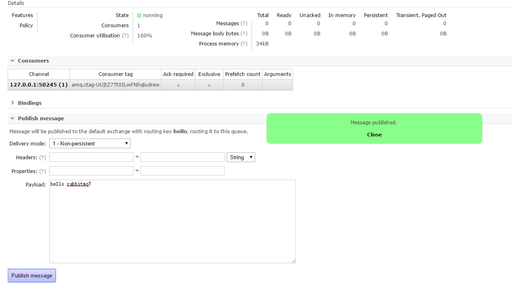
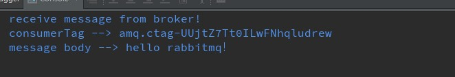

[TOC]

# SpringAmqp源码分析

## 前言

**一个功能模块无论怎么封装，底层也离不开官方原生的客户端，SpringAmqp模块也是如此。**

本文阅读的源码基于以下模块(Maven依赖):

```xml
        <dependency>
            <groupId>org.springframework.boot</groupId>
            <artifactId>spring-boot-starter-amqp</artifactId>
            <version>1.5.3.RELEASE</version>
        </dependency>
```

本文的一些标记和规则:

* 类:首字母大写并且是驼峰
* 内部类:带有$
* 属性:首字母小写并且是驼峰
* 方法:带有#

## 源码分析

先看一个rabbitmq:amqp-client的demo:

编写消费者:

```java
import com.rabbitmq.client.*;

import java.io.IOException;

/**
 * @author throwable
 * @version v1.0
 * @description
 * @since 2017/6/13 23:29
 */
public class InneralConsumer extends DefaultConsumer{

	public InneralConsumer(Channel channel) {
		super(channel);
	}

	@Override
	public void handleConsumeOk(String consumerTag) {
		super.handleConsumeOk(consumerTag);
	}

	@Override
	public void handleCancelOk(String consumerTag) {

	}

	@Override
	public void handleCancel(String consumerTag) throws IOException {

	}

	@Override
	public void handleShutdownSignal(String consumerTag, ShutdownSignalException e) {

	}

	@Override
	public void handleRecoverOk(String consumerTag) {

	}

	@Override
	public void handleDelivery(String consumerTag, Envelope envelope, AMQP.BasicProperties basicProperties, byte[] bytes) throws IOException {
		System.out.println("receive message from broker!");
		System.out.println("consumerTag --> " + consumerTag);
		System.out.println("message body --> " + new String(bytes));
	}
}
```

Main方法:

```java
import com.rabbitmq.client.Channel;
import com.rabbitmq.client.Connection;
import com.rabbitmq.client.ConnectionFactory;

/**
 * @author throwable
 * @version v1.0
 * @description
 * @since 2017/6/13 23:29
 */
public class ConsumerMain {

	public static void main(String[] args) throws Exception{
		ConnectionFactory factory = new ConnectionFactory();
		factory.setHost("localhost");
		factory.setUsername("guest");
		factory.setPassword("guest");
		Connection connection = factory.newConnection();
		Channel channel = connection.createChannel();
		channel.queueDeclare("hello", false, false, false, null);
		channel.basicConsume("hello",true,"",false,false,null,
				new InneralConsumer(channel));
		Thread.sleep(Integer.MAX_VALUE);
	}
}
```



结果:



上面就是Rabbitmq官方的Java客户端的使用例子，在SpringAmqp模块中有类似的实现，在消费者部分源码分析一节再详细说明。

### Connection和Channel的管理

首先要知道一点，SpringAmqp没有直接使用原生Rabbitmq Java客户端的Connection、Channel接口(下面把Rabbitmq的java客户端的原生Api直接称为原生xxxx)，它有一套内建的接口:

* ```
  org.springframework.amqp.rabbit.connection.Connection
  ```

* ```
  org.springframework.amqp.rabbit.connection.ConnectionFactory
  ```

解析一下几个核心类的内容和作用:

* **CachingConnectionFactory**：org.springframework.amqp.rabbit.connection.ConnectionFactory接口的实现，其父抽象类AbstractConnectionFactory持有原生的ConnectionFactory。主要作用是生成、管理和缓存Connection或者Channel(默认是Channel)。

* **SimpleConnection** ：org.springframework.amqp.rabbit.connection.Connection接口的实现，持有原生的Connection。

* **ChannelProxy** ：继承原生的Channel，主要是添加了一个#isTransactional的接口方法用于判断是否存在事务操作。

* **ChannelCachingConnectionProxy** ：org.springframework.amqp.rabbit.connection.Connection接口和ConnectionProxy接口的实现，持有org.springframework.amqp.rabbit.connection.Connection，主要方法用于获取Connection、Channel以及Connections状态的获取。CachingConnectionFactory里面有很多个集合对象，几乎都有ChannelCachingConnectionProxy的存在。

* **CachedChannelInvocationHandler** ：实现了InvocationHandler，用于JDK原生代理，作用是#getCachedChannelProxy方法中生成ChannelProxy。

* **RabbitResourceHolder** ： 真正存放需要用到的org.springframework.amqp.rabbit.connection.Connection和com.rabbitmq.client.Channle，存放在

  一个叫channelsPerConnection的`Map<Connection, List<Channel>>`，这个类的作用和名字一样，用于持有rabbitmq的必须资源。

* **ConnectionFactoryUtils** ：用于管理RabbitResourceHolder。

* **ConsumerChannelRegistry**： 缓存消费者必须的ChannelHolder(使用了ThreadLocal)。

看到这里为止，可能会有一点比较大的疑惑，理论上Connection和Channel的管理的核心类应该是CachingConnectionFactory才对，但是从上面类的分析实际上可用的资源是存放在RabbitResourceHolder，而

CachingConnectionFactory本身也持有很多个Connection代理和Channel代理的集合，但是这些集合并不是真正的可用资源。分析这个问题之前，先看一下Spring里面经常用到的**"委托(delegate)"**和**"策略模式"**:

```java
public class B {
  private A delegate;
  public B(A a){
    this.delegate = a;
  }
  
  public void targetMethod(){
    this.delegate.targetMethod();
  }
  
  public void extendMethod(){
    this.delegate.targetMethod();
    //other operations
  }
}

public class A {
  
  public void targetMethod(){
    
  }
}
```

委托并不是一种设计模式，但是它有一点点像设计模式中的组合模式，delegate对象一般是作为构造的入参，然后委托的调用方会一直持有委托的对象并且可以随时调用委托对象的公开方法。

策略模式直接用一段源码分析,ConnectionFactoryUtils的#getTransactionalResourceHolder：

```java
public static RabbitResourceHolder getTransactionalResourceHolder(final ConnectionFactory connectionFactory,
			final boolean synchedLocalTransactionAllowed) {

		return doGetTransactionalResourceHolder(connectionFactory, new ResourceFactory() {

			@Override
			public Channel getChannel(RabbitResourceHolder holder) {
				return holder.getChannel();
			}

			@Override
			public Connection getConnection(RabbitResourceHolder holder) {
				return holder.getConnection();
			}

            //看这个方法，是调用外层策略接口的createConnection()方法
			@Override
			public Connection createConnection() throws IOException {
				return connectionFactory.createConnection();
			}

			@Override
			public Channel createChannel(Connection con) throws IOException {
				return con.createChannel(synchedLocalTransactionAllowed);
			}

			@Override
			public boolean isSynchedLocalTransactionAllowed() {
				return synchedLocalTransactionAllowed;
			}

		});
	}

private static RabbitResourceHolder doGetTransactionalResourceHolder(ConnectionFactory connectionFactory,ResourceFactory resourceFactory) {
		Assert.notNull(connectionFactory, "ConnectionFactory must not be null");
		Assert.notNull(resourceFactory, "ResourceFactory must not be null");

		RabbitResourceHolder resourceHolder = (RabbitResourceHolder) TransactionSynchronizationManager
				.getResource(connectionFactory);
		if (resourceHolder != null) {
			Channel channel = resourceFactory.getChannel(resourceHolder);
			if (channel != null) {
				return resourceHolder;
			}
		}
		RabbitResourceHolder resourceHolderToUse = resourceHolder;
		if (resourceHolderToUse == null) {
			resourceHolderToUse = new RabbitResourceHolder();
		}
		Connection connection = resourceFactory.getConnection(resourceHolderToUse); //NOSONAR
		Channel channel = null;
		try {
			/*
			 * If we are in a listener container, first see if there's a channel registered
			 * for this consumer and the consumer is using the same connection factory.
			 */
			channel = ConsumerChannelRegistry.getConsumerChannel(connectionFactory);
			if (channel == null && connection == null) {
				connection = resourceFactory.createConnection();
				resourceHolderToUse.addConnection(connection);
			}
			if (channel == null) {
				channel = resourceFactory.createChannel(connection);
			}
			resourceHolderToUse.addChannel(channel, connection);

			if (resourceHolderToUse != resourceHolder) {
				bindResourceToTransaction(resourceHolderToUse, connectionFactory,
						resourceFactory.isSynchedLocalTransactionAllowed());
			}

			return resourceHolderToUse;

		}
		catch (IOException ex) {
			RabbitUtils.closeConnection(connection);
			throw new AmqpIOException(ex);
		}
	}
```

上面就是策略模式的一个使用例子，ResourceFactory接口的匿名实现里面有个#createConnection方法，这个方法是直接调用方法入参ConnectionFactory的#createConnection，而ConnectionFactory在SpringAmqp里面有多个实现，我们一般指定为CachingConnectionFactory。九曲十八弯之后终于看到CachingConnectionFactory的方法被调用。#doGetTransactionalResourceHolder方法就是RabbitResourceHolder缓存Connection和Channel的逻辑，值得注意的是#getTransactionalResourceHolder方法的另一个布尔值的入参synchedLocalTransactionAllowed是用于控制事务的，因为Rabbitmq的事务用得比较少而且逻辑更加复杂，暂时超出本人的分析能力，暂且当这个值永远为false。

接着可以直接分析ResourceFactory接口的匿名实现里面的#createConnection方法，它调用到connectionFactory.createConnection()方法，实际上就是CachingConnectionFactory的#createConnection方法，源码如下:

```java
public final Connection createConnection() throws AmqpException {
		Assert.state(!this.stopped, "The ApplicationContext is closed and the ConnectionFactory can no longer create connections.");
		synchronized (this.connectionMonitor) {
			if (this.cacheMode == CacheMode.CHANNEL) {
				if (this.connection.target == null) {
                    //调用抽象父类AbstractConnectionFactory的#createBareConnection方法
                    //有一点非常值得注意的是this.connection是一个ChannelCachingConnectionProxy实例
					this.connection.target = super.createBareConnection();
					// invoke the listener *after* this.connection is assigned
					if (!this.checkoutPermits.containsKey(this.connection)) {
						this.checkoutPermits.put(this.connection, new Semaphore(this.channelCacheSize));
					}
					this.connection.closeNotified.set(false);
					getConnectionListener().onCreate(this.connection);
				}
				return this.connection;
			}
			else if (this.cacheMode == CacheMode.CONNECTION) {
				ChannelCachingConnectionProxy connection = findIdleConnection();
				long now = System.currentTimeMillis();
				while (connection == null && System.currentTimeMillis() - now < this.channelCheckoutTimeout) {
					if (countOpenConnections() >= this.connectionLimit) {
						try {
							this.connectionMonitor.wait(this.channelCheckoutTimeout);
							connection = findIdleConnection();
						}
						catch (InterruptedException e) {
							Thread.currentThread().interrupt();
							throw new AmqpException("Interrupted while waiting for a connection", e);
						}
					}
				}
				if (connection == null) {
					if (countOpenConnections() >= this.connectionLimit
							&& System.currentTimeMillis() - now >= this.channelCheckoutTimeout) {
						throw new AmqpTimeoutException("Timed out attempting to get a connection");
					}
					connection = new ChannelCachingConnectionProxy(super.createBareConnection());
					if (logger.isDebugEnabled()) {
						logger.debug("Adding new connection '" + connection + "'");
					}
					this.allocatedConnections.add(connection);
					this.allocatedConnectionNonTransactionalChannels.put(connection, new LinkedList<ChannelProxy>());
					this.channelHighWaterMarks.put(ObjectUtils.getIdentityHexString(
							this.allocatedConnectionNonTransactionalChannels.get(connection)), new AtomicInteger());
					this.allocatedConnectionTransactionalChannels.put(connection, new LinkedList<ChannelProxy>());
					this.channelHighWaterMarks.put(
							ObjectUtils.getIdentityHexString(this.allocatedConnectionTransactionalChannels.get(connection)),
							new AtomicInteger());
					this.checkoutPermits.put(connection, new Semaphore(this.channelCacheSize));
					getConnectionListener().onCreate(connection);
				}
				else if (!connection.isOpen()) {
					try {
						refreshProxyConnection(connection);
					}
					catch (Exception e) {
						this.idleConnections.addLast(connection);
					}
				}
				else {
					if (logger.isDebugEnabled()) {
						logger.debug("Obtained connection '" + connection + "' from cache");
					}
				}
				return connection;
			}
		}
		return null;
	}
```

**这里有一点十分值得注意**，CachingConnectionFactory里面有一个final域的变量:

`private final ChannelCachingConnectionProxy connection = new ChannelCachingConnectionProxy(null);`

如果在CachingConnectionFactory中看到属性this.connection，必定是ChannelCachingConnectionProxy的这个命名为connection的实例，上面的this.connection.target就是ChannelCachingConnectionProxy的Connection属性，也就是同一个CachingConnectionFactory中ChannelCachingConnectionProxy永远只有一个实例，但是这个实例中的target属性(Connection对象)有可能被覆写。同时它是CacheMode.CHANNEL模式下#createConnection方法的返回值，也就是#createConnection实际上返回的是一个持有Connection属性的包装类ChannelCachingConnectionProxy的实例(这一点对下文的分析至关重要)。

默认的cacheMode是CacheMode.CHANNEL，因此直接进入if逻辑的第一个分支，调用的是抽象父类AbstractConnectionFactory的#createBareConnection方法:

```java
protected final Connection createBareConnection() {
		try {
			String connectionName = this.connectionNameStrategy == null ? null
					: this.connectionNameStrategy.obtainNewConnectionName(this);

			com.rabbitmq.client.Connection rabbitConnection;
			if (this.addresses != null) {
				rabbitConnection = this.rabbitConnectionFactory.newConnection(this.executorService, this.addresses,
						connectionName);
			}
			else {
				rabbitConnection = this.rabbitConnectionFactory.newConnection(this.executorService, connectionName);
			}
			Connection connection = new SimpleConnection(rabbitConnection, this.closeTimeout);
			if (this.logger.isInfoEnabled()) {
				this.logger.info("Created new connection: " + connection);
			}
			if (this.recoveryListener != null && rabbitConnection instanceof AutorecoveringConnection) {
				((AutorecoveringConnection) rabbitConnection).addRecoveryListener(this.recoveryListener);
			}
			return connection;
		}
		catch (IOException e) {
			throw RabbitExceptionTranslator.convertRabbitAccessException(e);
		}
		catch (TimeoutException e) {
			throw RabbitExceptionTranslator.convertRabbitAccessException(e);
		}
	}
```

实际上就是调用原生ConnectionFactory的#newConnection方法获取到原生的Connection对象实例，再封装进去

**SimpleConnection**，SimpleConnection使用的就是委托。之后还有一个添加RecoveryListener的操作，RecoveryListener是用于重发回调。方法返回到CachingConnectionFactory的#createConnection，后面是往

`private final Map<Connection, Semaphore> checkoutPermits = new HashMap<Connection, Semaphore>()`里面

添加一个元素，这个checkoutPermits使用了信号量来限制每个Connection可使用的Channel数量，这个由channelCacheSize属性值控制，默认是25个。可以这样理解：每个从外部调用到CachingConnectionFactory的#createConnection方法的都会生成一个新的Connection，并且都会缓存到checkoutPermits里面。这里的逻辑可以启发我们如果项目中的消费者数目很多的话，可以适当把这个channelCacheSize调大。

**#doGetTransactionalResourceHolder方法里面**除了有获取并且缓存Connection的逻辑(见上面的分析)还有获取Channel的逻辑，入口就是ResourceFactory的匿名接口#createChannel：

```java
           channel = ConsumerChannelRegistry.getConsumerChannel(connectionFactory);
			if (channel == null && connection == null) {
				connection = resourceFactory.createConnection();
				resourceHolderToUse.addConnection(connection);
			}
			if (channel == null) {
				channel = resourceFactory.createChannel(connection);
			}
			resourceHolderToUse.addChannel(channel, connection); 
```

这个方法实际上是调用了CachingConnectionFactory的内部类(前面提到过)ChannelCachingConnectionProxy 。

获取Channel的方法见`private Channel getChannel(ChannelCachingConnectionProxy connection, boolean transactional)`，上一层方法(主要为外部方法调用)是ChannelCachingConnectionProxy的#createChannel:

```java
public Channel createChannel(boolean transactional) {
    //此处的this为ChannelCachingConnectionProxy
	return getChannel(this, transactional);
}
```

现在主要看#getChannel(ChannelCachingConnectionProxy connection, boolean transactional):

```java
private Channel getChannel(ChannelCachingConnectionProxy connection, boolean transactional) {
		if (this.channelCheckoutTimeout > 0) {
			Semaphore checkoutPermits = this.checkoutPermits.get(connection);
			if (checkoutPermits != null) {
				try {
					if (!checkoutPermits.tryAcquire(this.channelCheckoutTimeout, TimeUnit.MILLISECONDS)) {
						throw new AmqpTimeoutException("No available channels");
					}
					if (logger.isDebugEnabled()) {
						logger.debug(
							"Acquired permit for " + connection + ", remaining:" + checkoutPermits.availablePermits());
					}
				}
				catch (InterruptedException e) {
					Thread.currentThread().interrupt();
					throw new AmqpTimeoutException("Interrupted while acquiring a channel", e);
				}
			}
			else {
				throw new IllegalStateException("No permits map entry for " + connection);
			}
		}
		LinkedList<ChannelProxy> channelList;
		if (this.cacheMode == CacheMode.CHANNEL) {
            //transactional为false,channelList直接赋值为cachedChannelsNonTransactional
			channelList = transactional ? this.cachedChannelsTransactional
					: this.cachedChannelsNonTransactional;
		}
		else {
			channelList = transactional ? this.allocatedConnectionTransactionalChannels.get(connection)
					: this.allocatedConnectionNonTransactionalChannels.get(connection);
		}
		if (channelList == null) {
			throw new IllegalStateException("No channel list for connection " + connection);
		}
		ChannelProxy channel = null;
		if (connection.isOpen()) {
			synchronized (channelList) {
				while (!channelList.isEmpty()) {
					channel = channelList.removeFirst();
					if (logger.isTraceEnabled()) {
						logger.trace(channel + " retrieved from cache");
					}
					if (channel.isOpen()) {
						break;
					}
					else {
						try {
							Channel target = channel.getTargetChannel();
							if (target != null) {
								target.close();
								/*
								 *  To remove it from auto-recovery if so configured,
								 *  and nack any pending confirms if PublisherCallbackChannel.
								 */
							}
						}
						catch (AlreadyClosedException e) {
							if (logger.isTraceEnabled()) {
								logger.trace(channel + " is already closed");
							}
						}
						catch (IOException e) {
							if (logger.isDebugEnabled()) {
								logger.debug("Unexpected Exception closing channel " + e.getMessage());
							}
						}
						catch (TimeoutException e) {
							if (logger.isWarnEnabled()) {
								logger.warn("TimeoutException closing channel " + e.getMessage());
							}
						}
						channel = null;
					}
				}
			}
			if (channel != null) {
				if (logger.isTraceEnabled()) {
					logger.trace("Found cached Rabbit Channel: " + channel.toString());
				}
			}
		}
        //第一次初始化直接跳到此处
		if (channel == null) {
			channel = getCachedChannelProxy(connection, channelList, transactional);
		}
		return channel;
	}
```

只有属性channelCheckoutTimeout(默认值为0)大于0的时候才会尝试从checkoutPermits获取信号量，debug的时候没有设置这个值，直接跳到if之后的代码行，也就是不适用信号量进行限流。(这里有个疑惑，channelCacheSize和channelCheckoutTimeout这两个值应该是必须同时设置才会生效的)

transactional为false，channelList直接赋值为cachedChannelsNonTransactional。由于cachedChannelsNonTransactional这个`LinkedList<ChannelProxy>`的初始size也为0，所以方法跳过了前边的逻辑直接走到**#getCachedChannelProxy**。接着连看三个方法的源码如下：

```java
private ChannelProxy getCachedChannelProxy(ChannelCachingConnectionProxy connection,
			LinkedList<ChannelProxy> channelList, boolean transactional) {
		Channel targetChannel = createBareChannel(connection, transactional);
		if (logger.isDebugEnabled()) {
			logger.debug("Creating cached Rabbit Channel from " + targetChannel);
		}
		getChannelListener().onCreate(targetChannel, transactional);
		Class<?>[] interfaces;
		if (this.publisherConfirms || this.publisherReturns) {
			interfaces = new Class<?>[] { ChannelProxy.class, PublisherCallbackChannel.class };
		}
		else {
			interfaces = new Class<?>[] { ChannelProxy.class };
		}
		return (ChannelProxy) Proxy.newProxyInstance(ChannelProxy.class.getClassLoader(),
				interfaces, new CachedChannelInvocationHandler(connection, targetChannel, channelList,transactional));
	}

	private Channel createBareChannel(ChannelCachingConnectionProxy connection, boolean transactional) {
		if (this.cacheMode == CacheMode.CHANNEL) {
			if (!this.connection.isOpen()) {
				synchronized (this.connectionMonitor) {
					if (!this.connection.isOpen()) {
						this.connection.notifyCloseIfNecessary();
					}
					if (!this.connection.isOpen()) {
						this.connection.target = null;
						createConnection();
					}
				}
			}
			return doCreateBareChannel(this.connection, transactional);
		}
		else if (this.cacheMode == CacheMode.CONNECTION) {
			if (!connection.isOpen()) {
				synchronized (this.connectionMonitor) {
					this.allocatedConnectionNonTransactionalChannels.get(connection).clear();
					this.allocatedConnectionTransactionalChannels.get(connection).clear();
					connection.notifyCloseIfNecessary();
					refreshProxyConnection(connection);
				}
			}
			return doCreateBareChannel(connection, transactional);
		}
		return null;
	}

	private Channel doCreateBareChannel(ChannelCachingConnectionProxy connection, boolean transactional) {
		Channel channel = connection.createBareChannel(transactional);
		if (this.publisherConfirms) {
			try {
				channel.confirmSelect();
			}
			catch (IOException e) {
				logger.error("Could not configure the channel to receive publisher confirms", e);
			}
		}
		if (this.publisherConfirms || this.publisherReturns) {
			if (!(channel instanceof PublisherCallbackChannelImpl)) {
				channel = new PublisherCallbackChannelImpl(channel);
			}
		}
		if (channel != null) {
			channel.addShutdownListener(this);
		}
		return channel;
	}
```

最后实际上是走进了#doCreateBareChannel方法里面并且调用了ChannelCachingConnectionProxy这个代理里面的#createBareChannel，这里刚好就用到了委托，委托的对象就是Connection(查看前文分析，Connection对应的实例就是SimpleConnection)，直接调用Connection的#createChannel方法。翻看一下SimpleConnection的

**#createChannel**方法，直接调用委托对象com.rabbitmq.client.Connection的#createChannel。还是九曲十八弯终于看到#getCachedChannelProxy获取targetChannel对象的实质就是调用原生的#createChannel。当然获取到Channel实例并没有直接返回，而是返回了它的代理：

```java
return (ChannelProxy) Proxy.newProxyInstance(ChannelProxy.class.getClassLoader(),
				interfaces, new CachedChannelInvocationHandler(connection, targetChannel, channelList,transactional));
```

上面的分析有些冗长和混乱，现在整理一下思路：

1.Rabbitmq原生对象和Spring包装过的对象的关系

|    Rabbitmq原生     |          Spring包装           |
| :---------------: | :-------------------------: |
| ConnectionFactory | 主要是CachingConnectionFactory |
|    Connection     |      SimpleConnection       |
|      Channel      |        ChannelProxy         |

2.明确一些类或者对象的作用

**RabbitResourceHolder** : 缓存着实际使用的Connection-List&lt;ChannelProxy&gt;集合 ，实际上像RabbitTempate或者BlokingQueueConsumer需要获取Channel的时候都是从RabbitResourceHolder获取。

**CachingConnectionFactory** ：缓存Connection或者Channel，作用是创建和管理Connection或者Channel，创建的Connection实际上包装为它的内部类ChannelCachingConnectionProxy。

**ConnectionFactoryUtils**： 这个类就是RabbitResourceHolder和CachingConnectionFactory的桥梁。

3.备注

* 暂时不分析消息事务部分(涉及到Spring事务管理那部分的源码，相对复杂)
* 暂时不分析CacheMode为CONNECTION模式下的源码(CachingConnectionFactory有很多集合属性是在此模式下使用)
* 忽略一些非关键的类和方法

到此，Connection和Channel的管理基本分析完毕。


### 消费者(Listener)部分源码分析

阅读了SpringAmqp对Consumer处理的源码后，个人认为这部分的扩展度是相对比较高的。基于读懂这部分源码的基础，写了一个SpringAmqp多Rabbitmq实例支持的脚手架，详情见github仓库[slime](https://github.com/zjcscut/slime)。

还是那个套路，先把核心的注解和类贴出来:

* 注解: @RabbitListeners、@RabbitListener、@RabbitHandler。

  类: RabbitListenerAnnotationBeanPostProcessor、RabbitListenerEndpointRegistry、RabbitListenerEndpointRegistrar、MultiMethodRabbitListenerEndpoint、MethodRabbitListenerEndpoint、SimpleRabbitListenerContainerFactory、SimpleMessageListenerContainer、BlockingQueueConsumer、SimpleMessageListenerContainer$AsyncMessageProcessingConsumer

这些类的大致关系如下:

(其中MethodRabbitListenerEndpoint、MultiMethodRabbitListenerEndpoint实现了RabbitListenerEndpoint接口，除这两个实现之外，还有一个实现是SimpleRabbitListenerEndpoint)


* 一个类级别的@RabbitListener和一个@RabbitHandler会产生一个MultiMethodRabbitListenerEndpoint的实例。
* 一个方法级别的@RabbitListener会产生一个MethodRabbitListenerEndpoint的实例。
* RabbitListenerEndpoint的实例的加工逻辑在RabbitListenerEndpointRegistrar，注册成功的RabbitListenerEndpoint缓存在RabbitListenerEndpointRegistry。
* 每个RabbitListenerEndpoint的实例都会创建一个SimpleMessageListenerContainer的实例，而SimpleMessageListenerContainer实例的创建由默认的SimpleRabbitListenerContainerFactory完成。
* 每个SimpleMessageListenerContainer的实例都会包含多个AsyncMessageProcessingConsumer实例(这个AsyncMessageProcessingConsumer是SimpleMessageListenerContainer的一个内部类)，AsyncMessageProcessingConsumer是BlockingQueueConsumer的一个包装类，主要是实现了Runnable接口。
* BlockingQueueConsumer就是SpringAmqp模块的消费者和原生Rabbitmq消费者逻辑的桥梁。(个人认为这个类就是SpringAmqp模块消费者部分的核心)

下面详细分析一下上面说到的这系列的逻辑。

#### @RabbitListener、@RabbitHanlder注解的解析

@RabbitListener和@RabbitHanlder注解的解析的所有逻辑都在RabbitListenerAnnotationBeanPostProcessor中，这个类实现了BeanPostProcessor接口(如果不了解BeanPostProcessor可以翻看本人写过的一篇博客[Spring钩子类和钩子接口详解](http://www.jianshu.com/p/e22b9fef311c))，解析的入口在#postProcessAfterInitialization。

RabbitListenerAnnotationBeanPostProcessor$TypeMetadata用于缓存解析Bean中注解的结果:

```java
private static class TypeMetadata {

		/**
		 * Methods annotated with {@link RabbitListener}.
		 */
		final ListenerMethod[] listenerMethods;

		/**
		 * Methods annotated with {@link RabbitHandler}.
		 */
		final Method[] handlerMethods;

		/**
		 * Class level {@link RabbitListener} annotations.
		 */
		final RabbitListener[] classAnnotations;

		static final TypeMetadata EMPTY = new TypeMetadata();

		private TypeMetadata() {
			this.listenerMethods = new ListenerMethod[0];
			this.handlerMethods = new Method[0];
			this.classAnnotations = new RabbitListener[0];
		}

		TypeMetadata(ListenerMethod[] methods, Method[] multiMethods, RabbitListener[] classLevelListeners) {
			this.listenerMethods = methods;
			this.handlerMethods = multiMethods;
			this.classAnnotations = classLevelListeners;
		}
	}

    //静态内部类,用于存放方法级别@RabbitListener的解析结果
    private static class ListenerMethod {

		final Method method;

		final RabbitListener[] annotations;

		ListenerMethod(Method method, RabbitListener[] annotations) {
			this.method = method;
			this.annotations = annotations;
		}

	}
```

* listenerMethods存放方法级别的@RabbitListener的解析结果。
* classAnnotations存放类级别的@RabbitListener的注解数组。
* handlerMethods用于存放@ RabbitHandler的解析結果。

回到前边提到的解析入口#postProcessAfterInitialization，源码如下:

```java
public Object postProcessAfterInitialization(final Object bean, final String beanName) throws BeansException {
		Class<?> targetClass = AopUtils.getTargetClass(bean);

		TypeMetadata metadata = this.typeCache.get(targetClass);
		if (metadata == null) {
			metadata = buildMetadata(targetClass);
			this.typeCache.putIfAbsent(targetClass, metadata);
		}

		for (ListenerMethod lm : metadata.listenerMethods) {
			for (RabbitListener rabbitListener : lm.annotations) {
				processAmqpListener(rabbitListener, lm.method, bean, beanName);
			}
		}
		if (metadata.handlerMethods.length > 0) {
			processMultiMethodListeners(metadata.classAnnotations, metadata.handlerMethods, bean, beanName);
		}
		return bean;
	}

private TypeMetadata buildMetadata(Class<?> targetClass) {
		Collection<RabbitListener> classLevelListeners = findListenerAnnotations(targetClass);
		final boolean hasClassLevelListeners = classLevelListeners.size() > 0;
		final List<ListenerMethod> methods = new ArrayList<ListenerMethod>();
		final List<Method> multiMethods = new ArrayList<Method>();
		ReflectionUtils.doWithMethods(targetClass, new ReflectionUtils.MethodCallback() {
		
public void doWith(Method method) throws IllegalArgumentException, IllegalAccessException {
				Collection<RabbitListener> listenerAnnotations = findListenerAnnotations(method);
				if (listenerAnnotations.size() > 0) {
					methods.add(new ListenerMethod(method,
							listenerAnnotations.toArray(new RabbitListener[listenerAnnotations.size()])));
				}
				if (hasClassLevelListeners) {
					RabbitHandler rabbitHandler = AnnotationUtils.findAnnotation(method, RabbitHandler.class);
					if (rabbitHandler != null) {
						multiMethods.add(method);
					}
				}

			}
		}, ReflectionUtils.USER_DECLARED_METHODS);
		if (methods.isEmpty() && multiMethods.isEmpty()) {
			return TypeMetadata.EMPTY;
		}
		return new TypeMetadata(
				methods.toArray(new ListenerMethod[methods.size()]),
				multiMethods.toArray(new Method[multiMethods.size()]),
				classLevelListeners.toArray(new RabbitListener[classLevelListeners.size()]));
	}
```

**WARN:** 由于使用的是BeanPostProcessor接口，因此定义Listener的时候必须确保定义的类是Spring的一个Bean(**添加@Component注解**)。

* 先获取Listener目标Bean的Class -- > targetClass。
* 接着解析类上的注解并且添加进去TypeMetadata。
* 遍历TypeMetadata，分别处理方法级别的@RabbitListener(**#processAmqpListener**)和类级别的@RabbitListener、@RabbitHandler组合(**#processMultiMethodListeners**)。

RabbitListenerAnnotationBeanPostProcessor#processAmqpListener源码很简单:

```java
protected void processAmqpListener(RabbitListener rabbitListener, Method method, Object bean, String beanName) {
		Method methodToUse = checkProxy(method, bean);
		MethodRabbitListenerEndpoint endpoint = new MethodRabbitListenerEndpoint();
		endpoint.setMethod(methodToUse);
		endpoint.setBeanFactory(this.beanFactory);
		processListener(endpoint, rabbitListener, bean, methodToUse, beanName);
	}
```

* 先检查该Method是否JDK代理方法，如果是则把Bean强转为Advised类型再从接口获取Method，如果不是JDK代理则直接返回。
* 接着创建一个新的MethodRabbitListenerEndpoint实例，后续注册工作#processListener完成。

RabbitListenerAnnotationBeanPostProcessor#processMultiMethodListeners源码也很简单:

```java
private void processMultiMethodListeners(RabbitListener[] classLevelListeners, Method[] multiMethods,
			Object bean, String beanName) {
		List<Method> checkedMethods = new ArrayList<Method>();
		for (Method method : multiMethods) {
			checkedMethods.add(checkProxy(method, bean));
		}
		for (RabbitListener classLevelListener : classLevelListeners) {
			MultiMethodRabbitListenerEndpoint endpoint = new MultiMethodRabbitListenerEndpoint(checkedMethods, bean);
			endpoint.setBeanFactory(this.beanFactory);
			processListener(endpoint, classLevelListener, bean, bean.getClass(), beanName);
		}
	}
```

* 检查使用到的所有@RabbitHandler对应的方法是否JDK代理，过程和上面的分析一致。
* 遍历类级别的@RabbitListener数组并且创建MultiMethodRabbitListenerEndpoint实例(一般来说，一个Listener只有有一个class级别的@RabbitListener，除非有特殊需要)，后续注册工作#processListener完成。

由此看出所有的注册工作的核心都在#processListener中，#processListener的源码如下:

```java
protected void processListener(MethodRabbitListenerEndpoint endpoint, RabbitListener rabbitListener, Object bean,
			Object adminTarget, String beanName) {
		endpoint.setBean(bean);
		endpoint.setMessageHandlerMethodFactory(this.messageHandlerMethodFactory);
		endpoint.setId(getEndpointId(rabbitListener));
		endpoint.setQueueNames(resolveQueues(rabbitListener));
		String group = rabbitListener.group();
		if (StringUtils.hasText(group)) {
			Object resolvedGroup = resolveExpression(group);
			if (resolvedGroup instanceof String) {
				endpoint.setGroup((String) resolvedGroup);
			}
		}

		endpoint.setExclusive(rabbitListener.exclusive());
		String priority = resolve(rabbitListener.priority());
		if (StringUtils.hasText(priority)) {
			try {
				endpoint.setPriority(Integer.valueOf(priority));
			}
			catch (NumberFormatException ex) {
				throw new BeanInitializationException("Invalid priority value for " +
						rabbitListener + " (must be an integer)", ex);
			}
		}

		String rabbitAdmin = resolve(rabbitListener.admin());
		if (StringUtils.hasText(rabbitAdmin)) {
			Assert.state(this.beanFactory != null, "BeanFactory must be set to resolve RabbitAdmin by bean name");
			try {
				endpoint.setAdmin(this.beanFactory.getBean(rabbitAdmin, RabbitAdmin.class));
			}
			catch (NoSuchBeanDefinitionException ex) {
				throw new BeanInitializationException("Could not register rabbit listener endpoint on [" +
						adminTarget + "], no " + RabbitAdmin.class.getSimpleName() + " with id '" +
						rabbitAdmin + "' was found in the application context", ex);
			}
		}


		RabbitListenerContainerFactory<?> factory = null;
		String containerFactoryBeanName = resolve(rabbitListener.containerFactory());
		if (StringUtils.hasText(containerFactoryBeanName)) {
			Assert.state(this.beanFactory != null, "BeanFactory must be set to obtain container factory by bean name");
			try {
				factory = this.beanFactory.getBean(containerFactoryBeanName, RabbitListenerContainerFactory.class);
			}
			catch (NoSuchBeanDefinitionException ex) {
				throw new BeanInitializationException("Could not register rabbit listener endpoint on [" +
						adminTarget + "] for bean " + beanName + ", no " +
						RabbitListenerContainerFactory.class.getSimpleName() + " with id '" +
						containerFactoryBeanName + "' was found in the application context", ex);
			}
		}

		this.registrar.registerEndpoint(endpoint, factory);
	}
```

* 前边的步骤主要是解析注解之中的一些属性，解析过程兼容原生类型和SpEL表达式类型的变量，过程不是很复杂，不细说。
* 这里注意一个调用到的一个方法**#resolveQueues**，这个方法会把所有的Queue、Exchange、Binding注册为Spring容器的单例，注册的时候有一定的Bean命名规则，具体可以参看#declareQueue以及#declareExchangeAndBinding的源码。
* 为MethodRabbitListenerEndpoint实例设置RabbitAdmin，这个步骤是十分关键的，因为RabbitAdmin(具备类似超级管理员权限)在SpringAmqp体系中是**用于管理队列、交换器、绑定、预声明等操作的核心类**，因为必须确保Spring容器中存在这个类的实例，注解中的admin属性要求传入这个类在Spring容器中的Bean名称。
* 为MethodRabbitListenerEndpoint实例设置RabbitListenerContainerFactory，这个也是至关重要的，前文提到每个RabbitListenerEndpoint最终都会转化为一个SimpleMessageListenerContainer实例，而SimpleMessageListenerContainer实例的创建必须依赖RabbitListenerContainerFactory(**SimpleRabbitListenerContainerFactory**)。
* 最后注册工作交由RabbitListenerEndpointRegistrar#registerEndpoint完成。

RabbitListenerEndpointRegistrar#registerEndpoint的源码如下:

```java
public void registerEndpoint(RabbitListenerEndpoint endpoint, RabbitListenerContainerFactory<?> factory) {
		Assert.notNull(endpoint, "Endpoint must be set");
		Assert.hasText(endpoint.getId(), "Endpoint id must be set");
		// Factory may be null, we defer the resolution right before actually creating the container
		AmqpListenerEndpointDescriptor descriptor = new AmqpListenerEndpointDescriptor(endpoint, factory);
		synchronized (this.endpointDescriptors) {
			if (this.startImmediately) { // Register and start immediately
				this.endpointRegistry.registerListenerContainer(descriptor.endpoint,
						resolveContainerFactory(descriptor), true);
			}
			else {
				this.endpointDescriptors.add(descriptor);
			}
		}
	}

private static final class AmqpListenerEndpointDescriptor {

		private final RabbitListenerEndpoint endpoint;

		private final RabbitListenerContainerFactory<?> containerFactory;

		private AmqpListenerEndpointDescriptor(RabbitListenerEndpoint endpoint, RabbitListenerContainerFactory<?> containerFactory) {
			this.endpoint = endpoint;
			this.containerFactory = containerFactory;
		}
	}
```

* 使用一个内部类AmqpListenerEndpointDescriptor存放RabbitListenerEndpoint、RabbitListenerContainerFactory，所有的AmqpListenerEndpointDescriptor缓存在一个叫做endpointDescriptors的ArrayList中。
* 注册的时候为因为startImmediately默认为false，因此只会向endpointDescriptors添加元素，当startImmediately为true的时候，调用到RabbitListenerEndpointRegistry#registerListenerContainer方法，这个操作见RabbitListenerEndpointRegistrar#afterPropertiesSet，#afterPropertiesSet调用了#registerAllEndpoints。

```java
    protected void registerAllEndpoints() {
		synchronized (this.endpointDescriptors) {
			for (AmqpListenerEndpointDescriptor descriptor : this.endpointDescriptors) {
				this.endpointRegistry.registerListenerContainer(
						descriptor.endpoint, resolveContainerFactory(descriptor));
			}
			this.startImmediately = true;  // trigger immediate startup
		}
	}
```

registerAllEndpoints方法实际上就是遍历endpointDescriptors中所有缓存好的AmqpListenerEndpointDescriptor，注册操作交由RabbitListenerEndpointRegistry#registerListenerContainer完成。接着就跟踪到RabbitListenerEndpointRegistry#registerListenerContainer的源码:

```java
public void registerListenerContainer(RabbitListenerEndpoint endpoint, RabbitListenerContainerFactory<?> factory) {
		registerListenerContainer(endpoint, factory, false);
}

public void registerListenerContainer(RabbitListenerEndpoint endpoint, RabbitListenerContainerFactory<?> factory,boolean startImmediately) {
		Assert.notNull(endpoint, "Endpoint must not be null");
		Assert.notNull(factory, "Factory must not be null");

		String id = endpoint.getId();
		Assert.hasText(id, "Endpoint id must not be empty");
		synchronized (this.listenerContainers) {
			Assert.state(!this.listenerContainers.containsKey(id),
					"Another endpoint is already registered with id '" + id + "'");
			MessageListenerContainer container = createListenerContainer(endpoint, factory);
			this.listenerContainers.put(id, container);
			if (StringUtils.hasText(endpoint.getGroup()) && this.applicationContext != null) {
				List<MessageListenerContainer> containerGroup;
				if (this.applicationContext.containsBean(endpoint.getGroup())) {
					containerGroup = this.applicationContext.getBean(endpoint.getGroup(), List.class);
				}
				else {
					containerGroup = new ArrayList<MessageListenerContainer>();
					this.applicationContext.getBeanFactory().registerSingleton(endpoint.getGroup(), containerGroup);
				}
				containerGroup.add(container);
			}
			if (startImmediately) {
				startIfNecessary(container);
			}
		}
	}

protected MessageListenerContainer createListenerContainer(RabbitListenerEndpoint endpoint,
			RabbitListenerContainerFactory<?> factory) {

		MessageListenerContainer listenerContainer = factory.createListenerContainer(endpoint);

		if (listenerContainer instanceof InitializingBean) {
			try {
				((InitializingBean) listenerContainer).afterPropertiesSet();
			}
			catch (Exception ex) {
				throw new BeanInitializationException("Failed to initialize message listener container", ex);
			}
		}

		int containerPhase = listenerContainer.getPhase();
		if (containerPhase < Integer.MAX_VALUE) {  // a custom phase value
			if (this.phase < Integer.MAX_VALUE && this.phase != containerPhase) {
				throw new IllegalStateException("Encountered phase mismatch between container factory definitions: " +
						this.phase + " vs " + containerPhase);
			}
			this.phase = listenerContainer.getPhase();
		}

		return listenerContainer;
	}
```

* **#registerListenerContainer**方法中主要是创建MessageListenerContainer并且缓存到一个命名为listenerContainers的ConcurrentHashMap中，key为EndPoint的id，value为MessageListenerContainer，如果存在分组还需进行分组的具体处理。
* 调用到**#createListenerContainer**方法的时候实际上就是调用RabbitListenerContainerFactory#createListenerContainer，如果实例是SimpleRabbitListenerContainerFactory，实际上就是创建一个新的SimpleRabbitListenerContainer实例，后面调用RabbitListenerContainer#afterPropertiesSet主要是为了设置属性(如初始化消费者数量等等)。
* 最后调用#startIfNecessary，实际上就是调用RabbitListenerContainer#start。

从上面分析可以知道当RabbitListenerEndpointRegistrar#afterPropertiesSet被调用之后，所有的SimpleRabbitListenerContainer实例的#start方法都调用了，也就是所有的SimpleRabbitListenerContainer都启动了，接下来可以仔细分析SimpleRabbitListenerContainer以及它的工厂类SimpleRabbitListenerContainerFactory。

SimpleRabbitListenerContainerFactory从名称上解读：简单的rabbit消费者容器工厂。毫无疑问，它的作用就是生产SimpleRabbitListenerContainer实例。

SimpleRabbitListenerContainerFactory使用了设计模式中的模板方法模式，上文中分析到的**RabbitListenerEndpointRegistry#createListenerContainer**有一句代码:

`MessageListenerContainer listenerContainer = factory.createListenerContainer(endpoint);`，这句代码实际上就是调用到SimpleRabbitListenerContainerFactory的父抽象类AbstractMessageListenerContainer#createListenerContainer。

查看#createListenerContainer的源码:

```java
public C createListenerContainer(RabbitListenerEndpoint endpoint) {
		C instance = createContainerInstance();

		if (this.connectionFactory != null) {
			instance.setConnectionFactory(this.connectionFactory);
		}
		if (this.errorHandler != null) {
			instance.setErrorHandler(this.errorHandler);
		}
		if (this.messageConverter != null) {
			instance.setMessageConverter(this.messageConverter);
		}
		if (this.acknowledgeMode != null) {
			instance.setAcknowledgeMode(this.acknowledgeMode);
		}
		if (this.channelTransacted != null) {
			instance.setChannelTransacted(this.channelTransacted);
		}
		if (this.autoStartup != null) {
			instance.setAutoStartup(this.autoStartup);
		}
		if (this.phase != null) {
			instance.setPhase(this.phase);
		}
		instance.setListenerId(endpoint.getId());

		endpoint.setupListenerContainer(instance);
		initializeContainer(instance);

		return instance;
	}

protected abstract C createContainerInstance();

protected void initializeContainer(C instance) {
}
```

**#createContainerInstance**由子类实现，**#initializeContainer**由子类覆盖，**#setupListenerContainer**这个方法也十分重要，它实际上调用的是AbstractRabbitListenerEndpoint#setupListenerContainer：

```java
public void setupListenerContainer(MessageListenerContainer listenerContainer) {
		SimpleMessageListenerContainer container = (SimpleMessageListenerContainer) listenerContainer;

		boolean queuesEmpty = getQueues().isEmpty();
		boolean queueNamesEmpty = getQueueNames().isEmpty();
		if (!queuesEmpty && !queueNamesEmpty) {
			throw new IllegalStateException("Queues or queue names must be provided but not both for " + this);
		}
		if (queuesEmpty) {
			Collection<String> names = getQueueNames();
			container.setQueueNames(names.toArray(new String[names.size()]));
		}
		else {
			Collection<Queue> instances = getQueues();
			container.setQueues(instances.toArray(new Queue[instances.size()]));
		}

		container.setExclusive(isExclusive());
		if (getPriority() != null) {
			Map<String, Object> args = new HashMap<String, Object>();
			args.put("x-priority", getPriority());
			container.setConsumerArguments(args);
		}

		if (getAdmin() != null) {
			container.setRabbitAdmin(getAdmin());
		}
		setupMessageListener(listenerContainer);
	}
//这个方法是抽象方法,由子类MethodRabbitListenerEndpoint实现
protected abstract MessageListener createMessageListener(MessageListenerContainer container);

private void setupMessageListener(MessageListenerContainer container) {
		MessageListener messageListener = createMessageListener(container);
		Assert.state(messageListener != null, "Endpoint [" + this + "] must provide a non null message listener");
		container.setupMessageListener(messageListener);
	}
```

**#setupListenerContainer**为MethodRabbitListenerEndpoint实例设置由**#createContainerInstance**创建的SimpleRabbitListenerContainer实例。上面#setupMessageListener中调用的的#createMessageListener由子类

MethodRabbitListenerEndpoint实现：

```java
protected MessagingMessageListenerAdapter createMessageListener(MessageListenerContainer container) {
		Assert.state(this.messageHandlerMethodFactory != null,
				"Could not create message listener - MessageHandlerMethodFactory not set");
		MessagingMessageListenerAdapter messageListener = createMessageListenerInstance();
		messageListener.setHandlerMethod(configureListenerAdapter(messageListener));
		String replyToAddress = getDefaultReplyToAddress();
		if (replyToAddress != null) {
			messageListener.setResponseAddress(replyToAddress);
		}
		MessageConverter messageConverter = container.getMessageConverter();
		if (messageConverter != null) {
			messageListener.setMessageConverter(messageConverter);
		}
		if (getBeanResolver() != null) {
			messageListener.setBeanResolver(getBeanResolver());
		}
		return messageListener;
	}

protected MessagingMessageListenerAdapter createMessageListenerInstance() {
		return new MessagingMessageListenerAdapter(this.bean, this.method);
}  
```

由上面的源码可以看出最终设置进去SimpleRabbitListenerContainer实例的MessageListener属性就是MessagingMessageListenerAdapter的实例。

MessagingMessageListenerAdapter继承于AbstractAdaptableMessageListener，实现了**MessageListener**和

**ChannelAwareMessageListener**接口，主要处理逻辑在MessagingMessageListenerAdapter#invokeHandler

，这里不打算详细分析MessagingMessageListenerAdapter的实现，知道它直接了MessageListener和

ChannelAwareMessageListener这两个接口就可以，通常自定义消费者的时候我们也需要实现这两个接口其中之一。

在SimpleRabbitListenerContainerFactory中查看#createContainerInstance和#initializeContainer这两个方法的源码:

```java
protected SimpleMessageListenerContainer createContainerInstance() {
		return new SimpleMessageListenerContainer();
}

protected void initializeContainer(SimpleMessageListenerContainer instance) {
		super.initializeContainer(instance);

		if (this.applicationContext != null) {
			instance.setApplicationContext(this.applicationContext);
		}
		if (this.taskExecutor != null) {
			instance.setTaskExecutor(this.taskExecutor);
		}
		if (this.transactionManager != null) {
			instance.setTransactionManager(this.transactionManager);
		}
		if (this.txSize != null) {
			instance.setTxSize(this.txSize);
		}
		if (this.concurrentConsumers != null) {
			instance.setConcurrentConsumers(this.concurrentConsumers);
		}
		if (this.maxConcurrentConsumers != null) {
			instance.setMaxConcurrentConsumers(this.maxConcurrentConsumers);
		}
		if (this.startConsumerMinInterval != null) {
			instance.setStartConsumerMinInterval(this.startConsumerMinInterval);
		}
		if (this.stopConsumerMinInterval != null) {
			instance.setStopConsumerMinInterval(this.stopConsumerMinInterval);
		}
		if (this.consecutiveActiveTrigger != null) {
			instance.setConsecutiveActiveTrigger(this.consecutiveActiveTrigger);
		}
		if (this.consecutiveIdleTrigger != null) {
			instance.setConsecutiveIdleTrigger(this.consecutiveIdleTrigger);
		}
		if (this.prefetchCount != null) {
			instance.setPrefetchCount(this.prefetchCount);
		}
		if (this.receiveTimeout != null) {
			instance.setReceiveTimeout(this.receiveTimeout);
		}
		if (this.defaultRequeueRejected != null) {
			instance.setDefaultRequeueRejected(this.defaultRequeueRejected);
		}
		if (this.adviceChain != null) {
			instance.setAdviceChain(this.adviceChain);
		}
		if (this.recoveryBackOff != null) {
			instance.setRecoveryBackOff(this.recoveryBackOff);
		}
		if (this.mismatchedQueuesFatal != null) {
			instance.setMismatchedQueuesFatal(this.mismatchedQueuesFatal);
		}
		if (this.missingQueuesFatal != null) {
			instance.setMissingQueuesFatal(this.missingQueuesFatal);
		}
		if (this.consumerTagStrategy != null) {
			instance.setConsumerTagStrategy(this.consumerTagStrategy);
		}
		if (this.idleEventInterval != null) {
			instance.setIdleEventInterval(this.idleEventInterval);
		}
		if (this.applicationEventPublisher != null) {
			instance.setApplicationEventPublisher(this.applicationEventPublisher);
		}
	}
```

**#createContainerInstance**就是简单的new SimpleMessageListenerContainer()并返回实例，**#initializeContainer**就是为#createContainerInstance新建的实例赋予SimpleRabbitListenerContainerFactory定义的一些和消费者相关的属性。

SimpleRabbitListenerContainer从名称上解读：简单的rabbit消费者容器。这个类的主要作用就是作为BlockingQueueConsumer(在SimpleRabbitListenerContainer中被包装为内部类$AsyncMessageProcessingConsumer，主要是为了实现Runnable接口)的容器，里面有多个控制消费者的属性，列举几个常用的属性：concurrentConsumers(初始消费者数量，即初始的AsyncMessageProcessingConsumer实例的数量)、maxConcurrentConsumers(最大的消费者数量，，即最大的AsyncMessageProcessingConsumer实例的数量)等等。到此一个MethodRabbitListenerEndpoint实例如何转化为一个SimpleMessageListenerContainer实例大致说明清楚，下面研究一下SimpleMessageListenerContainer实例的初始化和启动。

前文提到过，SimpleRabbitListenerContainer的两个方法#afterPropertiesSet和#start在注册所有EndPoint时被调用到，下面深入分析这两个方法的源码。

SimpleRabbitListenerContainer#afterPropertiesSet也使用到模板方法模式，源码如下:

```java
public final void afterPropertiesSet() {
		super.afterPropertiesSet();
		Assert.state(
				this.exposeListenerChannel || !getAcknowledgeMode().isManual(),
				"You cannot acknowledge messages manually if the channel is not exposed to the listener "
						+ "(please check your configuration and set exposeListenerChannel=true or acknowledgeMode!=MANUAL)");
		Assert.state(
				!(getAcknowledgeMode().isAutoAck() && isChannelTransacted()),
				"The acknowledgeMode is NONE (autoack in Rabbit terms) which is not consistent with having a "
						+ "transactional channel. Either use a different AcknowledgeMode or make sure channelTransacted=false");
		validateConfiguration();
		initialize();
	}

public void initialize() {
		try {
			synchronized (this.lifecycleMonitor) {
				this.lifecycleMonitor.notifyAll();
			}
			doInitialize();
		}
		catch (Exception ex) {
			throw convertRabbitAccessException(ex);
		}
	}

protected void validateConfiguration() {
	
}

protected abstract void doInitialize() throws Exception;
```

SimpleRabbitListenerContainer#validateConfiguration：

```java
protected void validateConfiguration() {

		super.validateConfiguration();

		Assert.state(
				!(getAcknowledgeMode().isAutoAck() && this.transactionManager != null),
				"The acknowledgeMode is NONE (autoack in Rabbit terms) which is not consistent with having an "
						+ "external transaction manager. Either use a different AcknowledgeMode or make sure " +
						"the transactionManager is null.");

	}
```

* 主要是状态判断：如果没有事务管理的时候，acknowledgeMode必须为autoAck模式。

SimpleRabbitListenerContainer#doInitialize：

```java
protected void doInitialize() throws Exception {
		checkMissingQueuesFatal();
		if (!this.isExposeListenerChannel() && this.transactionManager != null) {
			logger.warn("exposeListenerChannel=false is ignored when using a TransactionManager");
		}
		if (!this.taskExecutorSet && StringUtils.hasText(this.getBeanName())) {
			this.taskExecutor = new SimpleAsyncTaskExecutor(this.getBeanName() + "-");
			this.taskExecutorSet = true;
		}
		initializeProxy();
		if (this.transactionManager != null) {
			if (!isChannelTransacted()) {
				logger.debug("The 'channelTransacted' is coerced to 'true', when 'transactionManager' is provided");
				setChannelTransacted(true);
			}

		}
	}
```

做了四件事：

* 检查missingQueuesFatal属性是否设置了，这个属性默认为true。当此属性为true的时候，如果SimpleRabbitListenerContainer中定义的所有队列在broker中是不可用的，那么Spring容器上下文刷新会失败，也就是容器会启动失败；当SimpleRabbitListenerContainer实例在运行期间broker中队列被移除了，那么SimpleRabbitListenerContainer实例会被停止。
* 创建任务线程池。
* 如果adviceChain被设置了，初始化代理。
* 如果存在事务管理，把transactional属性设置为true。

接着查看SimpleRabbitListenerContainer#start，实际上这个也是模板方法模式，见父类中的start方法如下:

```java
public void start() {
		if (!this.initialized) {
			synchronized (this.lifecycleMonitor) {
				if (!this.initialized) {
					afterPropertiesSet();
					this.initialized = true;
				}
			}
		}
		try {
			if (logger.isDebugEnabled()) {
				logger.debug("Starting Rabbit listener container.");
			}
			doStart();
		}
		catch (Exception ex) {
			throw convertRabbitAccessException(ex);
		}
	}
	
protected void doStart() throws Exception {
		// Reschedule paused tasks, if any.
		synchronized (this.lifecycleMonitor) {
			this.active = true;
			this.running = true;
			this.lifecycleMonitor.notifyAll();
		}
	}	
```

实际上是调用SimpleRabbitListenerContainer覆写的#doStart，这个方法比较长，不过逻辑不复杂：

```java
protected void doStart() throws Exception {
		if (getMessageListener() instanceof ListenerContainerAware) {
			Collection<String> expectedQueueNames = ((ListenerContainerAware) getMessageListener()).expectedQueueNames();
			if (expectedQueueNames != null) {
				String[] queueNames = getQueueNames();
				Assert.state(expectedQueueNames.size() == queueNames.length,
						"Listener expects us to be listening on '" + expectedQueueNames + "'; our queues: "
								+ Arrays.asList(queueNames));
				boolean found = false;
				for (String queueName : queueNames) {
					if (expectedQueueNames.contains(queueName)) {
						found = true;
					}
					else {
						found = false;
						break;
					}
				}
				Assert.state(found, "Listener expects us to be listening on '" + expectedQueueNames + "'; our queues: "
						+ Arrays.asList(queueNames));
			}
		}
		if (this.rabbitAdmin == null && this.getApplicationContext() != null) {
			Map<String, RabbitAdmin> admins = this.getApplicationContext().getBeansOfType(RabbitAdmin.class);
			if (admins.size() == 1) {
				this.rabbitAdmin = admins.values().iterator().next();
			}
			else {
				if (this.autoDeclare || this.mismatchedQueuesFatal) {
					if (logger.isDebugEnabled()) {
						logger.debug("For 'autoDeclare' and 'mismatchedQueuesFatal' to work, there must be exactly one "
								+ "RabbitAdmin in the context or you must inject one into this container; found: "
								+ admins.size() + " for container " + this.toString());
					}
				}
				if (this.mismatchedQueuesFatal) {
					throw new IllegalStateException("When 'mismatchedQueuesFatal' is 'true', there must be exactly "
							+ "one RabbitAdmin in the context or you must inject one into this container; found: "
							+ admins.size() + " for container " + this.toString());
				}
			}
		}
		checkMismatchedQueues();
		super.doStart();
		synchronized (this.consumersMonitor) {
			int newConsumers = initializeConsumers();
			if (this.consumers == null) {
				if (logger.isInfoEnabled()) {
					logger.info("Consumers were initialized and then cleared " +
							"(presumably the container was stopped concurrently)");
				}
				return;
			}
			if (newConsumers <= 0) {
				if (logger.isInfoEnabled()) {
					logger.info("Consumers are already running");
				}
				return;
			}
			Set<AsyncMessageProcessingConsumer> processors = new HashSet<AsyncMessageProcessingConsumer>();
			for (BlockingQueueConsumer consumer : this.consumers) {
				AsyncMessageProcessingConsumer processor = new AsyncMessageProcessingConsumer(consumer);
				processors.add(processor);
				this.taskExecutor.execute(processor);
				if (this.applicationEventPublisher != null) {
					this.applicationEventPublisher.publishEvent(new AsyncConsumerStartedEvent(this, consumer));
				}
			}
			for (AsyncMessageProcessingConsumer processor : processors) {
				FatalListenerStartupException startupException = processor.getStartupException();
				if (startupException != null) {
					throw new AmqpIllegalStateException("Fatal exception on listener startup", startupException);
				}
			}
		}
	}
```

分析一下具体的步骤：

* 如果SimpleMessageListenerContainer中的MessageListener实现了ListenerContainerAware接口，那么MessageListener获取到的期望监听的队列必须和SimpleMessageListenerContainer实例中设置的队列一致，否则会抛出异常(ListenerContainerAware是由RabbitTemplate实现的，RabbitTemplate有点特殊，它是SpringAmqp生产者部分的核心，它同时也具有消费者的功能，这个在生产者部分再详细说明)。
* 接着就是获取Spring容器中的RabbitAdmin对应的Bean，一般来说一个Rabbitmq实例应该只配置一个RabbitAdmin的Bean。
* **#checkMismatchedQueues** ：mismatchedQueuesFatal属性(默认为false)当设置为true的时候，如果上下文中定义的任何队列有不匹配的参数(Arguments)的时候，那么就可以防止消费者容器启动，里面实际上是调用了RabbitAdmin#initialize，也就是从Spring容器中取出所有定义好的Queue、Exchange、Binding向broker声明一次，如果有异常参数，就会抛出异常。
* 调用父类方法的#doStart。
* 调用**#initializeConsumers**，里面用到#createBlockingQueueConsumer用于创建BlockingQueueConsumer实例(注意到**actualPrefetchCount**这个属性，用于控制阻塞队列actualPrefetchCount的容量)，把BlockingQueueConsumer实例缓存进去一个命名为**consumers**的HashSet:

```java
protected int initializeConsumers() {
		int count = 0;
		synchronized (this.consumersMonitor) {
			if (this.consumers == null) {
				this.cancellationLock.reset();
				this.consumers = new HashSet<BlockingQueueConsumer>(this.concurrentConsumers);
				for (int i = 0; i < this.concurrentConsumers; i++) {
					BlockingQueueConsumer consumer = createBlockingQueueConsumer();
					this.consumers.add(consumer);
					count++;
				}
			}
		}
		return count;
	}

protected BlockingQueueConsumer createBlockingQueueConsumer() {
		BlockingQueueConsumer consumer;
		String[] queues = getQueueNames();
		// There's no point prefetching less than the tx size, otherwise the consumer will stall because the broker
		// didn't get an ack for delivered messages
		int actualPrefetchCount = this.prefetchCount > this.txSize ? this.prefetchCount : this.txSize;
		consumer = new BlockingQueueConsumer(getConnectionFactory(), this.messagePropertiesConverter, this.cancellationLock,
				getAcknowledgeMode(), isChannelTransacted(), actualPrefetchCount, this.defaultRequeueRejected,
				this.consumerArgs, this.exclusive, queues);
		if (this.declarationRetries != null) {
			consumer.setDeclarationRetries(this.declarationRetries);
		}
		if (this.failedDeclarationRetryInterval != null) {
			consumer.setFailedDeclarationRetryInterval(this.failedDeclarationRetryInterval);
		}
		if (this.retryDeclarationInterval != null) {
			consumer.setRetryDeclarationInterval(this.retryDeclarationInterval);
		}
		if (this.consumerTagStrategy != null) {
			consumer.setTagStrategy(this.consumerTagStrategy);
		}
		consumer.setBackOffExecution(this.recoveryBackOff.start());
		consumer.setShutdownTimeout(this.shutdownTimeout);
		return consumer;
	}
```

* 构造一个命名为processors的HashSet用于存放AsyncMessageProcessingConsumer的实例，通过遍历consumers这个HashSet，以BlockingQueueConsumer的实例为构造入参新建AsyncMessageProcessingConsumer的实例，taskExecutor(**SimpleAsyncTaskExecutor**)#execute启动实例并且把实例缓存在processors这个中间变量。
* 最后遍历processors看是否有启动失败的实例，如果有则抛出异常。

SimpleAsyncTaskExecutor实例执行了#taskExecutor后AsyncMessageProcessingConsumer的实例就会启动，这时候分析一下AsyncMessageProcessingConsumer#run：

```java
public void run() {

			boolean aborted = false;

			int consecutiveIdles = 0;

			int consecutiveMessages = 0;

			this.consumer.setLocallyTransacted(isChannelLocallyTransacted(null));

			String routingLookupKey = getRoutingLookupKey();
			if (routingLookupKey != null) {
				SimpleResourceHolder.bind(getRoutingConnectionFactory(), routingLookupKey);
			}

			if (this.consumer.getQueueCount() < 1) {
				if (logger.isDebugEnabled()) {
					logger.debug("Consumer stopping; no queues for " + this.consumer);
				}
				SimpleMessageListenerContainer.this.cancellationLock.release(this.consumer);
				if (SimpleMessageListenerContainer.this.applicationEventPublisher != null) {
					SimpleMessageListenerContainer.this.applicationEventPublisher.publishEvent(
							new AsyncConsumerStoppedEvent(SimpleMessageListenerContainer.this, this.consumer));
				}
				this.start.countDown();
				return;
			}

			try {

				try {
					if (SimpleMessageListenerContainer.this.autoDeclare) {
						SimpleMessageListenerContainer.this.redeclareElementsIfNecessary();
					}
					this.consumer.start();
					this.start.countDown();
				}
				catch (QueuesNotAvailableException e) {
					if (SimpleMessageListenerContainer.this.missingQueuesFatal) {
						throw e;
					}
					else {
						this.start.countDown();
						handleStartupFailure(this.consumer.getBackOffExecution());
						throw e;
					}
				}
				catch (FatalListenerStartupException ex) {
					throw ex;
				}
				catch (Throwable t) { //NOSONAR
					this.start.countDown();
					handleStartupFailure(this.consumer.getBackOffExecution());
					throw t;
				}

				if (SimpleMessageListenerContainer.this.transactionManager != null) {
					/*
					 * Register the consumer's channel so it will be used by the transaction manager
					 * if it's an instance of RabbitTransactionManager.
					 */
					ConsumerChannelRegistry.registerConsumerChannel(this.consumer.getChannel(), getConnectionFactory());
				}

				while (isActive(this.consumer) || this.consumer.hasDelivery() || !this.consumer.cancelled()) {
					try {
						boolean receivedOk = receiveAndExecute(this.consumer); // At least one message received
						if (SimpleMessageListenerContainer.this.maxConcurrentConsumers != null) {
							if (receivedOk) {
								if (isActive(this.consumer)) {
									consecutiveIdles = 0;
									if (consecutiveMessages++ > SimpleMessageListenerContainer.this.consecutiveActiveTrigger) {
										considerAddingAConsumer();
										consecutiveMessages = 0;
									}
								}
							}
							else {
								consecutiveMessages = 0;
								if (consecutiveIdles++ > SimpleMessageListenerContainer.this.consecutiveIdleTrigger) {
									considerStoppingAConsumer(this.consumer);
									consecutiveIdles = 0;
								}
							}
						}
						if (SimpleMessageListenerContainer.this.idleEventInterval != null) {
							if (receivedOk) {
								SimpleMessageListenerContainer.this.lastReceive = System.currentTimeMillis();
							}
							else {
								long now = System.currentTimeMillis();
								long lastAlertAt = SimpleMessageListenerContainer.this.lastNoMessageAlert.get();
								long lastReceive = SimpleMessageListenerContainer.this.lastReceive;
								if (now > lastReceive + SimpleMessageListenerContainer.this.idleEventInterval
										&& now > lastAlertAt + SimpleMessageListenerContainer.this.idleEventInterval
										&& SimpleMessageListenerContainer.this.lastNoMessageAlert
										.compareAndSet(lastAlertAt, now)) {
									publishIdleContainerEvent(now - lastReceive);
								}
							}
						}
					}
					catch (ListenerExecutionFailedException ex) {
						// Continue to process, otherwise re-throw
						if (ex.getCause() instanceof NoSuchMethodException) {
							throw new FatalListenerExecutionException("Invalid listener", ex);
						}
					}
					catch (AmqpRejectAndDontRequeueException rejectEx) {
						/*
						 *  These will normally be wrapped by an LEFE if thrown by the
						 *  listener, but we will also honor it if thrown by an
						 *  error handler.
						 */
					}
				}

			}
			catch (InterruptedException e) {
				logger.debug("Consumer thread interrupted, processing stopped.");
				Thread.currentThread().interrupt();
				aborted = true;
				publishConsumerFailedEvent("Consumer thread interrupted, processing stopped", true, e);
			}
			catch (QueuesNotAvailableException ex) {
				if (SimpleMessageListenerContainer.this.missingQueuesFatal) {
					logger.error("Consumer received fatal exception on startup", ex);
					this.startupException = ex;
					// Fatal, but no point re-throwing, so just abort.
					aborted = true;
				}
				publishConsumerFailedEvent("Consumer queue(s) not available", aborted, ex);
			}
			catch (FatalListenerStartupException ex) {
				logger.error("Consumer received fatal exception on startup", ex);
				this.startupException = ex;
				// Fatal, but no point re-throwing, so just abort.
				aborted = true;
				publishConsumerFailedEvent("Consumer received fatal exception on startup", true, ex);
			}
			catch (FatalListenerExecutionException ex) {
				logger.error("Consumer received fatal exception during processing", ex);
				// Fatal, but no point re-throwing, so just abort.
				aborted = true;
				publishConsumerFailedEvent("Consumer received fatal exception during processing", true, ex);
			}
			catch (ShutdownSignalException e) {
				if (RabbitUtils.isNormalShutdown(e)) {
					if (logger.isDebugEnabled()) {
						logger.debug("Consumer received Shutdown Signal, processing stopped: " + e.getMessage());
					}
				}
				else {
					this.logConsumerException(e);
				}
			}
			catch (AmqpIOException e) {
				if (e.getCause() instanceof IOException && e.getCause().getCause() instanceof ShutdownSignalException
						&& e.getCause().getCause().getMessage().contains("in exclusive use")) {
					SimpleMessageListenerContainer.this.exclusiveConsumerExceptionLogger.log(logger,
							"Exclusive consumer failure", e.getCause().getCause());
					publishConsumerFailedEvent("Consumer raised exception, attempting restart", false, e);
				}
				else {
					this.logConsumerException(e);
				}
			}
			catch (Error e) { //NOSONAR
				// ok to catch Error - we're aborting so will stop
				logger.error("Consumer thread error, thread abort.", e);
				aborted = true;
			}
			catch (Throwable t) { //NOSONAR
				// by now, it must be an exception
				if (isActive()) {
					this.logConsumerException(t);
				}
			}
			finally {
				if (SimpleMessageListenerContainer.this.transactionManager != null) {
					ConsumerChannelRegistry.unRegisterConsumerChannel();
				}
			}

			// In all cases count down to allow container to progress beyond startup
			this.start.countDown();

			if (!isActive(this.consumer) || aborted) {
				logger.debug("Cancelling " + this.consumer);
				try {
					this.consumer.stop();
					SimpleMessageListenerContainer.this.cancellationLock.release(this.consumer);
					if (SimpleMessageListenerContainer.this.applicationEventPublisher != null) {
						SimpleMessageListenerContainer.this.applicationEventPublisher.publishEvent(
								new AsyncConsumerStoppedEvent(SimpleMessageListenerContainer.this, this.consumer));
					}
				}
				catch (AmqpException e) {
					logger.info("Could not cancel message consumer", e);
				}
				if (aborted) {
					logger.error("Stopping container from aborted consumer");
					stop();
				}
			}
			else {
				logger.info("Restarting " + this.consumer);
				restart(this.consumer);
			}

			if (routingLookupKey != null) {
				SimpleResourceHolder.unbind(getRoutingConnectionFactory());
			}
	}
```

这个方法一共有很长，不过也不是太复杂，主要的步骤大概如下：

* 判断当前的ConnectionFactory是否RoutingConnectionFactory，如果是则进行资源绑定，接下来就是一大批try-catch块。

* 如果autoDeclare属性为true，则执行#redeclareElementsIfNecessary，最终也是调用RabbitAdmin#initialize。

* 调用consumer#start，这个consumer就是BlockingQueueConsumer的实例。

* 如果存在事务管理，则向ConsumerChannelRegistry缓存Channel和ConnectionFactory。

* 进入while死循环，跳出循环的条件是!#isActive || !#consumer.hasDelivery || #cancelled，循环里面主要做了几个操作：#receiveAndExecute方法接收消息和调用Listener去执行返回的消息，返回一个布尔值receivedOk，确认是接收和处理，当receivedOk为true的时候consecutiveMessages会进行累加操作，，接着调用#considerAddingAConsumer进行添加消费者操作或者调用#considerStoppingAConsumer进行移除消费者操作，关键是看#receiveAndExecute返回的状态以及#isActive状态，最后当idleEventInterval(控制调用#publishIdleContainerEvent的时间间隔)属性不为空的时候通过系统时间分析启动状态并且发送Event。

* 忽略了一大批的catch块(主要是判断异常类型并且发送Event)，当start#countDown执行后，

  `!isActive(this.consumer) || aborted`判断后确定是否需要停止消费者或者重启。

**WARN:** 这里本人有点疑惑，疑惑点就在于上面倒数第二点提到的**while死循环**和**#receiveAndExecute**方法，这个方法就是消费者容器SimpleMessageListenerContainer和阻塞队列消费者BlockingQueueConsumer的桥梁。阅读源码之后对这里的设计有点质疑，这个while竟然不是永久阻塞，#receiveAndExecute使用了阻塞队列的#poll操作，超时时间是1000milliseconds，也就是这个死循环除非跳出循环体，否则一直在进行poll操作(**即使当前broker没有任何的消息积压**)。

SimpleMessageListenerContainer#receiveAndExecute：

```java
private boolean receiveAndExecute(final BlockingQueueConsumer consumer) throws Throwable {

		if (this.transactionManager != null) {
			try {
				if (this.transactionTemplate == null) {
					this.transactionTemplate =
							new TransactionTemplate(this.transactionManager, this.transactionAttribute);
				}
				return this.transactionTemplate
						.execute(new TransactionCallback<Boolean>() {

							@Override
							public Boolean doInTransaction(TransactionStatus status) {
								RabbitResourceHolder resourceHolder = ConnectionFactoryUtils.bindResourceToTransaction(
										new RabbitResourceHolder(consumer.getChannel(), false),
										getConnectionFactory(), true);
								try {
									return doReceiveAndExecute(consumer);
								}
								catch (RuntimeException e) {
									prepareHolderForRollback(resourceHolder, e);
									throw e;
								}
								catch (Throwable e) { //NOSONAR
									// ok to catch Throwable here because we re-throw it below
									throw new WrappedTransactionException(e);
								}
							}
						});
			}
			catch (WrappedTransactionException e) {
				throw e.getCause();
			}
		}

		return doReceiveAndExecute(consumer);

	}
```

由于暂时不研究事务管理部分，直接跳到SimpleMessageListenerContainer#doReceiveAndExecute：

```java
private boolean doReceiveAndExecute(BlockingQueueConsumer consumer) throws Throwable { //NOSONAR

		Channel channel = consumer.getChannel();
        //注意这里txSize的默认值为1，这个循环一定会步入
		for (int i = 0; i < this.txSize; i++) {

			logger.trace("Waiting for message from consumer.");
			Message message = consumer.nextMessage(this.receiveTimeout);
			if (message == null) {
				break;
			}
			try {
				executeListener(channel, message);
			}
			catch (ImmediateAcknowledgeAmqpException e) {
				if (this.logger.isDebugEnabled()) {
					this.logger.debug("User requested ack for failed delivery: "
							+ message.getMessageProperties().getDeliveryTag());
				}
				break;
			}
			catch (Throwable ex) { //NOSONAR
				if (causeChainHasImmediateAcknowledgeAmqpException(ex)) {
					if (this.logger.isDebugEnabled()) {
						this.logger.debug("User requested ack for failed delivery: "
								+ message.getMessageProperties().getDeliveryTag());
					}
					break;
				}
				if (this.transactionManager != null) {
					if (this.transactionAttribute.rollbackOn(ex)) {
						RabbitResourceHolder resourceHolder = (RabbitResourceHolder) TransactionSynchronizationManager
								.getResource(getConnectionFactory());
						if (resourceHolder != null) {
							consumer.clearDeliveryTags();
						}
						else {
							/*
							 * If we don't actually have a transaction, we have to roll back
							 * manually. See prepareHolderForRollback().
							 */
							consumer.rollbackOnExceptionIfNecessary(ex);
						}
						throw ex; // encompassing transaction will handle the rollback.
					}
					else {
						if (this.logger.isDebugEnabled()) {
							this.logger.debug("No rollback for " + ex);
						}
						break;
					}
				}
				else {
					consumer.rollbackOnExceptionIfNecessary(ex);
					throw ex;
				}
			}
		}

		return consumer.commitIfNecessary(isChannelLocallyTransacted(channel));

	}
```

Message实例的获取调用了BlockingQueueConsumer#nextMessage：

```java
public Message nextMessage(long timeout) throws InterruptedException, ShutdownSignalException {
		if (logger.isDebugEnabled()) {
			logger.debug("Retrieving delivery for " + this);
		}
		checkShutdown();
		if (this.missingQueues.size() > 0) {
			checkMissingQueues();
		}
        //注意这一行
		Message message = handle(this.queue.poll(timeout, TimeUnit.MILLISECONDS));
		if (message == null && this.cancelled.get()) {
			throw new ConsumerCancelledException();
		}
		return message;
	}

private Message handle(Delivery delivery) throws InterruptedException {
		if ((delivery == null && this.shutdown != null)) {
			throw this.shutdown;
		}
		if (delivery == null) {
			return null;
		}
		byte[] body = delivery.getBody();
		Envelope envelope = delivery.getEnvelope();

		MessageProperties messageProperties = this.messagePropertiesConverter.toMessageProperties(
				delivery.getProperties(), envelope, "UTF-8");
		messageProperties.setMessageCount(0);
		messageProperties.setConsumerTag(delivery.getConsumerTag());
		messageProperties.setConsumerQueue(this.consumerTags.get(delivery.getConsumerTag()));
		Message message = new Message(body, messageProperties);
		if (logger.isDebugEnabled()) {
			logger.debug("Received message: " + message);
		}
        //注意这里有一行代码添加deliveryTags，这是一个HashSet<Long>
		this.deliveryTags.add(messageProperties.getDeliveryTag());
		if (this.transactional && !this.locallyTransacted) {
			ConnectionFactoryUtils.registerDeliveryTag(this.connectionFactory, this.channel,
					delivery.getEnvelope().getDeliveryTag());
		}
		return message;
	}
```

重点注意这行代码:

`Message message = handle(this.queue.poll(timeout, TimeUnit.MILLISECONDS));`，其中timeout默认值为1000，这个this.queue是一个阻塞队列，它的初始化在BlockingQueueConsumer的构造函数中:

`this.queue = new LinkedBlockingQueue<Delivery>(prefetchCount);`(prefetchCount前文也提到过，默认值为1)，这个阻塞队列就是用来存放原生Rabbitmq的消费者逻辑消费后得到的消息体的包装类Delivery。这里还要注意当BlockingQueueConsumer#handle里面有一行代码：

`this.deliveryTags.add(messageProperties.getDeliveryTag());`,这个deliveryTags是一个HashSet&le;Long&gt;，用于存放消息的tag序号，这个deliveryTags频繁调用到其#clear。#poll获取到的Message实例为null，SimpleMessageListenerContainer#doReceiveAndExecute会跳出for循环直接执行最后的BlockingQueueConsumer#commitIfNecessary：

```java
public boolean commitIfNecessary(boolean locallyTransacted) throws IOException {

		if (this.deliveryTags.isEmpty()) {
			return false;
		}

		/*
		 * If we have a TX Manager, but no TX, act like we are locally transacted.
		 */
		boolean isLocallyTransacted = locallyTransacted
				|| (this.transactional
						&& TransactionSynchronizationManager.getResource(this.connectionFactory) == null);
		try {

			boolean ackRequired = !this.acknowledgeMode.isAutoAck() && !this.acknowledgeMode.isManual();

			if (ackRequired) {
				if (!this.transactional || isLocallyTransacted) {
					long deliveryTag = new ArrayList<Long>(this.deliveryTags).get(this.deliveryTags.size() - 1);
					this.channel.basicAck(deliveryTag, true);
				}
			}

			if (isLocallyTransacted) {
				// For manual acks we still need to commit
				RabbitUtils.commitIfNecessary(this.channel);
			}

		}
		finally {
            //清空deliveryTags
			this.deliveryTags.clear();
		}
		return true;
	}
```

当deliveryTags#isEmpty，BlockingQueueConsumer#commitIfNecessary会返回false，其他情况都是直接返回true。那么可以分析了，deliveryTags只有在BlockingQueueConsumer.queue#poll返回的Delivery实例不为null的时候才会有添加元素的操作，否则它都是empty，BlockingQueueConsumer.queue#poll返回的Delivery实例不为null的情况当且仅当broker中有消息积压，并且刚好此BlockingQueueConsumer实例进行了消费，其他情况返回的都是null，这个时候，BlockingQueueConsumer#commitIfNecessary返回的false就是SimpleMessageListenerContainer#receiveAndExecute的返回值receivedOk，此时就会有可能进行动态减少消费者数量，调用SimpleMessageListenerContainer#considerStoppingAConsumer。这里看出的问题就是：SimpleMessageListenerContainer$AsyncMessageProcessingConsumer#run中之前提到的white死循环:

`while (isActive(this.consumer) || this.consumer.hasDelivery() || !this.consumer.cancelled())`，里面调用SimpleMessageListenerContainer#receiveAndExecute相当于每隔一秒钟就调用一次BlockingQueueConsumer.queue#poll，即使broker中对应的队列没有任何消息，此时肯定会得到receivedOk为false。当SimpleMessageListenerContainer$AsyncMessageProcessingConsumer的实例有很多的时候，每个实例都会挂着这样的一个while死循环，并且每隔一秒都会进行一次BlockingQueueConsumer.queue#poll操作。个人认为这是一个不优雅的设计，但是具体为什么这样设计估计只有作者才能解释了。

前面一直在探讨当BlockingQueueConsumer.queue#poll操作返回null的情况，如果broker中有消息并且刚好此实例消费了消息，那么返回的Delivery实例不为null，从而BlockingQueueConsumer#nextMessage获取到的Message实例不为null，此时SimpleMessageListenerContainer#doReceiveAndExecute将会调用SimpleMessageListenerContainer#executeListener：

```java
protected void executeListener(Channel channel, Message messageIn) throws Throwable {
		if (!isRunning()) {
			if (logger.isWarnEnabled()) {
				logger.warn("Rejecting received message because the listener container has been stopped: " + messageIn);
			}
			throw new MessageRejectedWhileStoppingException();
		}
		try {
			Message message = messageIn;
			if (this.afterReceivePostProcessors != null) {
				for (MessagePostProcessor processor : this.afterReceivePostProcessors) {
					message = processor.postProcessMessage(message);
				}
			}
			Object batchFormat = message.getMessageProperties().getHeaders().get(MessageProperties.SPRING_BATCH_FORMAT);
			if (MessageProperties.BATCH_FORMAT_LENGTH_HEADER4.equals(batchFormat) && this.deBatchingEnabled) {
				ByteBuffer byteBuffer = ByteBuffer.wrap(message.getBody());
				MessageProperties messageProperties = message.getMessageProperties();
				messageProperties.getHeaders().remove(MessageProperties.SPRING_BATCH_FORMAT);
				while (byteBuffer.hasRemaining()) {
					int length = byteBuffer.getInt();
					if (length < 0 || length > byteBuffer.remaining()) {
						throw new ListenerExecutionFailedException("Bad batched message received",
								new MessageConversionException("Insufficient batch data at offset " + byteBuffer.position()),
										message);
					}
					byte[] body = new byte[length];
					byteBuffer.get(body);
					messageProperties.setContentLength(length);
					// Caveat - shared MessageProperties.
					Message fragment = new Message(body, messageProperties);
					invokeListener(channel, fragment);
				}
			}
			else {
				invokeListener(channel, message);
			}
		}
		catch (Exception ex) {
			handleListenerException(ex);
			throw ex;
		}
	}
	
protected void invokeListener(Channel channel, Message message) throws Exception {
		Object listener = getMessageListener();
		if (listener instanceof ChannelAwareMessageListener) {
			doInvokeListener((ChannelAwareMessageListener) listener, channel, message);
		}
		else if (listener instanceof MessageListener) {
			boolean bindChannel = isExposeListenerChannel() && isChannelLocallyTransacted(channel);
			if (bindChannel) {
				RabbitResourceHolder resourceHolder = new RabbitResourceHolder(channel, false);
				resourceHolder.setSynchronizedWithTransaction(true);
				TransactionSynchronizationManager.bindResource(this.getConnectionFactory(),
						resourceHolder);
			}
			try {
				doInvokeListener((MessageListener) listener, message);
			}
			finally {
				if (bindChannel) {
					// unbind if we bound
					TransactionSynchronizationManager.unbindResource(this.getConnectionFactory());
				}
			}
		}
		else if (listener != null) {
			throw new FatalListenerExecutionException("Only MessageListener and SessionAwareMessageListener supported: "
					+ listener);
		}
		else {
			throw new FatalListenerExecutionException("No message listener specified - see property 'messageListener'");
		}
	}

protected void doInvokeListener(MessageListener listener, Message message) throws Exception {
		try {
			listener.onMessage(message);
		}
		catch (Exception e) {
			throw wrapToListenerExecutionFailedExceptionIfNeeded(e, message);
		}
	}

protected void doInvokeListener(ChannelAwareMessageListener listener, Channel channel, Message message)
			throws Exception {

		RabbitResourceHolder resourceHolder = null;
		Channel channelToUse = channel;
		boolean boundHere = false;
		try {
			if (!isExposeListenerChannel()) {
				// We need to expose a separate Channel.
				resourceHolder = getTransactionalResourceHolder();
				channelToUse = resourceHolder.getChannel();
				/*
				 * If there is a real transaction, the resource will have been bound; otherwise
				 * we need to bind it temporarily here. Any work done on this channel
				 * will be committed in the finally block.
				 */
				if (isChannelLocallyTransacted(channelToUse) &&
							!TransactionSynchronizationManager.isActualTransactionActive()) {
						resourceHolder.setSynchronizedWithTransaction(true);
						TransactionSynchronizationManager.bindResource(this.getConnectionFactory(),
								resourceHolder);
					boundHere = true;
				}
			}
			else {
				// if locally transacted, bind the current channel to make it available to RabbitTemplate
				if (isChannelLocallyTransacted(channel)) {
					RabbitResourceHolder localResourceHolder = new RabbitResourceHolder(channelToUse, false);
					localResourceHolder.setSynchronizedWithTransaction(true);
					TransactionSynchronizationManager.bindResource(this.getConnectionFactory(),
							localResourceHolder);
					boundHere = true;
				}
			}
			// Actually invoke the message listener...
			try {
				listener.onMessage(message, channelToUse);
			}
			catch (Exception e) {
				throw wrapToListenerExecutionFailedExceptionIfNeeded(e, message);
			}
		}
		finally {
			if (resourceHolder != null && boundHere) {
				// so the channel exposed (because exposeListenerChannel is false) will be closed
				resourceHolder.setSynchronizedWithTransaction(false);
			}
			ConnectionFactoryUtils.releaseResources(resourceHolder);
			if (boundHere) {
				// unbind if we bound
				TransactionSynchronizationManager.unbindResource(this.getConnectionFactory());
				if (!isExposeListenerChannel() && isChannelLocallyTransacted(channelToUse)) {
					/*
					 *  commit the temporary channel we exposed; the consumer's channel
					 *  will be committed later. Note that when exposing a different channel
					 *  when there's no transaction manager, the exposed channel is committed
					 *  on each message, and not based on txSize.
					 */
					RabbitUtils.commitIfNecessary(channelToUse);
				}
			}
		}
	}
```

可以看到主要是区分listener的类型调用不同的SimpleMessageListenerContainer#doInvokeListener，当listener实现了ChannelAwareMessageListener接口，会把Channel实例回调到ChannelAwareMessageListener#onMessage，当listener实现了MessageListener就直接调用MessageListener#onMessage。

到此，SimpleMessageListenerContainer的启动分析完毕，那么重头戏来了，接下来要分析这个消费者体系的核心——**BlockingQueueConsumer**。

BlockingQueueConsumer的主要逻辑都集中在#start里面，而上文也提到BlockingQueueConsumer#start是在SimpleMessageListenerContainer$AsyncMessageProcessingConsumer#run中被调用的。BlockingQueueConsumer#start：

```java
public void start() throws AmqpException {
		if (logger.isDebugEnabled()) {
			logger.debug("Starting consumer " + this);
		}
		try {
			this.resourceHolder = ConnectionFactoryUtils.getTransactionalResourceHolder(this.connectionFactory,
					this.transactional);
			this.channel = this.resourceHolder.getChannel();
		}
		catch (AmqpAuthenticationException e) {
			throw new FatalListenerStartupException("Authentication failure", e);
		}
		this.consumer = new InternalConsumer(this.channel);
		this.deliveryTags.clear();
		this.activeObjectCounter.add(this);

		// mirrored queue might be being moved
		int passiveDeclareRetries = this.declarationRetries;
		do {
			try {
				attemptPassiveDeclarations();
				if (passiveDeclareRetries < this.declarationRetries && logger.isInfoEnabled()) {
					logger.info("Queue declaration succeeded after retrying");
				}
				passiveDeclareRetries = 0;
			}
			catch (DeclarationException e) {
				if (passiveDeclareRetries > 0 && this.channel.isOpen()) {
					if (logger.isWarnEnabled()) {
						logger.warn("Queue declaration failed; retries left=" + (passiveDeclareRetries), e);
						try {
							Thread.sleep(this.failedDeclarationRetryInterval);
						}
						catch (InterruptedException e1) {
							Thread.currentThread().interrupt();
						}
					}
				}
				else if (e.getFailedQueues().size() < this.queues.length) {
					if (logger.isWarnEnabled()) {
						logger.warn("Not all queues are available; only listening on those that are - configured: "
								+ Arrays.asList(this.queues) + "; not available: " + e.getFailedQueues());
					}
					this.missingQueues.addAll(e.getFailedQueues());
					this.lastRetryDeclaration = System.currentTimeMillis();
				}
				else {
					this.activeObjectCounter.release(this);
					throw new QueuesNotAvailableException("Cannot prepare queue for listener. "
							+ "Either the queue doesn't exist or the broker will not allow us to use it.", e);
				}
			}
		}
		while (passiveDeclareRetries-- > 0);

		if (!this.acknowledgeMode.isAutoAck()) {
			// Set basicQos before calling basicConsume (otherwise if we are not acking the broker
			// will send blocks of 100 messages)
			try {
				this.channel.basicQos(this.prefetchCount);
			}
			catch (IOException e) {
				this.activeObjectCounter.release(this);
				throw new AmqpIOException(e);
			}
		}


		try {
			for (String queueName : this.queues) {
				if (!this.missingQueues.contains(queueName)) {
					consumeFromQueue(queueName);
				}
			}
		}
		catch (IOException e) {
			throw RabbitExceptionTranslator.convertRabbitAccessException(e);
		}
	}
```

分析一下步骤：

* 通过ConnectionFactoryUtils#getTransactionalResourceHolder获取RabbitResourceHolder实例，并从RabbitResourceHolder获取可用的Channel，这里有疑惑可以看回第一节。
* `this.consumer = new InternalConsumer(this.channel);`，新建一个InternalConsumer实例，这个InternalConsumer继承于Rabbitmq原生的DefaultConsumer，用过Rabbitmq原生Java客户端代码(可以参看本文的开头的那个demo)的都知道消息的回调在#handleDelivery：

```java
private final class InternalConsumer extends DefaultConsumer {

		private InternalConsumer(Channel channel) {
			super(channel);
		}

		@Override
		public void handleConsumeOk(String consumerTag) {
			super.handleConsumeOk(consumerTag);
			if (logger.isDebugEnabled()) {
				logger.debug("ConsumeOK : " + BlockingQueueConsumer.this);
			}
		}

		@Override
		public void handleShutdownSignal(String consumerTag, ShutdownSignalException sig) {
			if (logger.isDebugEnabled()) {
				if (RabbitUtils.isNormalShutdown(sig)) {
					logger.debug("Received shutdown signal for consumer tag=" + consumerTag + ": " + sig.getMessage());
				}
				else {
					logger.debug("Received shutdown signal for consumer tag=" + consumerTag, sig);
				}
			}
			BlockingQueueConsumer.this.shutdown = sig;
			// The delivery tags will be invalid if the channel shuts down
			BlockingQueueConsumer.this.deliveryTags.clear();
			BlockingQueueConsumer.this.activeObjectCounter.release(BlockingQueueConsumer.this);
		}

		@Override
		public void handleCancel(String consumerTag) throws IOException {
			if (logger.isWarnEnabled()) {
				logger.warn("Cancel received for " + consumerTag + " ("
						+ BlockingQueueConsumer.this.consumerTags.get(consumerTag)
						+ "); " + BlockingQueueConsumer.this);
			}
			if (removeConsumer(consumerTag)) {
				basicCancel(false);
			}
		}

		@Override
		public void handleCancelOk(String consumerTag) {
			if (logger.isDebugEnabled()) {
				logger.debug("Received cancelOk for tag " + consumerTag + " ("
						+ BlockingQueueConsumer.this.consumerTags.get(consumerTag)
						+ "); " + BlockingQueueConsumer.this);
			}
		}

		@Override
		public void handleDelivery(String consumerTag, Envelope envelope, AMQP.BasicProperties properties, byte[] body)
				throws IOException {
			if (logger.isDebugEnabled()) {
				logger.debug("Storing delivery for " + BlockingQueueConsumer.this);
			}
			try {
				if (BlockingQueueConsumer.this.abortStarted > 0) {
					if (!BlockingQueueConsumer.this.queue.offer(new Delivery(consumerTag, envelope, properties, body),
							BlockingQueueConsumer.this.shutdownTimeout, TimeUnit.MILLISECONDS)) {
						RabbitUtils.setPhysicalCloseRequired(true);
						// Defensive - should never happen
						BlockingQueueConsumer.this.queue.clear();
						getChannel().basicNack(envelope.getDeliveryTag(), true, true);
						getChannel().basicCancel(consumerTag);
						try {
							getChannel().close();
						}
						catch (TimeoutException e) {
							// no-op
						}
					}
				}
				else {
					BlockingQueueConsumer.this.queue.put(new Delivery(consumerTag, envelope, properties, body));
				}
			}
			catch (InterruptedException e) {
				Thread.currentThread().interrupt();
			}
		}

	}
```

可见获取到消息之后封装为Delivery然后投放进去之前提到的阻塞队列BlockingQueueConsumer#queue。

* 接着#attemptPassiveDeclarations是尝试预声明队列，主要使用了Channel#queueDeclarePassive，目的是检查队列是否存在。
* 当acknowledgeMode不为autoAck模式，设置basicQos，调用Channel#basicQos，值为prefetchCount。
* 最后遍历所有的queueName调用原生的Channel#basicConsume，里面的一个入参this.consumer就是刚才提到的BlockingQueueConsumer$InternalConsumer的实例，源码如下:

```java
private void consumeFromQueue(String queue) throws IOException {
		String consumerTag = this.channel.basicConsume(queue, this.acknowledgeMode.isAutoAck(),
				(this.tagStrategy != null ? this.tagStrategy.createConsumerTag(queue) : ""), false, this.exclusive,
				this.consumerArgs, this.consumer);
		if (consumerTag != null) {
			this.consumerTags.put(consumerTag, queue);
			if (logger.isDebugEnabled()) {
				logger.debug("Started on queue '" + queue + "' with tag " + consumerTag + ": " + this);
			}
		}
		else {
			logger.error("Null consumer tag received for queue " + queue);
		}
	}
```

注意到Channel#basicConsume会返回一个Sring类型的consumerTag，这个就是队列消费者的唯一标签，consumerTags这个Map就是用来缓存消费者标签和队列名称的，这个consumerTag在broker中也标示出来(可以见篇首的demo)。

到此，SpringAmqp的消费者模块的核心源码大致分析完毕。

